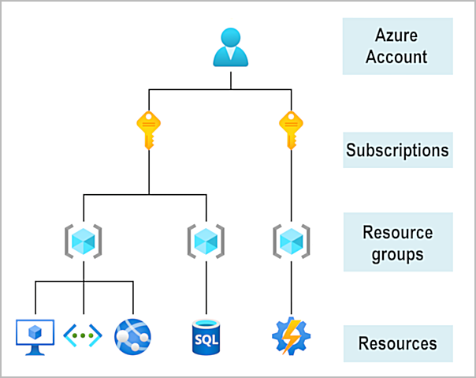
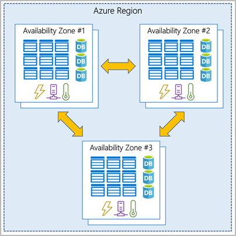
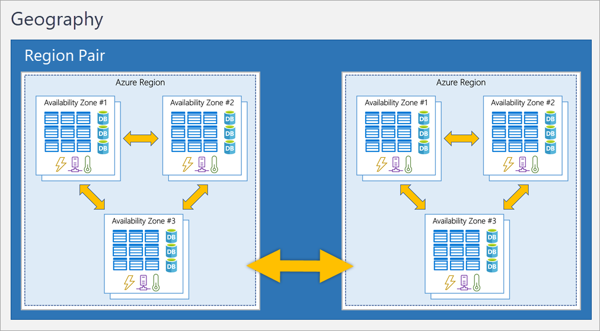
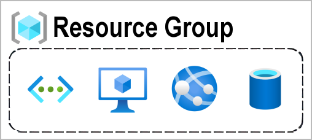
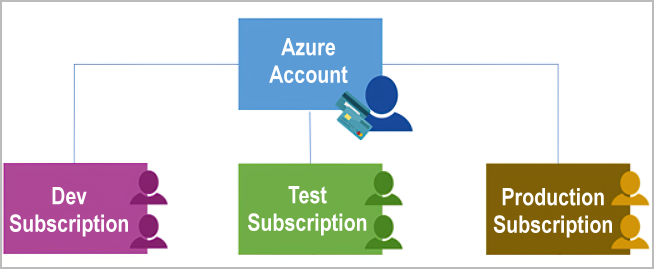
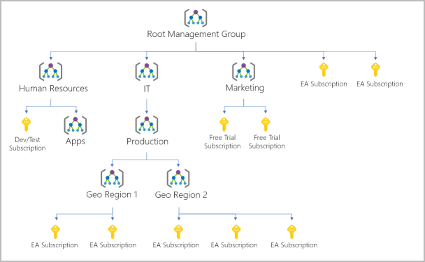

Descrever Azure

Azure Accounts

Zonas

para garantir resiliencia, usar 3 zonas diferentes

Availability zones:

    Zonal services: You pin the resource to a specific zone (for example, VMs, managed disks, IP addresses).
    Zone-redundant services: The platform replicates automatically across zones (for example, zone-redundant storage, SQL Database).
    Non-regional services: Services are always available from Azure geographies and are resilient to zone-wide outages as well as region-wide outages.

Region pairs

somente a 300m

se uma região sofrer um desastre existe outro datacenter disponivel para tomar ação.

Data continues to reside within the same geography as its pair (except for Brazil South) for tax- and law-enforcement jurisdiction purposes.

Sovereign Regions

são regiões isoladas da azure, são mais usadas por governo.

Resource group

Azure subscription

Management group
RBAC

10000 management groups
só pode ter 6 leveis de profundidade
cada grupo e subscrição só pode ter um parente
