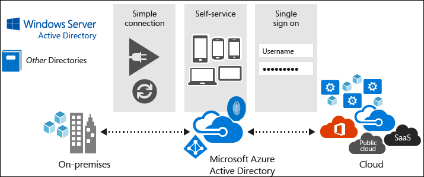
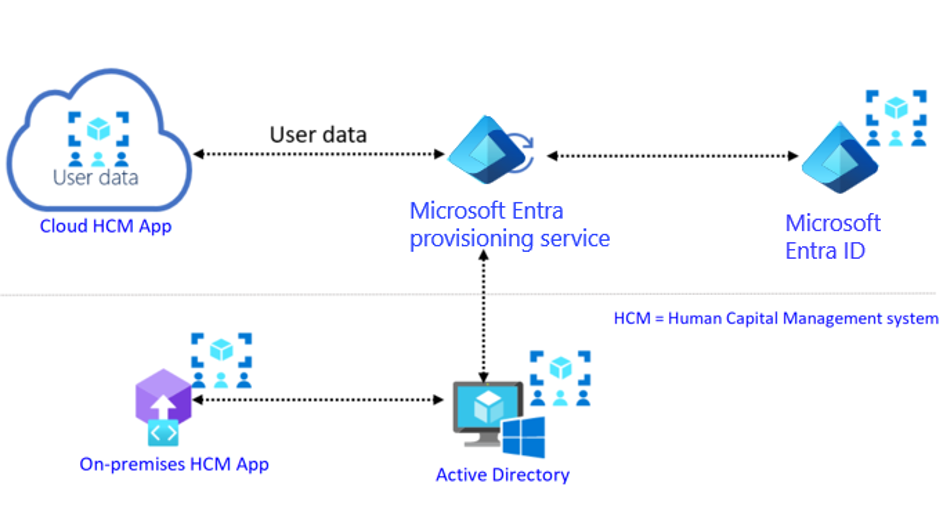
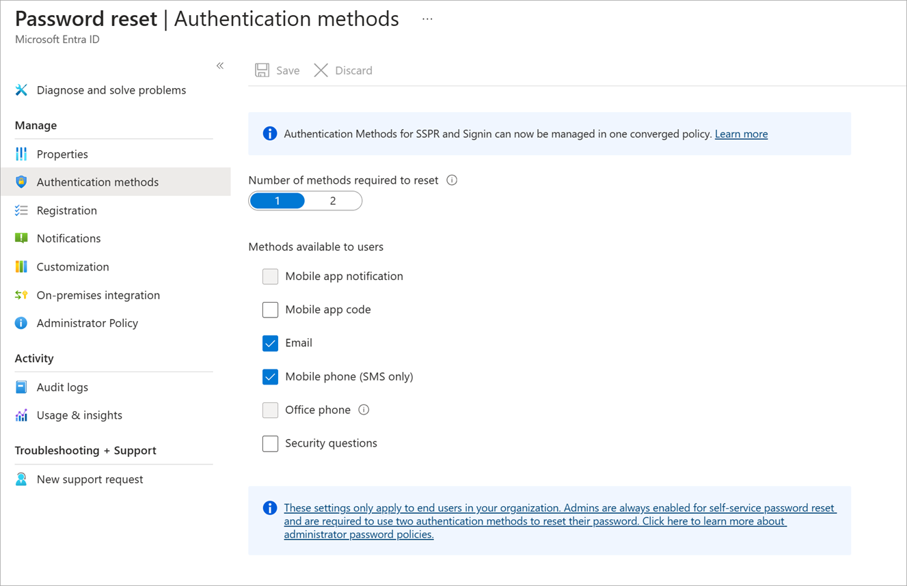

Entra ID (AD DS)

free tier



ao contrario do AD ele é multi tenant

uma subscrição azure só pode ser atralado a somente um Entra ID

todo tenant pega o sufixo de onmicrosoft.com

não começa com as OU, da para arranjar os objetos em containers customizados

Caracteristicas do AD DS

```
AD DS is a true directory service, with a hierarchical X.500-based structure.
AD DS uses Domain Name System (DNS) for locating resources such as domain controllers.
You can query and manage AD DS by using Lightweight Directory Access Protocol (LDAP) calls.
AD DS primarily uses the Kerberos protocol for authentication.
AD DS uses OUs and GPOs for management.
AD DS includes computer objects, representing computers that join an Active Directory domain.
AD DS uses trusts between domains for delegated management.
```

Caracteristicas do Entra ID

```
Microsoft Entra ID is primarily an identity solution, and it’s designed for internet-based applications by using HTTP (port 80) and HTTPS (port 443) communications.
Microsoft Entra ID is a multi-tenant directory service.
Microsoft Entra users and groups are created in a flat structure, and there are no OUs or GPOs.
You can't query Microsoft Entra ID by using LDAP; instead, Microsoft Entra ID uses the REST API over HTTP and HTTPS.
Microsoft Entra ID doesn't use Kerberos authentication; instead, it uses HTTP and HTTPS protocols such as SAML, WS-Federation, and OpenID Connect for authentication, and uses OAuth for authorization.
Microsoft Entra ID includes federation services, and many third-party services such as Facebook are federated with and trust Microsoft Entra ID.
```

existe versão P1 e P2  
p1 tem MFA e password reset a p2 tem algumas proteções de segurança a mais.  
MIM Microsoft identity manager

não precisa existir domain admins para usar entra ID e nada de AD

contrapontos:  
não tem OU estruturado, somente flat  
não tem GPO  
nada de WMI

Oauth para autorização

Permissões de usuário para deletar ou fazer update em outros users:

```
Global administrator
Partner Tier-1 Support
Partner Tier-2 Support
User administrator
```

Precisa ter permissão de office 365 ou global admin  
[https://admin.microsoft.com/Adminportal/Home?#/homepage](https://admin.microsoft.com/Adminportal/Home#/homepage "https://admin.microsoft.com/Adminportal/Home?#/homepage")

https://entra.microsoft.com/#home

existe dois tipos de grupos,  
Microsoft 365 -> colaboração  
Security -> padrão

e dois tipos de membros:  
assigned e dinamic, o primeiro sendo manualmente gerenciado e segundo baseado em rules.

Entra Joined Devices:  
da para ter um ambiente full cloud ou hibrido

group-based license:

```
Paid or trial subscription for Microsoft Entra ID Premium P1 and above
Paid or trial edition of Office 365 Enterprise E3 or Office 365 A3 or Office 365 GCC G3 or Office 365 E3 for GCCH or Office 365 E3 for DOD and above
```

Custom attributes,

mesmo eu tendo o global adminsitrator precisei do Attribute Assignment Adm

por que usar? extende profiles, adicionar tempo de comissão, hora da comissão etc. Permite um controle mais granular

## SCIM (system for Cross-Doamin Identity Management)



é um sistema opensource que faz com que o RH automatize a criação de usuários com adição HCM (human capital management)

dependency violation -> quando a licença foi removida e nenhuma outra foi colocada

countviolation -> quando não tem licença suficiente pra todo mundo

LicenseAssignmentAttributeConcurrencyException

https://docs.azure.cn/en-us/entra/identity/users/licensing-groups-resolve-problems

&nbsp;

SSPR (self service password reset)

