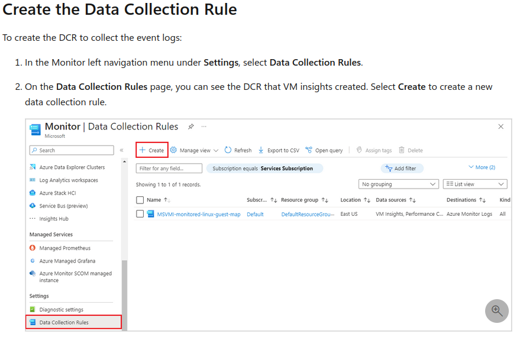
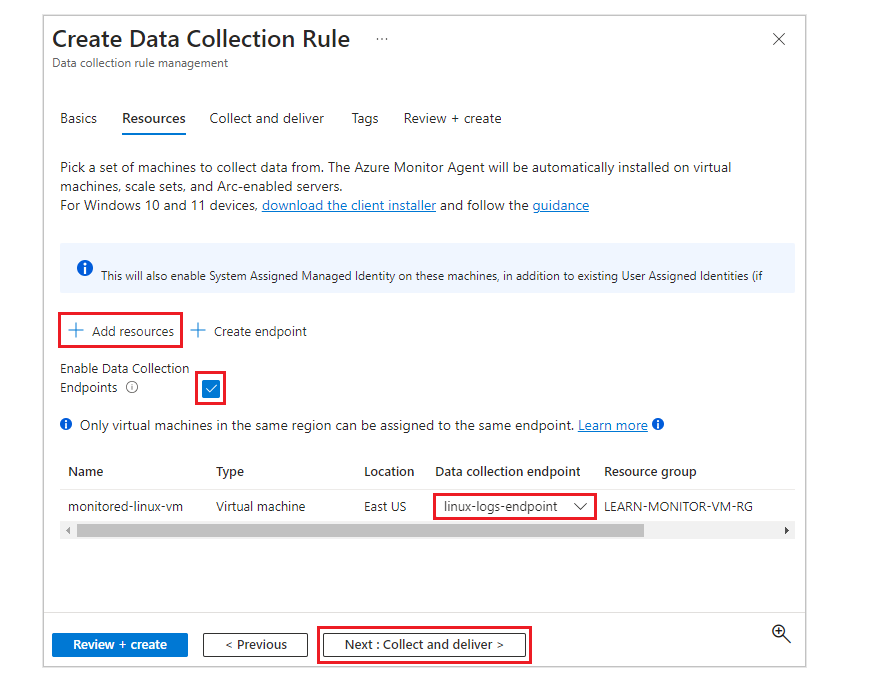

Monitor VM

ele pega algumas logs com retenção de 93 dias

aqui entra a parte de VM insights também
se instala um azure log agent com varios workspaces 

VM insights = logs basicos
DCR = logs que vc escolhe (quase um SIEM)

DCR (data collection rules) para coletar linux logs

criar rules
