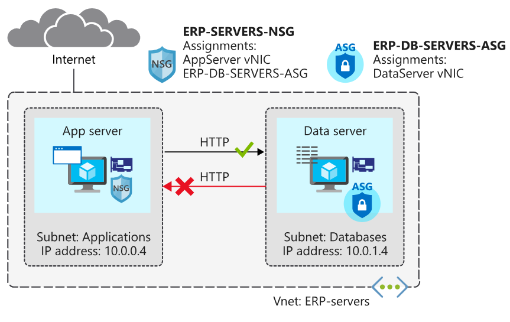

Network Security Group (NSG)

E ASG (Application security group)

vamos usar o NSG para ser o firewall da rede, e a ASG para fazer tags de servidores de aplicações comuns e então adota-los ao NSG.

&nbsp;

Criar ASG -> assimilar ASG para VNIC -> assimilar ASG em um NSG

&nbsp;

az network vnet create --resource-group $rg --name ERP-servers --address-prefixes 10.0.0.0/16 --subnet-name Applications --subnet-prefixes 10.0.0.0/24

&nbsp;

az network vnet subnet create --resource-group $rg --vnet-name ERP-servers --address-prefixes 10.0.1.0/24 --name Databases

&nbsp;

az network nsg create --resource-group $rg --name ERP-SERVERS-NSG

&nbsp;

wget -N https://raw.githubusercontent.com/MicrosoftDocs/mslearn-secure-and-isolate-with-nsg-and-service-endpoints/master/cloud-init.yml && az vm create --resource-group $rg --name AppServer --vnet-name ERP-servers --subnet Applications --nsg ERP-SERVERS-NSG --image Ubuntu2204 --size Standard_DS1_v2 --generate-ssh-keys --admin-username azureuser --custom-data cloud-init.yml --no-wait --admin-password &lt;password&gt;

az vm create --resource-group $rg --name DataServer --vnet-name ERP-servers --subnet Databases --nsg ERP-SERVERS-NSG --size Standard_DS1_v2 --image Ubuntu2204 --generate-ssh-keys --admin-username azureuser --custom-data cloud-init.yml --no-wait --admin-password &lt;password&gt;

&nbsp;

az vm list --resource-group $rg --show-details --query "\[\*\].{Name:name, Provisioned:provisioningState, Power:powerState}" --output table

&nbsp;

```
**az network nsg rule create** --resource-group $rg --nsg-name ERP-SERVERS-NSG --name AllowSSHRule **\--direction Inbound** --priority 100 --source-address-prefixes '\*' --source-port-ranges '\*' --destination-address-prefixes '\*' **\--destination-port-ranges 22** --access Allow --protocol Tcp --description "**Allow inbound SSH**"
```

```
az network nsg rule create --resource-group $rg --nsg-name ERP-SERVERS-NSG --name httpRule --direction Inbound --priority 150 --source-address-prefixes 10.0.1.4 --source-port-ranges '*' --destination-address-prefixes 10.0.0.4 --destination-port-ranges 80 --access Deny --protocol Tcp --description "Deny from DataServer to AppServer on port 80"
```

Não deixa a conexão pela regra de deny do dataserver até o app server na porta 80:

ssh -t azureuser@$DATASERVERIP 'wget http://10.0.0.4; exit; bash'



```
**az network asg create** --resource-group $rg --name ERP-DB-SERVERS-ASG
```

```
az network nic ip-config update --resource-group $rg --application-security-groups ERP-DB-SERVERS-ASG --name ipconfigDataServer --nic-name DataServerVMNic --vnet-name ERP-servers --subnet Databases
```

```
**az network nsg rule update** --resource-group $rg --nsg-name ERP-SERVERS-NSG --name httpRule --direction Inbound --priority 150 --source-address-prefixes "" --source-port-ranges '*' --source-asgs ERP-DB-SERVERS-ASG --destination-address-prefixes 10.0.0.4 --destination-port-ranges 80 --access Deny --protocol Tcp --description "Deny from DataServer to AppServer on port 80 using application security group"
```

&nbsp;