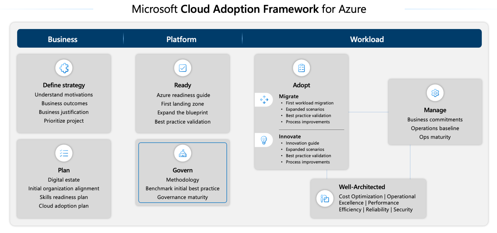
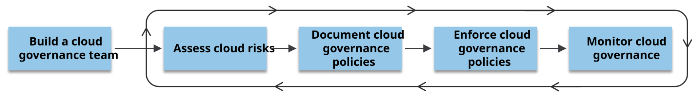
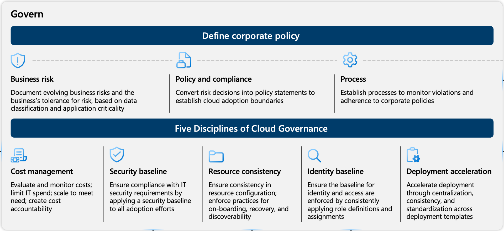
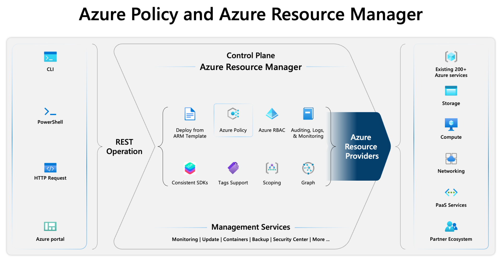
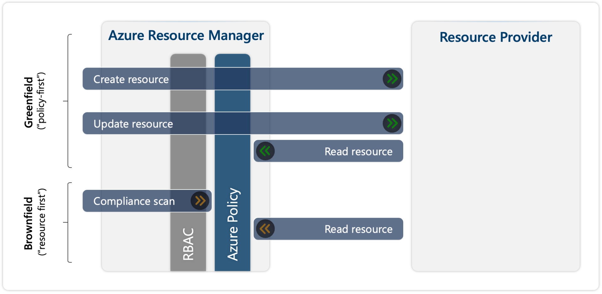
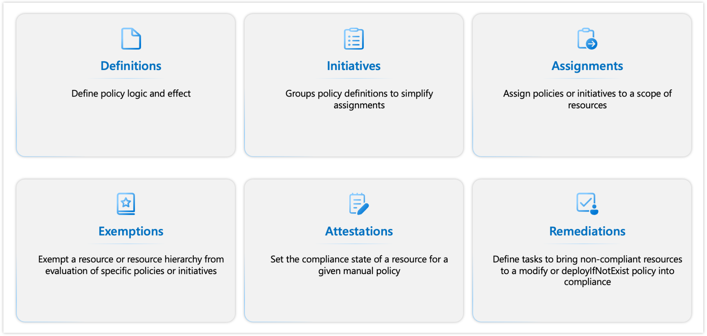
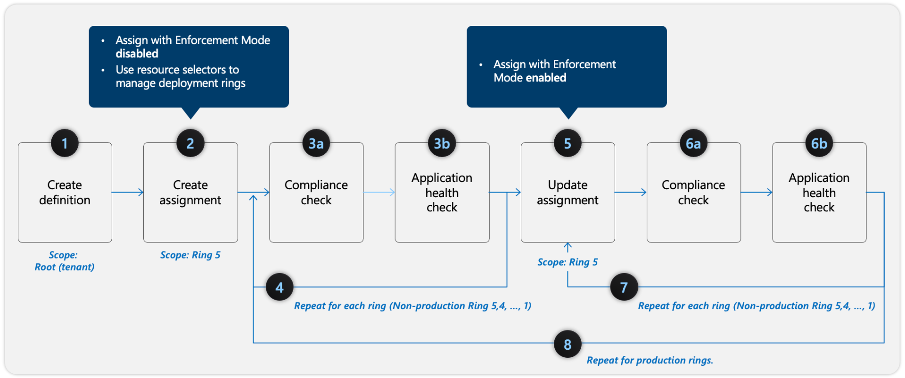

Policies

microsoft cloud framework

&nbsp;

&nbsp;

passo a passo da governanca

&nbsp;

Considerações da governanca

&nbsp;

a ferramenta para isso

https://learn.microsoft.com/en-us/azure/governance/policy/overview

tem um dashboad de compliance

&nbsp;

Design

control plane

&nbsp;

data:

geralmente é controlada por RBAC e ACL, porém alguns serviços estão inclusos na Azure Policy para controle como:

- **Microsoft.Kubernetes.Data** - Used for managing Kubernetes clusters and components such as pods, containers, and ingresses.
- **Microsoft.KeyVault.Data** - Used for managing vaults and certificates in Azure Key Vault.
- **Microsoft.Network.Data** - Used for managing Microsoft Azure Virtual Network Manager custom membership policies by using Azure Policy.
- **Microsoft.ManagedHSM.Data** - Used for managing Azure Key Vault Managed HSM keys by using Azure Policy.
- **Microsoft.DataFactory.Data** - Used for using Azure Policy to deny Microsoft Azure Data Factory outbound traffic domain names.
- **Microsoft.MachineLearningServices.v2.Data** - Used for managing Microsoft Azure Machine Learning model deployments. This Resource Provider mode reports compliance for newly created and updated components.

&nbsp;

modos de operação

&nbsp;

&nbsp;

&nbsp;

&nbsp;

da pra fazer por json

&nbsp;

