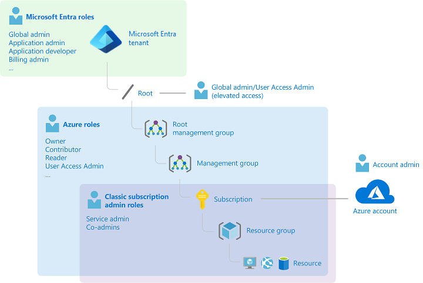
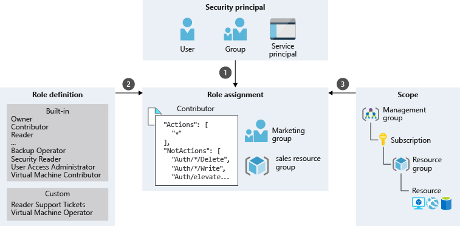

RBAC

&nbsp;

&nbsp;

&nbsp;

access control (IAM)

roles fundamentais:

- **Owner**: Has full access to all resources, including the right to delegate access to others.
- **Contributor**: Can create and manage all types of Azure resources, but can’t grant access to others.
- **Reader**: Can view existing Azure resources.
- **User Access Administrator**: Lets you manage user access to Azure resources.

security principal -> role definition > scope

Quem tem acesso a Oque, e Onde ele vai acessar

&nbsp;

