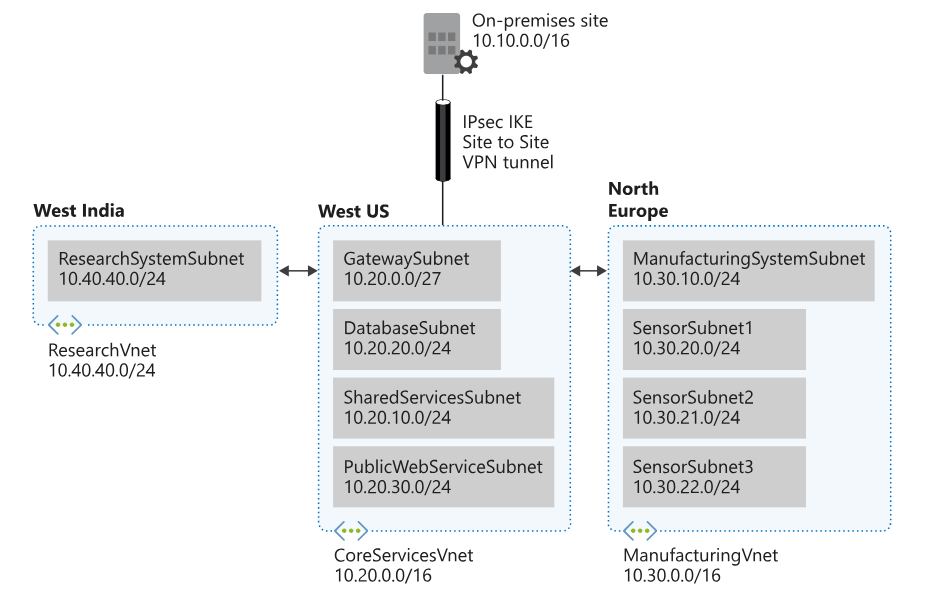

REDES

&nbsp;

https://learn.microsoft.com/en-us/training/modules/design-ip-addressing-for-azure/5-exercise-implement-vnets?tryIt=true&source=learn

https://microsoftlearning.github.io/Configure-secure-access-to-workloads-with-Azure-virtual-networking-services/Instructions/Labs/LAB_01_virtual_networks.html

DNS:

git clone https://github.com/MicrosoftDocs/mslearn-host-domain-azure-dns.git

cd mslearn-host-domain-azure-dns  
chmod +x setup.sh  
./setup.sh

az network vnet create --resource-group "learn-27f9345f-78cf-469f-8050-0167a19afdc7" --name CoreServicesVnet --address-prefixes 10.20.0.0/16 --location westus

&nbsp;

az network vnet subnet create --resource-group "learn-27f9345f-78cf-469f-8050-0167a19afdc7" --vnet-name CoreServicesVnet --name GatewaySubnet --address-prefixes 10.20.0.0/27

az network vnet subnet create --resource-group "learn-27f9345f-78cf-469f-8050-0167a19afdc7" --vnet-name CoreServicesVnet --name SharedServicesSubnet --address-prefixes 10.20.10.0/24

az network vnet subnet create --resource-group "learn-27f9345f-78cf-469f-8050-0167a19afdc7" --vnet-name CoreServicesVnet --name DatabaseSubnet --address-prefixes 10.20.20.0/24

az network vnet subnet create --resource-group "learn-27f9345f-78cf-469f-8050-0167a19afdc7" --vnet-name CoreServicesVnet --name PublicWebServiceSubnet --address-prefixes 10.20.30.0/24

&nbsp;

az network vnet subnet list --resource-group "learn-27f9345f-78cf-469f-8050-0167a19afdc7" --vnet-name CoreServicesVnet --output table

&nbsp;

az network vnet subnet create --resource-group "learn-27f9345f-78cf-469f-8050-0167a19afdc7" --vnet-name ManufacturingVnet --name ManufacturingSystemSubnet --address-prefixes 10.30.10.0/24

az network vnet subnet create --resource-group "learn-27f9345f-78cf-469f-8050-0167a19afdc7" --vnet-name ManufacturingVnet --name SensorSubnet1 --address-prefixes 10.30.20.0/24

az network vnet subnet create --resource-group "learn-27f9345f-78cf-469f-8050-0167a19afdc7" --vnet-name ManufacturingVnet --name SensorSubnet2 --address-prefixes 10.30.21.0/24

az network vnet subnet create --resource-group "learn-27f9345f-78cf-469f-8050-0167a19afdc7" --vnet-name ManufacturingVnet --name SensorSubnet3 --address-prefixes 10.30.22.0/24

&nbsp;

Azure public DNS