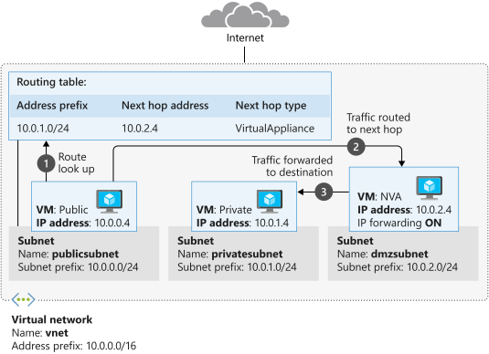

USR (user defined routes) and Network Virtual Appliance

https://learn.microsoft.com/en-us/training/modules/control-network-traffic-flow-with-routes/4-network-virtual-appliances

&nbsp;

https://learn.microsoft.com/en-us/azure/architecture/networking/guide/network-virtual-appliance-high-availability

ROUTES

az network route-table create --name publictable --resource-group "learn-a3e9bb8e-7f6d-466d-b8c4-dd71da270630" --disable-bgp-route-propagation false

az network route-table route create --route-table-name publictable --resource-group "learn-a3e9bb8e-7f6d-466d-b8c4-dd71da270630" --name productionsubnet --address-prefix 10.0.1.0/24 --next-hop-type VirtualAppliance --next-hop-ip-address 10.0.2.4

Virtual NET

az network vnet create --name vnet --resource-group "learn-a3e9bb8e-7f6d-466d-b8c4-dd71da270630" --address-prefixes 10.0.0.0/16 --subnet-name publicsubnet --subnet-prefixes 10.0.0.0/24

az network vnet subnet create --name privatesubnet --vnet-name vnet --resource-group "learn-a3e9bb8e-7f6d-466d-b8c4-dd71da270630" --address-prefixes 10.0.1.0/24

az network vnet subnet create --name dmzsubnet --vnet-name vnet --resource-group "learn-a3e9bb8e-7f6d-466d-b8c4-dd71da270630" --address-prefixes 10.0.2.0/24

az network vnet subnet list --resource-group "learn-a3e9bb8e-7f6d-466d-b8c4-dd71da270630" --vnet-name vnet --output table

update route table

az network vnet subnet update --name publicsubnet --vnet-name vnet --resource-group "learn-a3e9bb8e-7f6d-466d-b8c4-dd71da270630" --route-table publictable

&nbsp;

deploy NVA

&nbsp;

az vm create --resource-group "learn-a3e9bb8e-7f6d-466d-b8c4-dd71da270630" --name nva --vnet-name vnet --subnet dmzsubnet --image Ubuntu2204 --admin-username azureuser --admin-password P@ssw0rd123456

Enable ip forwarding in NIC

NICID=$(az vm nic list --resource-group "learn-a3e9bb8e-7f6d-466d-b8c4-dd71da270630" --vm-name nva --query "\[\].{id:id}" --output tsv)

echo $NICID

&nbsp;

NICNAME=$(az vm nic show --resource-group "learn-a3e9bb8e-7f6d-466d-b8c4-dd71da270630" --vm-name nva --nic $NICID --query "{name:name}" --output tsv)

echo $NICNAME

az network nic update --name $NICNAME --resource-group "learn-a3e9bb8e-7f6d-466d-b8c4-dd71da270630" --ip-forwarding true

enable IP forwarding in VM

NVAIP="$(az vm list-ip-addresses --resource-group "learn-a3e9bb8e-7f6d-466d-b8c4-dd71da270630" --name nva --query "\[\].virtualMachine.network.publicIpAddresses\[\*\].ipAddress" --output tsv)"

echo $NVAIP

&nbsp;

ssh -t -o StrictHostKeyChecking=no azureuser@$NVAIP 'sudo sysctl -w net.ipv4.ip_forward=1; exit;'

&nbsp;

coud-config

code cloud-init.txt

# cloud-config  
package_upgrade: true  
packages:  
   - inetutils-traceroute

&nbsp;

az vm create --resource-group "learn-a3e9bb8e-7f6d-466d-b8c4-dd71da270630" --name public --vnet-name vnet --subnet publicsubnet --image Ubuntu2204 --admin-username azureuser --no-wait --custom-data cloud-init.txt --admin-password P@ssw0rd123456

&nbsp;

az vm create --resource-group "learn-a3e9bb8e-7f6d-466d-b8c4-dd71da270630" --name private --vnet-name vnet --subnet privatesubnet --image Ubuntu2204 --admin-username azureuser --no-wait --custom-data cloud-init.txt --admin-password P@ssw0rd123456

&nbsp;

watch -d -n 5 "az vm list \\  
    --resource-group "learn-a3e9bb8e-7f6d-466d-b8c4-dd71da270630" \\  
    --show-details \\  
    --query '\[\*\].{Name:name, ProvisioningState:provisioningState, PowerState:powerState}' \\  
    --output table"

&nbsp;

PUBLICIP="$(az vm list-ip-addresses --resource-group "learn-a3e9bb8e-7f6d-466d-b8c4-dd71da270630" --name public --query "\[\].virtualMachine.network.publicIpAddresses\[\*\].ipAddress" --output tsv)"

echo $PUBLICIP

PRIVATEIP="$(az vm list-ip-addresses --resource-group "learn-a3e9bb8e-7f6d-466d-b8c4-dd71da270630" --name private --query "\[\].virtualMachine.network.publicIpAddresses\[\*\].ipAddress" --output tsv)"

echo $PRIVATEIP

&nbsp;

ssh -t -o StrictHostKeyChecking=no azureuser@$PUBLICIP 'traceroute private --type=icmp; exit'

ssh -t -o StrictHostKeyChecking=no azureuser@$PRIVATEIP 'traceroute public --type=icmp; exit'

