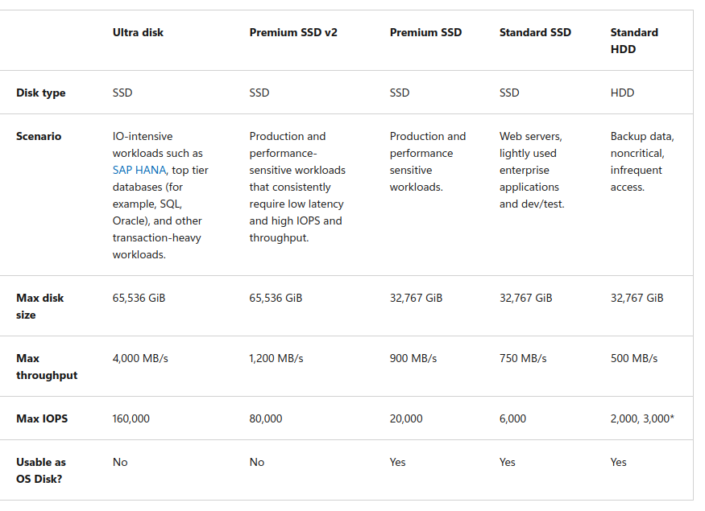

Virtual Disks


az configure --defaults location=eastus

```
az vm disk attach --vm-name support-web-vm01 --name uploadDataDisk1 --size-gb 64 --sku Premium_LRS --new
```

```
ipaddress=$(az vm show --name support-web-vm01 --show-details --query [publicIps] --output tsv)
```

ssh azureuser@$ipaddress lsblk


```
az vm extension set --vm-name support-web-vm01 --name customScript --publisher Microsoft.Azure.Extensions --settings '{"fileUris":["https://raw.githubusercontent.com/MicrosoftDocs/mslearn-add-and-size-disks-in-azure-virtual-machines/master/add-data-disk.sh"]}' --protected-settings '{"commandToExecute": "./add-data-disk.sh"}'
```


cenarios de como usar os discos



Expandir um disco

```
az vm deallocate --resource-group <resource-group-name> --name <vm-name>
```

```
az disk update --resource-group <resource-group-name> --name <disk-name> --size-gb 200
```

```
az vm start --resource-group <resource-group-name> --name <vm-name>
```


listar o disco
az disk list --query '[*].{Name:name,Gb:diskSizeGb,Tier:sku.tier}' --output table

deallocate faz com que a vm pare e vc consiga alocar mais disco.
az vm deallocate --name support-web-vm01

resize:
az disk update --name uploadDataDisk1 --size-gb 128

az vm start --name support-web-vm01

az vm extension set --vm-name support-web-vm01 --name customScript --publisher Microsoft.Azure.Extensions --settings '{"fileUris":["https://raw.githubusercontent.com/MicrosoftDocs/mslearn-add-and-size-disks-in-azure-virtual-machines/master/resize-data-disk.sh"]}' --protected-settings '{"commandToExecute": "./resize-data-disk.sh"}'