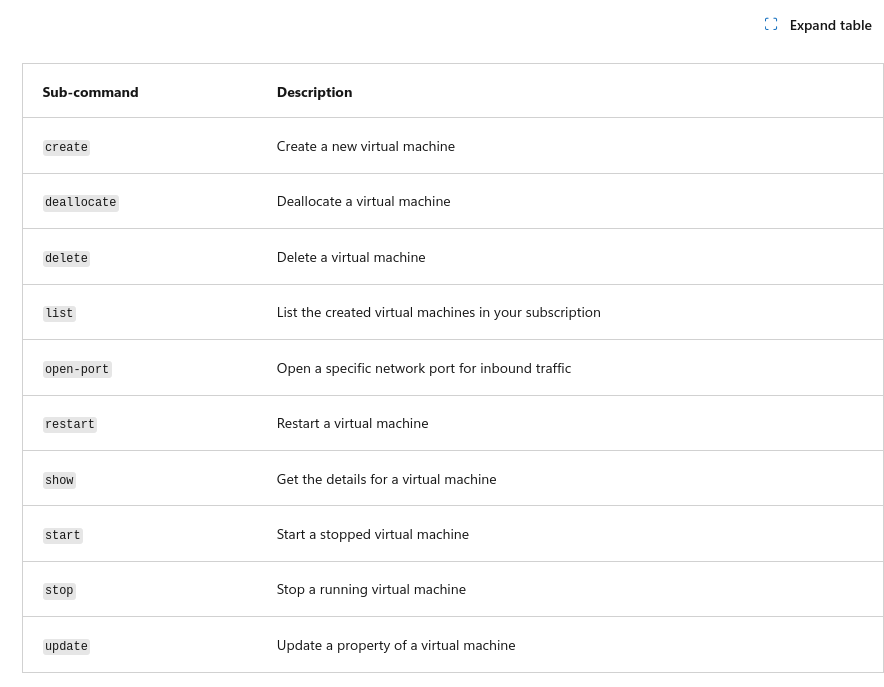
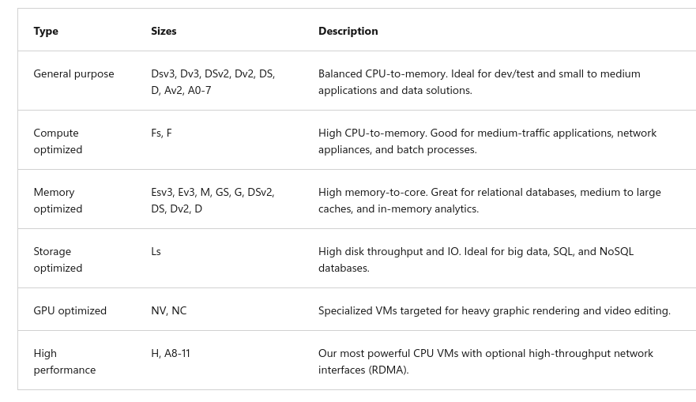
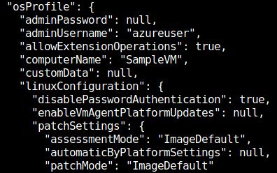

Virtual Machine comands



```
az vm create \
  --resource-group "learn-e5ee383b-ec34-460d-aa33-cc0661cead37" \
  --location westus \
  --name SampleVM \
  --image Ubuntu2204 \
  --admin-username azureuser \
  --generate-ssh-keys \
  --verbose 
```

se der um omit no --admin-username a VM será criada com seu usuário

lista maquinas mais famosas
```
az vm image list --output table
```

lista todas que providenciem wordpress
```
az vm image list --sku Wordpress --output table --all
```

maquinas da microsoft:
```
az vm image list --publisher Microsoft --output table --all

```


especificando tamanho
```
az vm create --resource-group "learn-e5ee383b-ec34-460d-aa33-cc0661cead37" --name SampleVM2 --image Ubuntu2204 --admin-username azureuser --generate-ssh-keys --verbose --size "Standard_DS2_v2"
```

lista todos os resize disponiveis:
```
az vm list-vm-resize-options --resource-group "learn-e5ee383b-ec34-460d-aa33-cc0661cead37" --name SampleVM --output table
```

resize vm:
```
az vm resize --resource-group "learn-e5ee383b-ec34-460d-aa33-cc0661cead37" --name SampleVM --size Standard_D2s_v3
```

```
az vm list
az vm list --output table
az vm list-ip-addresses -n SampleVM -o table
az vm show --resource-group "learn-e5ee383b-ec34-460d-aa33-cc0661cead37" --name SampleVM
```

## JMSESPath 
simplesmente são identificadores em JSON
```
{
  "people": [
    {
      "name": "Fred",
      "age": 28
    },
    {
      "name": "Barney",
      "age": 25
    },
    {
      "name": "Wilma",
      "age": 27
    }
  ]
}
```

com isso da para dar queryes para só ter a informação que precisas:

```
az vm show --resource-group "learn-e5ee383b-ec34-460d-aa33-cc0661cead37" --name SampleVM --query "osProfile.adminUsername"
```

  --query hardwareProfile.vmSize
   --query "networkProfile.networkInterfaces[].id"

   para ter o output já formatado:
```
   az vm show --resource-group "learn-e5ee383b-ec34-460d-aa33-cc0661cead37" --name SampleVM --query "networkProfile.networkInterfaces[].id" -o tsv
```

## Parar um VM

```
az vm stop --name SampleVM --resource-group "learn-e5ee383b-ec34-460d-aa33-cc0661cead37"
```

verificar parada:
```
az vm get-instance-view --name SampleVM --resource-group "learn-e5ee383b-ec34-460d-aa33-cc0661cead37" --query "instanceView.statuses[?starts_with(code, 'PowerState/')].displayStatus" -o tsv
```

## Reiniciar/iniciar VM
```
az vm start --name SampleVM --resource-group "learn-e5ee383b-ec34-460d-aa33-cc0661cead37"

vm restart
```

## Abrir portas
```
az vm open-port --port 80 --resource-group "learn-e5ee383b-ec34-460d-aa33-cc0661cead37" --name SampleVM
```

--no-wait