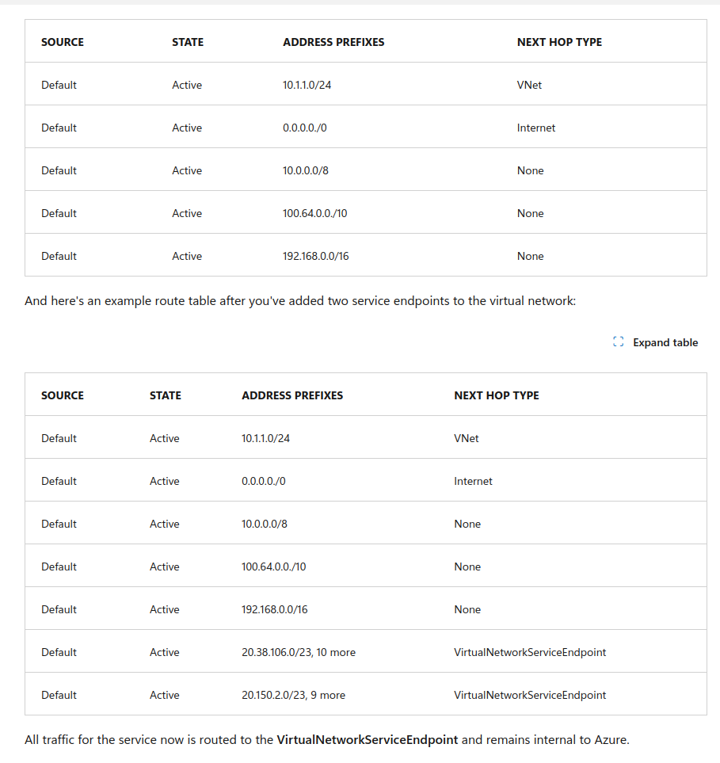
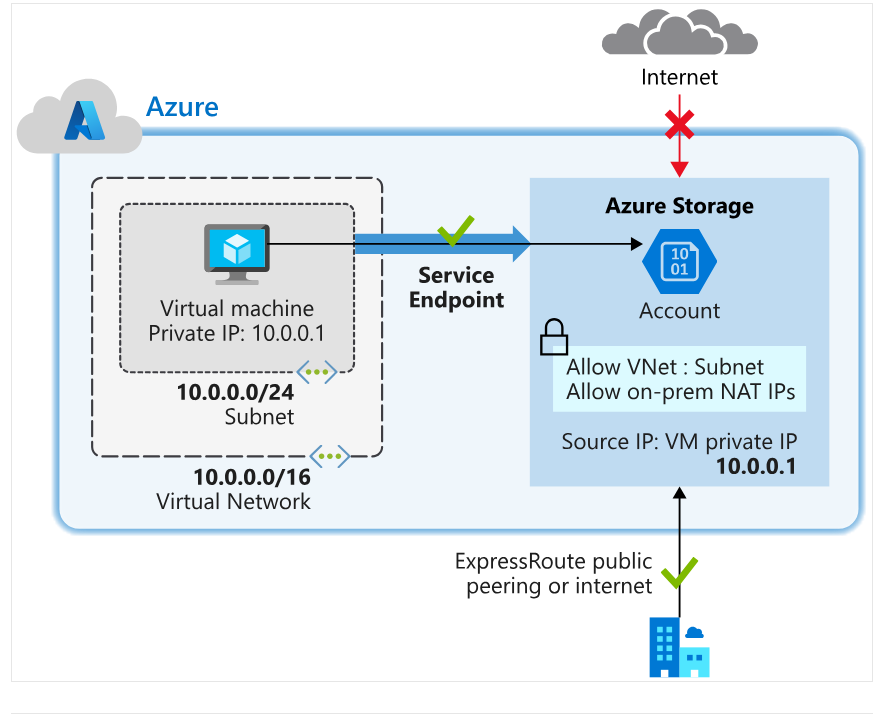
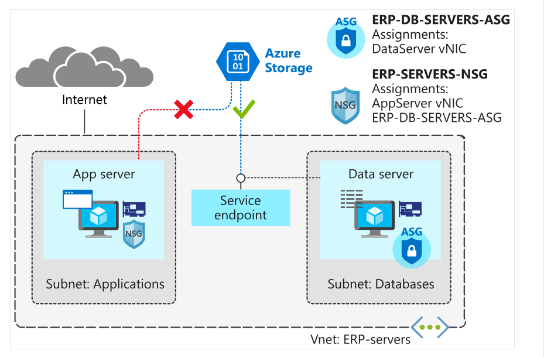
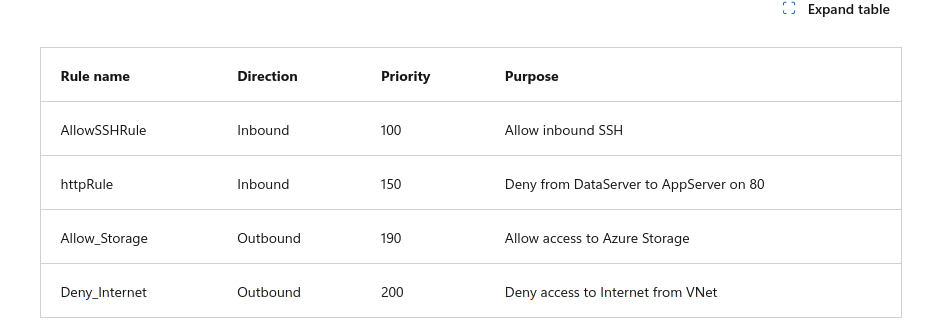

service endpoint

normal e abaixo com o SE habilitado





Projeto





az network nsg rule create --resource-group $rg --nsg-name ERP-SERVERS-NSG --name Allow_Storage --priority 190 --direction Outbound --source-address-prefixes "VirtualNetwork" --source-port-ranges '*' --destination-address-prefixes "Storage" --destination-port-ranges '*' --access Allow --protocol '*' --description "Allow access to Azure Storage"

az network nsg rule create --resource-group $rg --nsg-name ERP-SERVERS-NSG --name Deny_Internet --priority 200 --direction Outbound --source-address-prefixes "VirtualNetwork" --source-port-ranges '*' --destination-address-prefixes "Internet" --destination-port-ranges '*' --access Deny --protocol '*' --description "Deny access to Internet."

## Configurar o storage account

```
STORAGEACCT=$(az storage account create \
                --resource-group $rg \
                --name engineeringdocs$RANDOM \
                --sku Standard_LRS \
                --query "name" | tr -d '"')
```

```
STORAGEKEY=$(az storage account keys list \
                --resource-group $rg \
                --account-name $STORAGEACCT \
                --query "[0].value" | tr -d '"')

```

## criar

az storage share create --account-name $STORAGEACCT --account-key $STORAGEKEY --name "erp-data-share"

## Enable service endpoint
az network vnet subnet update --vnet-name ERP-servers --resource-group $rg --name Databases --service-endpoints Microsoft.Storage

az storage account update --resource-group $rg --name $STORAGEACCT --default-action Deny

az storage account network-rule add --resource-group $rg --account-name $STORAGEACCT --vnet-name ERP-servers --subnet Databases