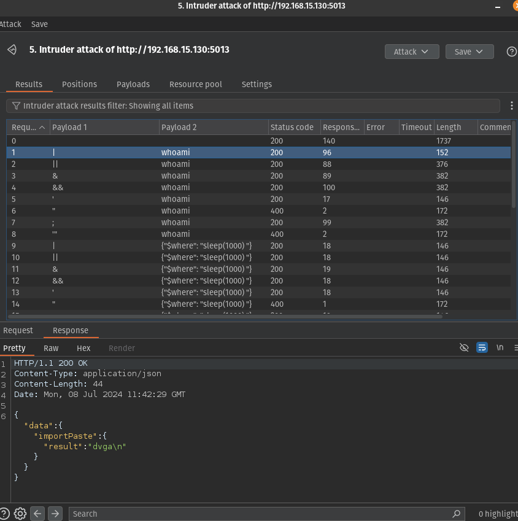
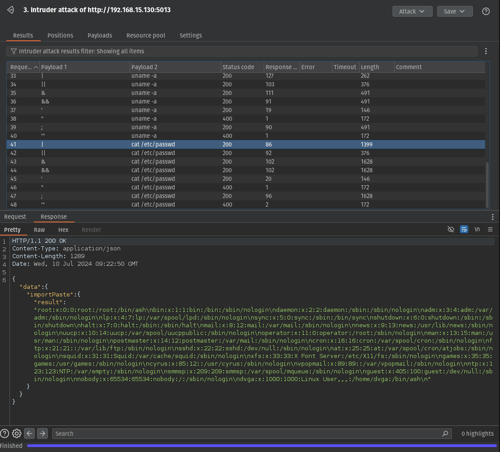

Injection

vairavel path do mutation suscetivel a injection

```http
POST /graphiql HTTP/1.1
Host: 192.168.15.130:5013
X-New-Header: X-New-Header-Value
Cookie: env=graphiql:enable
Content-Type: application/json
Content-Length: 280

{
  "query": "mutation($host: String!, $path: String!, $port: Int, $scheme: String!) { importPaste(host: $host, path: $path, port: $port, scheme: $scheme) { result } }",
  "variables": {
    "host": "google.com",
    "path": "/",
    "port": 80,
    "scheme": "http"
  }
}
```



