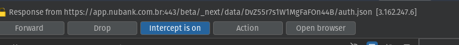

prod-global-webapp-proxy.nubank.com.br

`{"access_token":"eyJhbGciOiJSUzI1NiIsInR5cCI6IkpXVCIsImtpZCI6IjIwMTUtMTItMDRUMTc6MzY6MjIuNjY0LXU5ZC1ldWN1Ri1zQUFBRlJiaER3aUEifQ.eyJhdWQiOiJvdGhlci5jb250YSIsInN1YiI6IjVlMDkzN2M4LThhOTktNGYwOC04NzllLTRkMmEyODY1MmQ4OCIsImlzcyI6Imh0dHBzOi8vd3d3Lm51YmFuay5jb20uYnIiLCJleHAiOjE3MjE2NDg5NjIsInNjb3BlIjoiYXV0aC9saWZ0IiwianRpIjoicXNfTlI0YVpIWnVQU0ZXaWNpQ3NwZyIsImFjbCI6WyJwcm9kOmF1dGg6cG9zdDovYXBpL3Jldm9rZS9hbGwiLCJwcm9kOmF1dGg6cG9zdDovYXBpL3Jldm9rZSIsInByb2Q6Y3JlZGl0LWNhcmQtYWNjb3VudHM6Z2V0Oi9hcGkvYWNjb3VudHMvOmlkL2VtZXJnZW5jeS1hY2Nlc3MiLCJwcm9kOmZhY2FkZTpnZXQ6L2FwaS9jdXN0b21lcnMvOmlkL2FjY291bnQvZW1lcmdlbmN5LWFjY2VzcyIsInByb2Q6Y3JlZGl0LWNhcmQtYWNjb3VudHM6Z2V0Oi9hcGkvY3VzdG9tZXJzLzppZCIsInByb2Q6Y3JlZGl0LWNhcmQtYWNjb3VudHM6cHV0Oi9hcGkvY2FyZHMvOmlkL2Jsb2NrIiwicHJvZDpmYWNhZGU6cHV0Oi9hcGkvY2FyZHMvOmlkL2Jsb2NrIiwicHJvZDpiaWxsaW5nOmdldDovYXBpL2FjY291bnRzLzppZC9iaWxscy9lbWVyZ2VuY3ktYWNjZXNzIiwicHJvZDpmYWNhZGU6Z2V0Oi9hcGkvY3VzdG9tZXJzLzppZC9iaWxsL2VtZXJnZW5jeS1hY2Nlc3MiLCJwcm9kOmJpbGxpbmc6cG9zdDovYXBpL2JpbGxzLzppZC9ib2xldG8vZW1haWwiLCJwcm9kOmZhY2FkZTpwb3N0Oi9hcGkvYmlsbHMvOmlkL2JvbGV0by9lbWFpbCIsInByb2Q6YXV0aDpwb3N0Oi9hcGkvbGlmdCIsInByb2Q6cGlrYWNodTpwdXQ6L2FwaS9jdXN0b21lcnMvOmlkL2NhcmRzL3BoeXNpY2FsL2Jsb2NrLWFsbCIsInByb2Q6cGlrYWNodTpwdXQ6L2FwaS9jdXN0b21lcnMvOmlkL2NhcmRzL3ZpcnR1YWwvYmxvY2stYWxsIiwicHJvZDpwaWthY2h1OmdldDovYXBpL2N1c3RvbWVycy86aWQvY2FyZHMvbm9uLWNhbmNlbGVkIl0sInZlcnNpb24iOiIyIiwiaWF0IjoxNzIxNjQ1MzYyfQ.sFbt3HE2zuCVhP9n0QrBWq_tmwn2F_o1-raeyNX5aCPi0t1PdefxxBRoZ3Csg9TBIux48roiW3rGN28KBNXZxQ-K3Cq0-hJBgO_43_0ACxsukNmqUbCInqfmhbZi8Ux0vlYKjXX4Hyt5iiWF2i0hvXAFHUE-WzkPrjVlmIl72IPZ9dQSgI2RpczZ07ZFYid87nCo9N-oPG1o35T-rfpX2F69t0TjzozgFc6oVZp7JQTjClOLf4st50ACljUsmYjfludr59Hy0xrZ0hPugC718rCoFTmj_bbZuZ_YJNCBZDGNcDmg5ZxCSDnXx0ixSMoxV9t3ubSwhyH9p34yFsi-Aw","token_type":"bearer","_links":{"revoke_token":{"href":"https://prod-global-webapp-proxy.nubank.com.br/api/proxy/AJxL5LDoV28GLVEQYvnPwBMVrQIH5KJBMQ.aHR0cHM6Ly9wcm9kLWdsb2JhbC1hdXRoLm51YmFuay5jb20uYnIvYXBpL3Jldm9rZQ"},"revoke_all":{"href":"https://prod-global-webapp-proxy.nubank.com.br/api/proxy/AJxL5LCi_hq8s2Ixt7wmq4_qG6mtdnCCrA.aHR0cHM6Ly9wcm9kLWdsb2JhbC1hdXRoLm51YmFuay5jb20uYnIvYXBpL3Jldm9rZS9hbGw"},"account_emergency":{"href":"https://prod-global-webapp-proxy.nubank.com.br/api/proxy/AJxL5LDHjA184Ix5gz-gJyhg66tHUFZfOg.aHR0cHM6Ly9wcm9kLXMxMS1mYWNhZGUubnViYW5rLmNvbS5ici9hcGkvY3VzdG9tZXJzLzVlMDkzN2M4LThhOTktNGYwOC04NzllLTRkMmEyODY1MmQ4OC9hY2NvdW50L2VtZXJnZW5jeS1hY2Nlc3M"},"block_physical_cards":{"href":"https://prod-global-webapp-proxy.nubank.com.br/api/proxy/AJxL5LBiySlfsFz9ThBR_D8saDpdUe7p8A.aHR0cHM6Ly9wcm9kLWdsb2JhbC1waWthY2h1Lm51YmFuay5jb20uYnIvYXBpL2N1c3RvbWVycy81ZTA5MzdjOC04YTk5LTRmMDgtODc5ZS00ZDJhMjg2NTJkODgvY2FyZHMvcGh5c2ljYWwvYmxvY2stYWxs"},"block_virtual_cards":{"href":"https://prod-global-webapp-proxy.nubank.com.br/api/proxy/AJxL5LCrTbBRY4KFOxFHsuQaV2tMf5wb1A.aHR0cHM6Ly9wcm9kLWdsb2JhbC1waWthY2h1Lm51YmFuay5jb20uYnIvYXBpL2N1c3RvbWVycy81ZTA5MzdjOC04YTk5LTRmMDgtODc5ZS00ZDJhMjg2NTJkODgvY2FyZHMvdmlydHVhbC9ibG9jay1hbGw"},"list_cards":{"href":"https://prod-global-webapp-proxy.nubank.com.br/api/proxy/AJxL5LD4VgmFlWxoi5zx18PgxP7atqW3BA.aHR0cHM6Ly9wcm9kLWdsb2JhbC1waWthY2h1Lm51YmFuay5jb20uYnIvYXBpL2N1c3RvbWVycy81ZTA5MzdjOC04YTk5LTRmMDgtODc5ZS00ZDJhMjg2NTJkODgvY2FyZHMvbm9uLWNhbmNlbGVk"}},"refresh_token":"string token","refresh_before":"2024-07-22T11:49:22Z"}`

```json
HTTP/2 200 OK
Date: Mon, 22 Jul 2024 10:49:22 GMT
Content-Type: application/json;charset=utf-8
X-Frame-Options: DENY
X-Download-Options: noopen
Access-Control-Expose-Headers: X-Frame-Options, X-Download-Options, Access-Control-Expose-Headers, X-Permitted-Cross-Domain-Policies, Access-Control-Allow-Origin, X-Xss-Protection, X-Signature, Content-Type, Access-Control-Allow-Origin, X-Content-Type-Options, X-Download-Options, Referrer-Policy, Strict-Transport-Security, X-Frame-Options, Strict-Transport-Security, X-Permitted-Cross-Domain-Policies, Pragma, Access-Control-Allow-Credentials, Access-Control-Expose-Headers, X-Content-Type-Options, Content-Security-Policy, Content-Type, Vary, X-Http2-Stream-Id, X-Xss-Protection, Content-Security-Policy, Cache-Control
X-Permitted-Cross-Domain-Policies: none
Access-Control-Allow-Origin: https://app.nubank.com.br
X-Xss-Protection: 1; mode=block
X-Signature: ANNsWToAAAMhtB7wZJCNDZSfMFLzj1DL3wyu95Is1sq6Jo4P9gRuPJ2MxFqV34OWWU9p6fN6CP7PFj0jksUSh7DQWdnjBubGK4cXZ9NngW3saFSNpflv7GeE-rL6MAcsCxnWtTgGXnvmdD3IWbczvtzQer1sxHjjrhP2r_ZXsf8_RoCnxMgaIG6KyO6X
X-Content-Type-Options: nosniff
Referrer-Policy: same-origin
Strict-Transport-Security: max-age=31536000; includeSubdomains
Pragma: no-cache
Access-Control-Allow-Credentials: true
Content-Security-Policy: object-src 'none'; script-src 'unsafe-inline' 'unsafe-eval' 'strict-dynamic' https: http:;
Vary: Accept-Encoding, User-Agent
X-Http2-Stream-Id: 209
Cache-Control: no-store

{"access_token":"eyJhbGciOiJSUzI1NiIsInR5cCI6IkpXVCIsImtpZCI6IjIwMTUtMTItMDRUMTc6MzY6MjIuNjY0LXU5ZC1ldWN1Ri1zQUFBRlJiaER3aUEifQ.eyJhdWQiOiJvdGhlci5jb250YSIsInN1YiI6IjVlMDkzN2M4LThhOTktNGYwOC04NzllLTRkMmEyODY1MmQ4OCIsImlzcyI6Imh0dHBzOi8vd3d3Lm51YmFuay5jb20uYnIiLCJleHAiOjE3MjE2NDg5NjIsInNjb3BlIjoiYXV0aC9saWZ0IiwianRpIjoicXNfTlI0YVpIWnVQU0ZXaWNpQ3NwZyIsImFjbCI6WyJwcm9kOmF1dGg6cG9zdDovYXBpL3Jldm9rZS9hbGwiLCJwcm9kOmF1dGg6cG9zdDovYXBpL3Jldm9rZSIsInByb2Q6Y3JlZGl0LWNhcmQtYWNjb3VudHM6Z2V0Oi9hcGkvYWNjb3VudHMvOmlkL2VtZXJnZW5jeS1hY2Nlc3MiLCJwcm9kOmZhY2FkZTpnZXQ6L2FwaS9jdXN0b21lcnMvOmlkL2FjY291bnQvZW1lcmdlbmN5LWFjY2VzcyIsInByb2Q6Y3JlZGl0LWNhcmQtYWNjb3VudHM6Z2V0Oi9hcGkvY3VzdG9tZXJzLzppZCIsInByb2Q6Y3JlZGl0LWNhcmQtYWNjb3VudHM6cHV0Oi9hcGkvY2FyZHMvOmlkL2Jsb2NrIiwicHJvZDpmYWNhZGU6cHV0Oi9hcGkvY2FyZHMvOmlkL2Jsb2NrIiwicHJvZDpiaWxsaW5nOmdldDovYXBpL2FjY291bnRzLzppZC9iaWxscy9lbWVyZ2VuY3ktYWNjZXNzIiwicHJvZDpmYWNhZGU6Z2V0Oi9hcGkvY3VzdG9tZXJzLzppZC9iaWxsL2VtZXJnZW5jeS1hY2Nlc3MiLCJwcm9kOmJpbGxpbmc6cG9zdDovYXBpL2JpbGxzLzppZC9ib2xldG8vZW1haWwiLCJwcm9kOmZhY2FkZTpwb3N0Oi9hcGkvYmlsbHMvOmlkL2JvbGV0by9lbWFpbCIsInByb2Q6YXV0aDpwb3N0Oi9hcGkvbGlmdCIsInByb2Q6cGlrYWNodTpwdXQ6L2FwaS9jdXN0b21lcnMvOmlkL2NhcmRzL3BoeXNpY2FsL2Jsb2NrLWFsbCIsInByb2Q6cGlrYWNodTpwdXQ6L2FwaS9jdXN0b21lcnMvOmlkL2NhcmRzL3ZpcnR1YWwvYmxvY2stYWxsIiwicHJvZDpwaWthY2h1OmdldDovYXBpL2N1c3RvbWVycy86aWQvY2FyZHMvbm9uLWNhbmNlbGVkIl0sInZlcnNpb24iOiIyIiwiaWF0IjoxNzIxNjQ1MzYyfQ.sFbt3HE2zuCVhP9n0QrBWq_tmwn2F_o1-raeyNX5aCPi0t1PdefxxBRoZ3Csg9TBIux48roiW3rGN28KBNXZxQ-K3Cq0-hJBgO_43_0ACxsukNmqUbCInqfmhbZi8Ux0vlYKjXX4Hyt5iiWF2i0hvXAFHUE-WzkPrjVlmIl72IPZ9dQSgI2RpczZ07ZFYid87nCo9N-oPG1o35T-rfpX2F69t0TjzozgFc6oVZp7JQTjClOLf4st50ACljUsmYjfludr59Hy0xrZ0hPugC718rCoFTmj_bbZuZ_YJNCBZDGNcDmg5ZxCSDnXx0ixSMoxV9t3ubSwhyH9p34yFsi-Aw","token_type":"bearer","_links":{"revoke_token":{"href":"https://prod-global-webapp-proxy.nubank.com.br/api/proxy/AJxL5LDoV28GLVEQYvnPwBMVrQIH5KJBMQ.aHR0cHM6Ly9wcm9kLWdsb2JhbC1hdXRoLm51YmFuay5jb20uYnIvYXBpL3Jldm9rZQ"},"revoke_all":{"href":"https://prod-global-webapp-proxy.nubank.com.br/api/proxy/AJxL5LCi_hq8s2Ixt7wmq4_qG6mtdnCCrA.aHR0cHM6Ly9wcm9kLWdsb2JhbC1hdXRoLm51YmFuay5jb20uYnIvYXBpL3Jldm9rZS9hbGw"},"account_emergency":{"href":"https://prod-global-webapp-proxy.nubank.com.br/api/proxy/AJxL5LDHjA184Ix5gz-gJyhg66tHUFZfOg.aHR0cHM6Ly9wcm9kLXMxMS1mYWNhZGUubnViYW5rLmNvbS5ici9hcGkvY3VzdG9tZXJzLzVlMDkzN2M4LThhOTktNGYwOC04NzllLTRkMmEyODY1MmQ4OC9hY2NvdW50L2VtZXJnZW5jeS1hY2Nlc3M"},"block_physical_cards":{"href":"https://prod-global-webapp-proxy.nubank.com.br/api/proxy/AJxL5LBiySlfsFz9ThBR_D8saDpdUe7p8A.aHR0cHM6Ly9wcm9kLWdsb2JhbC1waWthY2h1Lm51YmFuay5jb20uYnIvYXBpL2N1c3RvbWVycy81ZTA5MzdjOC04YTk5LTRmMDgtODc5ZS00ZDJhMjg2NTJkODgvY2FyZHMvcGh5c2ljYWwvYmxvY2stYWxs"},"block_virtual_cards":{"href":"https://prod-global-webapp-proxy.nubank.com.br/api/proxy/AJxL5LCrTbBRY4KFOxFHsuQaV2tMf5wb1A.aHR0cHM6Ly9wcm9kLWdsb2JhbC1waWthY2h1Lm51YmFuay5jb20uYnIvYXBpL2N1c3RvbWVycy81ZTA5MzdjOC04YTk5LTRmMDgtODc5ZS00ZDJhMjg2NTJkODgvY2FyZHMvdmlydHVhbC9ibG9jay1hbGw"},"list_cards":{"href":"https://prod-global-webapp-proxy.nubank.com.br/api/proxy/AJxL5LD4VgmFlWxoi5zx18PgxP7atqW3BA.aHR0cHM6Ly9wcm9kLWdsb2JhbC1waWthY2h1Lm51YmFuay5jb20uYnIvYXBpL2N1c3RvbWVycy81ZTA5MzdjOC04YTk5LTRmMDgtODc5ZS00ZDJhMjg2NTJkODgvY2FyZHMvbm9uLWNhbmNlbGVk"}},"refresh_token":"string token","refresh_before":"2024-07-22T11:49:22Z"}
```

apos realizar auth

app.nubank

/beta/_next/data/DvZ55r7s1W1MgFaFOn44B/auth.json

```json
HTTP/2 200 OK
Content-Type: application/json
Last-Modified: Fri, 19 Jul 2024 17:07:02 GMT
Server: AmazonS3
Date: Mon, 22 Jul 2024 10:54:53 GMT
Cache-Control: max-age=60,public
Etag: W/"7060347fc1e3dfe460e6b3bd7b8dce1c"
Vary: Accept-Encoding
X-Cache: Hit from cloudfront
Via: 1.1 1f71c63658c4f74faed3133e50a0708a.cloudfront.net (CloudFront)
X-Amz-Cf-Pop: GRU3-P4
X-Amz-Cf-Id: 06CSPIGVsXuIy3hoY5uYElok8xcMWdi8CHnf75Xaly4HuZFZ90exYw==
Age: 41
X-Xss-Protection: 1; mode=block
X-Frame-Options: SAMEORIGIN
Referrer-Policy: strict-origin-when-cross-origin
X-Content-Type-Options: nosniff
Strict-Transport-Security: max-age=31536000

{"pageProps":{"locale":"br","localeData":{"COMMON.WEBAPPSHELL.HEADER.GREET":"Olá","COMMON.WEBAPPSHELL.HEADER.BETA":"Beta","COMMON.WEBAPPSHELL.MENU.LOGOUT.LABEL":"Sair","COMMON.WEBAPPSHELL.HEADER.POPOVER_ACCOUNT_SWITCH.TEXT":"Banco 260 • Nu Pagamentos S.A. - Instituição de Pagamentos","COMMON.WEBAPPSHELL.HEADER.BUTTON_ACCOUNT_SWITCH.TEXT":"Acessar outra conta","COMMON.WEBAPPSHELL.HEADER.BUTTON_SETTINGS.TEXT":"Configurações","COMMON.WEBAPPSHELL.HEADER.QUICK.BUTTON_AUTH.TEXT":"Autenticar","PLACEHOLDER":"Placeholder","GLOBAL.QUICK_ACCESS.CALLOUT.TITLE":"Modo acesso rápido","GLOBAL.QUICK_ACCESS.CALLOUT.DESCRIPTION":"As funções estão limitadas para a sua própria segurança. Para o <strong>acesso completo</strong> faça a autenticação.","GLOBAL.QUICK_ACCESS.CALLOUT.DESCRIPTION.ROBBED_MODE":"As funções estão limitadas para a sua própria segurança.","USER_MENU.REVOKE_ALL.ACTIVE.TITLE":"Sair de tudo","USER_MENU.REVOKE_ALL.ACTIVE.DESCRIPTION":"Desconecta todos os seus aparelhos","USER_MENU.REVOKE_ALL.PROMPT.TITLE":"Você quer desconectar tudo?","USER_MENU.REVOKE_ALL.PROMPT.DESCRIPTION":"Isso fará com que todos os aparelhos (celulares, tablets, computadores) conectados com essa conta se desconectem.","USER_MENU.REVOKE_ALL.PROMPT.BUTTON.CANCEL":"Cancelar","USER_MENU.REVOKE_ALL.PROMPT.BUTTON.CONFIRM":"Desconectar","USER_MENU.REVOKE_ALL.PROMPT.TOAST.SUCCESS":"Aparelhos desconectados","USER_MENU.REVOKE_ALL.PROMPT.TOAST.ERROR":"Erro ao desconectar de tudo, tente novamente","GLOBAL.AUTHENTICATE.PROMPT.STEP.1":"Abra o aplicativo do <strong>Nubank</strong> no celular","GLOBAL.AUTHENTICATE.PROMPT.STEP.2":"Toque na sua <strong>foto</strong> para acessar o menu","GLOBAL.AUTHENTICATE.PROMPT.STEP.3":"Selecione <strong>Segurança / Acesso no navegador</strong>","GLOBAL.AUTHENTICATE.PROMPT.STEP.4":"Aponte a câmera para o <strong>código QR</strong> abaixo","GLOBAL.PJ.AUTHENTICATE.PROMPT.STEP.1":"Abra o aplicativo do <strong>Nubank</strong> no celular","GLOBAL.PJ.AUTHENTICATE.PROMPT.STEP.2":"Toque na sua <strong>foto</strong> e acesse sua <strong>conta pessoal</strong>","GLOBAL.PJ.AUTHENTICATE.PROMPT.STEP.3":"Toque na sua <strong>foto</strong> novamente para acessar o menu","GLOBAL.PJ.AUTHENTICATE.PROMPT.STEP.4":"Selecione <strong>Segurança / Acesso no navegador</strong>","GLOBAL.PJ.AUTHENTICATE.PROMPT.STEP.5":"Aponte a câmera para o <strong>código QR</strong> abaixo","GLOBAL.AUTHENTICATE.QR_CODE.EXPIRED":"Clique para gerar um novo código QR","GLOBAL.AUTHENTICATE.QR_CODE.BUTTON.EXPIRED":"Recarregar<br/>código QR","GLOBAL.AUTHENTICATE.QR_CODE.BUTTON.EXPIRED.ARIAL.LABEL":"Clique para gerar um novo código qr","GLOBAL.AUTHENTICATE.QR_CODE.BUTTON.ARIAL.LABEL":"Código QR","SETTINGS_MENU.PJ.COMPANY.TITLE":"Empresa","SETTINGS_MENU.PJ.COMPANY.TITLE_DATA":"Dados da Empresa","SETTINGS_MENU.PJ.COMPANY.FORM.HELP":"Ajuda","SETTINGS_MENU.PJ.COMPANY.FORM.REQUIRED_LABEL":"Campo obrigatório","SETTINGS_MENU.PJ.COMPANY.FORM.SAVE_BUTTON":"Salvar alterações","SETTINGS_MENU.PJ.COMPANY.FORM.SAVE_BUTTON.TOAST_SUCCESS":"Alterações salvas","SETTINGS_MENU.PJ.COMPANY.FORM.SAVE_BUTTON.TOAST_ERROR":"Ocorreu um erro ao tentar salvar. Tente novamente.","SETTINGS_MENU.PJ.COMPANY.FORM.ONLY_NUMBER_INPUT.ERROR":"O campo deve conter apenas números","SETTINGS_MENU.PJ.COMPANY.FORM.ONLY_POSITIVE_NUMBER_INPUT.ERROR":"O campo deve conter apenas números positivos","SETTINGS_MENU.PJ.COMPANY.FORM.MAX_PERCENTAGE.ERROR":"O valor máximo é 100%","SETTINGS_MENU.PJ.COMPANY.DATA.FORM.KIND":"Tipo de unidade","SETTINGS_MENU.PJ.COMPANY.DATA.FORM.KIND.TOOLTIP":"É o local de referência para a tributação dos serviços prestados. Se houver apenas uma unidade, selecione \"Matriz\".","SETTINGS_MENU.PJ.COMPANY.DATA.FORM.REGISTRATION":"Inscrição Municipal","SETTINGS_MENU.PJ.COMPANY.DATA.FORM.REGISTRATION.MAX_LENGTH":"Deve ter no máximo {maxLength} caracteres","SETTINGS_MENU.PJ.COMPANY.DATA.FORM.REGISTRATION.TOOLTIP":"Esse número aparece no alvará emitido pela prefeitura da cidade em que sua empresa está localizada. Ele identifica a empresa contribuinte no Cadastro Tributário Municipal e é usado para fins de tributação do ISS (Imposto Sobre Serviços).","SETTINGS_MENU.PJ.COMPANY.ADDRESS.TITLE":"Endereço fiscal","SETTINGS_MENU.PJ.COMPANY.ADDRESS.RADIO.STORED":"Endereço fiscal padrão","SETTINGS_MENU.PJ.COMPANY.ADDRESS.RADIO.NEW":"Outro endereço fiscal","SETTINGS_MENU.PJ.COMPANY.ADDRESS.FORM.POSTCODE":"CEP","SETTINGS_MENU.PJ.COMPANY.ADDRESS.FORM.POSTCODE.NOT_FOUND":"CEP inválido. Verifique e tente de novo.","SETTINGS_MENU.PJ.COMPANY.ADDRESS.FORM.POSTCODE.SERVICE_ERROR":"Não foi possível conferir o CEP no momento","SETTINGS_MENU.PJ.COMPANY.ADDRESS.FORM.POSTCODE.ALLOWED_STATE_ERROR":"Não atendemos em {city}, {state}","SETTINGS_MENU.PJ.COMPANY.ADDRESS.FORM.POSTCODE.RETRY.BUTTON":"Tente novamente","SETTINGS_MENU.PJ.COMPANY.ADDRESS.FORM.POSTCODE.MIN_LENGTH":"CEP deve ter no mínimo {minLength} caracteres","SETTINGS_MENU.PJ.COMPANY.ADDRESS.FORM.NUMBER":"Número","SETTINGS_MENU.PJ.COMPANY.ADDRESS.FORM.LINE1":"Endereço","SETTINGS_MENU.PJ.COMPANY.ADDRESS.FORM.LOCALITY":"Bairro","SETTINGS_MENU.PJ.COMPANY.ADDRESS.FORM.CITY":"Cidade","SETTINGS_MENU.PJ.COMPANY.ADDRESS.FORM.STATE":"Estado","SETTINGS_MENU.PJ.COMPANY.ADDRESS.FORM.STATE.PLACEHOLDER":"Ex: SP","SETTINGS_MENU.PJ.COMPANY.ADDRESS.FORM.STATE.LENGTH_ERROR":"Deve ter dois caracteres","SETTINGS_MENU.PJ.COMPANY.ADDRESS.FORM.COMPLEMENT":"Complemento","SETTINGS_MENU.PJ.COMPANY.SUBMIT":"Salvar","SETTINGS_MENU.PJ.COMPANY.TAXES.TITLE":"Impostos e tributos","SETTINGS_MENU.PJ.COMPANY.TAXES.FORM.TAX_REGIME":"Regime tributário","SETTINGS_MENU.PJ.COMPANY.TAXES.FORM.TAX_REGIME.SIMPLES":"Simples Nacional","SETTINGS_MENU.PJ.COMPANY.TAXES.FORM.COMPANY_TYPE.TOOLTIP":"É a natureza jurídica da empresa. Essa informação pode ser encontrada nos documentos societários, como contrato social ou comprovante de inscrição no MEI.","SETTINGS_MENU.PJ.COMPANY.TAXES.FORM.COMPANY_TYPE":"Tipo de empresa","SETTINGS_MENU.PJ.COMPANY.TAXES.FORM.ISS":"ISS","SETTINGS_MENU.PJ.COMPANY.TAXES.FORM.ISS.TOOLTIP":"ISS tooltip","SETTINGS_MENU.PJ.COMPANY.TAXES.FORM.PIS":"PIS","SETTINGS_MENU.PJ.COMPANY.TAXES.FORM.PIS.TOOLTIP":"PIS tooltip","SETTINGS_MENU.PJ.COMPANY.TAXES.FORM.CONFIS":"CONFIS","SETTINGS_MENU.PJ.COMPANY.TAXES.FORM.CONFIS.TOOLTIP":"CONFIS tooltip","SETTINGS_MENU.PJ.COMPANY.TAXES.FORM.INSS":"INSS","SETTINGS_MENU.PJ.COMPANY.TAXES.FORM.INSS.TOOLTIP":"INSS tooltip","SETTINGS_MENU.PJ.COMPANY.TAXES.FORM.IR":"IR","SETTINGS_MENU.PJ.COMPANY.TAXES.FORM.IR.TOOLTIP":"IR tooltip","SETTINGS_MENU.PJ.COMPANY.TAXES.FORM.CSLL":"CSLL","SETTINGS_MENU.PJ.COMPANY.TAXES.FORM.CSLL.TOOLTIP":"CSLL tooltip","SETTINGS_MENU.PJ.COMPANY.TAXES.FORM.ISS_BY_THE_CLIENT":"ISS retido pelo cliente","SETTINGS_MENU.PJ.COMPANY.CREDENTIALS.TITLE":"Credenciais","SETTINGS_MENU.PJ.COMPANY.CREDENTIALS.DIGITAL_CERTIFICATE":"Certificado digital","SETTINGS_MENU.PJ.COMPANY.CREDENTIALS.DIGITAL_CERTIFICATE.TOOLTIP":"É aquele que é instalado em computadores e tem a validade de 12 meses a contar da data de emissão. Geralmente, tem a extensão .PFX ou .P12.","SETTINGS_MENU.PJ.COMPANY.CREDENTIALS.FORM.FILE":"Arquivo do certificado","SETTINGS_MENU.PJ.COMPANY.CREDENTIALS.FORM.FILE.BUTTON":"Selecione","SETTINGS_MENU.PJ.COMPANY.CREDENTIALS.FORM.CHANGE.FILE.BUTTON":"Alterar","SETTINGS_MENU.PJ.COMPANY.CREDENTIALS.FORM.PASSWORD":"Senha","SETTINGS_MENU.PJ.COMPANY.CREDENTIALS.FORM.SUCCESS":"Certificado válido até {dueDate}","SETTINGS_MENU.PJ.COMPANY.CREDENTIALS.FORM.EXPIRED":"Certificado expirou em {dueDate}","SETTINGS_MENU.PJ.COMPANY.CREDENTIALS.FORM.CHANGE.FILE.UPLOAD.BUTTON":"Alterar","SETTINGS_MENU.PJ.COMPANY.CREDENTIALS.FORM.FILE.VALIDATE":"Validar certificado","SETTINGS_MENU.PJ.COMPANY.CREDENTIALS.FORM.FILE.SIZE.ERROR":"Tamanho máximo do arquivo é de {param}Mb","SETTINGS_MENU.PJ.COMPANY.CREDENTIALS.FORM.FILE.TYPE.ERROR":"Formato do arquivo inválido","SETTINGS_MENU.PJ.COMPANY.CREDENTIALS.FORM.FILE.NAME.ERROR":"Tamanho máximo do nome do arquivo é de {param} caracteres","SETTINGS_MENU.PJ.COMPANY.CREDENTIALS.FORM.CNPJ_VALIDATION.ERROR":"Este certificado não pertence a este CNPJ","SETTINGS_MENU.PJ.COMPANY.CREDENTIALS.FORM.PASSWORD_VALIDATION.ERROR":"Senha incorreta","SETTINGS_MENU.PJ.COMPANY.CREDENTIALS.FORM.GENERIC.ERROR":"Ocorreu um erro ao validar. Por favor tente de novo.","SETTINGS_MENU.PJ.COMPANY.SERVICE_DATA.TITLE":"Dados dos serviços","SETTINGS_MENU.PJ.COMPANY.SERVICE_DATA.SERVICE_TYPE":"Serviços prestados","SETTINGS_MENU.PJ.COMPANY.SERVICE_DATA.MAIN_ACTIVITY_CODE":"Código da atividade principal","SETTINGS_MENU.PJ.COMPANY.SERVICE_DATA.SERVICE_TYPE.TOOLTIP":"Tipo de serviço ...","SETTINGS_MENU.PJ.COMPANY.SERVICE_DATA.FORM.ERROR":"Ops! Ocorreu um erro ao tentar submeter o formulário.","SETTINGS_MENU.PJ.COMPANY.SERVICE_DATA.FORM.ONLY_NUMBER_LABEL":"O campo deve conter apenas números","SETTINGS_MENU.PJ.COMPANY.SERVICE_DATA.FORM.ADD.SERVICE.BUTTON":"Adicionar serviço","SETTINGS_MENU.PJ.COMPANY.SERVICE_DATA.FORM.SERVICE_TYPE.PLACEHOLDER":"Selecione","SETTINGS_MENU.PJ.COMPANY.SERVICE_DATA.FORM.RPS":"Recibo Provisório de Serviço (RPS)","SETTINGS_MENU.PJ.COMPANY.SERVICE_DATA.FORM.RPS.TOOLTIP":"RPS (Recibo Provisório de Serviço) é um comprovante temporário, emitido quando há instabilidades nos sistemas das prefeituras municipais. Pode ser emitido, ainda, na emissão de recibos em lote antes da emissão da nota fiscal definitiva. A numeração é sequencial e pode ser consultada em qualquer nota fiscal já emitida por sua empresa.","SETTINGS_MENU.PJ.COMPANY.SERVICE_DATA.FORM.RPS.SERIE":"Série","SETTINGS_MENU.PJ.COMPANY.SERVICE_DATA.FORM.RPS.SERIE.TOOLTIP":"O número de série é um controle interno da prefeitura, sendo ela a faixa onde são emitidas as notas (RPS). Pode variar de prefeitura para prefeitura, podendo ser em forma de números ou letras. Porém, as mais comuns são 1 ou E.","SETTINGS_MENU.PJ.COMPANY.SERVICE_DATA.FORM.RPS.SERIE.MAX_LENGTH":"Série deve ter no máximo {maxLength} caracteres","SETTINGS_MENU.PJ.COMPANY.SERVICE_DATA.FORM.RPS.NEXT_NUMBER":"Nº próximo RPS","SETTINGS_MENU.PJ.COMPANY.SERVICE_DATA.FORM.RPS.NEXT_NUMBER.TOOLTIP":"RPS (Recibo Provisório de Serviço) é um comprovante temporário, emitido quando há instabilidades nos sistemas das prefeituras municipais. Pode ser emitido, ainda, na emissão de recibos em lote antes da emissão da nota fiscal definitiva. A numeração é sequencial e pode ser consultada em qualquer nota fiscal já emitida por sua empresa.","SETTINGS_MENU.PJ.COMPANY.SERVICE_DATA.FORM.RPS.NEXT_NUMBER.MAX_LENGTH":"Nº próximo RPS deve ter no máximo {maxLength} dígitos","SETTINGS_MENU.PJ.COMPANY.SERVICE_DATA.FORM.RPS.BATCH":"Nº próximo lote","SETTINGS_MENU.PJ.COMPANY.SERVICE_DATA.FORM.RPS.BATCH.HELPER":"Opcional","SETTINGS_MENU.PJ.COMPANY.SERVICE_DATA.FORM.RPS.BATCH.TOOLTIP":"Alguns municípios utilizam o conceito de lote para emissão de NFS-e. Ele nada mais é que um controle de quantidade de notas que foram emitidas por CNPJ e deve ser sequencial.","SETTINGS_MENU.PJ.COMPANY.SERVICE_DATA.FORM.RPS.BATCH.MAX_LENGTH":"Nº próximo lote deve ter no máximo {maxLength} dígitos","SETTINGS_MENU.PJ.COMPANY.SERVICE_DATA.FORM.RETRY.TEXT":"Ocorreu um erro ao carregar a lista de serviços","SETTINGS_MENU.PJ.COMPANY.SERVICE_DATA.FORM.RETRY.BUTTON":"Tentar novamente","SETTINGS_MENU.PJ.COMPANY.CREDENTIALS.PASSWORD.LENGTH.ERROR":"A senha deve ter no máximo {maxLength} caracteres","LAST":"LAST","LOGIN.BG_PF_SIDE_LEFT.SRC":"https://www.datocms-assets.com/39397/1670608418-bg_login_web.jpg?h=1080","LOGIN.BG_PF_SIDE_LEFT.ALT":"Imagem com uma pessoa segurando o cartão do Nubank","LOGIN.BG_PJ_SIDE_LEFT.SRC":"https://www.datocms-assets.com/39397/1671553853-bg_pj_login_web.jpg?h=1080","LOGIN.BG_PJ_SIDE_LEFT.ALT":"Imagem com uma pessoa segurando o cartão do Nubank","LOGIN.FORM_TITLE":"Acesse sua conta","LOGIN.FOOTER_TEXT_FORGOT_PASSWORD":"Esqueci a senha","LOGIN.FOOTER_LINK_FORGOT_PASSWORD":"/login/esqueci-senha","LOGIN.FORM_HELPER":"Possui 8 caracteres ou mais","LOGIN.FOOTER_TEXT_NEW_CLIENT":"Não sou cliente","LOGIN.FOOTER_LINK_NEW_CLIENT_PF":"https://nubank.com.br/conta","LOGIN.FOOTER_LINK_NEW_CLIENT_PJ":"https://nubank.com.br/pedir/nu/?utm_source=webapp&utm_medium=none","LOGIN.FOOTER_TEXT_QUICK_ACCESS":"Continuar sem celular","LOGIN.FOOTER_LINK_QUICK_ACCESS":"/auth","LOGIN.FORM_CHOOSE_YOUR_ACCOUNT":"Escolha sua conta","LOGIN.FORM_SUBMIT":"Continuar","LOGIN.ROBBED_MODE.TEXT.MODE":"Me Roubaram","LOGIN.ROBBED_MODE.FORM_TITLE":"Estamos aqui para te ajudar. Siga o passo a passo para proteger sua conta.","LOGIN.ROBBED_MODE.FORM_SUBTITLE":"Acesse sua conta para bloquearmos seus cartões e deslogarmos dos seus aparelhos.","LOGIN.ROBBED_MODE.FOOTER_TEXT_FORGOT_PASSWORD":"Esqueci a senha","LOGIN.ROBBED_MODE.FOOTER_LINK_FORGOT_PASSWORD":"/login/esqueci-senha","LOGIN.ROBBED_MODE.FOOTER_TEXT_SERVICE_CHANNELS":"Canais de atendimento","LOGIN.ROBBED_MODE.FOOTER_LINK_SERVICE_CHANNELS":"https://nubank.com.br/contato/","LOGIN.ROBBED_MODE.BG_SIDE_LEFT.SRC":"https://www.datocms-assets.com/39397/1680216905-roxinho-br-scene.png?h=1080","LOGIN.ROBBED_MODE.BG_SIDE_LEFT.ALT":"Imagem do cartão de crédito do Nubank","PASSWORD_RECOVERY.TITLE":"Vamos te ajudar a recuperar sua senha","PASSWORD_RECOVERY.SUBTITLE":"Você precisa do aplicativo do Nubank para recuperar sua senha.","PASSWORD_RECOVERY.DESCRIPTION":"Se você já tiver feito login no seu aplicativo do Nubank, você precisará sair da sua conta.","PASSWORD_RECOVERY.PROMPT.STEP.1":"Baixe o aplicativo do Nubank na sua loja de aplicativos, caso não esteja instalado;","PASSWORD_RECOVERY.PROMPT.STEP.2":"Toque em <strong>Entrar em minha</strong> conta e digite seu <strong>CPF;</strong>","PASSWORD_RECOVERY.PROMPT.STEP.3":"Clique em <strong>Esqueci a senha;</strong>","PASSWORD_RECOVERY.PROMPT.STEP.4":"Siga as instruções na tela para alterar sua senha.","PASSWORD_RECOVERY.LINK_TITLE.1":"Ainda tem dúvidas?","PASSWORD_RECOVERY.LINK.1":"Confira como alterar sua senha","PASSWORD_RECOVERY.LINK_TITLE.2":"Caso precise de ajuda com urgência, entre em contato conosco.","PASSWORD_RECOVERY.LINK.2":"Confira nossos canais de atendimento","PASSWORD_RECOVERY.REMEMBERED_PASSWORD":"Lembrei a senha","PASSWORD_RECOVERY.FORM.LABEL":"CPF","PASSWORD_RECOVERY.FORM.ERROR":"Não é um CPF válido","PASSWORD_RECOVERY.FORM.SUBMIT_BUTTON":"Continuar","PASSWORD_RECOVERY.CALLOUT.TITLE":"Atenção contra golpes","PASSWORD_RECOVERY.CALLOUT.TEXT":"Nubank não pede que você forneça ou altere senhas por telefone","PASSWORD_RECOVERY.CALLOUT.LINK":"Saiba mais no SOS Nu","PASSWORD_RECOVERY.CALLOUT.LINK.HREF":"https://blog.nubank.com.br/sos-nu/","NEW_PASSWORD.FOOTER.TEXT":"Lembrei a senha","NEW_PASSWORD.FOOTER.LINK":"/login","NEW_PASSWORD.FORM.TITLE":"Nova senha","NEW_PASSWORD.FORM.SUBTITLE":"Crie uma senha com 8 dígitos ou mais","NEW_PASSWORD.FORM.PASSWORD.LABEL":"Nova senha","NEW_PASSWORD.FORM.PASSWORD.REQUIRED":"Este campo é obrigatório","NEW_PASSWORD.FORM.PASSWORD.MIN_LENGTH":"A senha deve ter 8 caracteres ou mais","NEW_PASSWORD.FORM.PASSWORD_CONFIRM.LABEL":"Repita a nova senha","NEW_PASSWORD.FORM.PASSWORD_CONFIRM.REQUIRED":"Este campo é obrigatório","NEW_PASSWORD.FORM.PASSWORD_CONFIRM.EQUAL":"Sua confirmação não confere","NEW_PASSWORD.FORM.SUBMIT_BUTTON":"Criar nova senha","NEW_PASSWORD.FORM.ERROR":"Não foi possível conectar. Tente novamente.","PASSWORD_CREATED.TITLE":"Sua nova senha foi criada com sucesso","PASSWORD_CREATED.SUBTITLE":"Você já pode entrar na sua conta com a sua nova senha.","PASSWORD_CREATED.LINK.TEXT":"Entrar na conta","NEW_PASSWORD.TOKEN.ERROR.TITLE":"Este é um link antigo","NEW_PASSWORD.TOKEN.ERROR.SUBTITLE":"Este link já foi utilizado para alterar a sua senha. Se você quer alterar a senha novamente, refaça o processo.","NEW_PASSWORD.TOKEN.ERROR.LINK.TEXT":"Alterar senha","NEW_PASSWORD.TOKEN.ERROR.LINK.HREF":"/login/esqueci-senha","NEW_PASSWORD.TOKEN_EXPIRED.ERROR.TITLE":"Este é um link antigo","NEW_PASSWORD.TOKEN_EXPIRED.ERROR.SUBTITLE":"Para sua segurança o link expira após 12 horas. Por favor, refaça o processo para alterar sua a senha.","NEW_PASSWORD.TOKEN_EXPIRED.ERROR.LINK.TEXT":"Alterar senha","NEW_PASSWORD.TOKEN_EXPIRED.ERROR.LINK.HREF":"/login/esqueci-senha"}},"__N_SSG":true}
```



```json
HTTP/2 200 OK
Date: Wed, 24 Jul 2024 09:00:24 GMT
Content-Type: application/json;charset=utf-8
X-Frame-Options: DENY
Access-Control-Allow-Origin: https://app.nubank.com.br
X-Xss-Protection: 1; mode=block
X-Download-Options: noopen
Strict-Transport-Security: max-age=31536000; includeSubdomains
X-Permitted-Cross-Domain-Policies: none
Access-Control-Expose-Headers: Strict-Transport-Security, X-Frame-Options, X-Content-Type-Options, X-Xss-Protection, X-Download-Options, X-Permitted-Cross-Domain-Policies, Content-Security-Policy, Content-Type
X-Content-Type-Options: nosniff
Content-Security-Policy: object-src 'none'; script-src 'unsafe-inline' 'unsafe-eval' 'strict-dynamic' https: http:;
Vary: Accept-Encoding, User-Agent

{"company_social_invite_by_slug":"https://prod-global-webapp-proxy.nubank.com.br/api/proxy/AJxL5LA-3kTFhD7bgCYsjq4vP8iimY5A4w.aHR0cHM6Ly9wcm9kLWdsb2JhbC1hbmEtbWFyeS5udWJhbmsuY29tLmJyL2FwaS9jb21wYW55LWludml0ZS9zb2NpYWwvc2x1Zy86c2x1Zw","call_authentication":"https://prod-global-webapp-proxy.nubank.com.br/api/proxy/AJxL5LCUkb0ff6dymFzQl3ZtxqhI3xtU9Q.aHR0cHM6Ly9wcm9kLWdsb2JhbC1zdGV2aWUubnViYW5rLmNvbS5ici9hcGkvY2FsbC1tYW5hZ2VtZW50L2FkdmljZXM","register_prospect_savings_web":"https://prod-global-webapp-proxy.nubank.com.br/api/proxy/AJxL5LBijYSQBQwHMScYOrw1dfGdoonaFA.aHR0cHM6Ly9wcm9kLWdsb2JhbC1jdXN0b21zLm51YmFuay5jb20uYnIvYXBpL3Byb3NwZWN0L3JlZ2lzdGVyL3NhdmluZ3Mtd2Vi","common_xp":"https://prod-global-webapp-proxy.nubank.com.br/api/proxy/AJxL5LCCSWwY3_43kDOrohEVKd4iVoU_1w.aHR0cHM6Ly9wcm9kLWdsb2JhbC13ZWItY29va2llLm51YmFuay5jb20uYnIvYXBpL2tleXMvOmlkL2V4cGVyaW1lbnRzL2dyb3Vwcw","pusher_auth_channel":"https://prod-global-webapp-proxy.nubank.com.br/api/proxy/AJxL5LAeA3V5-G9OzDz-GUxxb4QaTZpr4g.aHR0cHM6Ly9wcm9kLWdsb2JhbC1jaGF0LWNsaWVudC5udWJhbmsuY29tLmJyL2FwaS9wdXNoZXIvYXV0aA","application_status_by_tax_id":"https://prod-global-webapp-proxy.nubank.com.br/api/proxy/AJxL5LAeY1l3yLHmFLOjQBaJz1w2H_78aw.aHR0cHM6Ly9wcm9kLWdsb2JhbC1jdXN0b21zLm51YmFuay5jb20uYnIvYXBpL2FwcC90YXgtaWQvYXBwbGljYXRpb24tc3RhdHVz","reset_password":"https://prod-global-webapp-proxy.nubank.com.br/api/proxy/AJxL5LAlsb_71MAcRvpX9jCh1FaKvBEuVg.aHR0cHM6Ly9wcm9kLWdsb2JhbC1hdXRoLm51YmFuay5jb20uYnIvYXBpL3Jlc2V0LXBhc3N3b3JkL2NvbXBsZXRl","register_prospect_ultraviolet_web":"https://prod-global-webapp-proxy.nubank.com.br/api/proxy/AJxL5LBzBj4mZOgKwMz_cGmjritBp_CI2Q.aHR0cHM6Ly9wcm9kLWdsb2JhbC1jdXN0b21zLm51YmFuay5jb20uYnIvYXBpL3Byb3NwZWN0L3JlZ2lzdGVyL3VsdHJhdmlvbGV0LXdlYg","business_card_waitlist":"https://prod-global-webapp-proxy.nubank.com.br/api/proxy/AJxL5LB8kp0xr4iAUEMn-ZfrdtUhJoCjdA.aHR0cHM6Ly9wcm9kLWdsb2JhbC1iaXJkLWJveC5udWJhbmsuY29tLmJyL2FwaS9jcmVkaXQtY2FyZC13YWl0bGlzdA","register_prospect":"https://prod-global-webapp-proxy.nubank.com.br/api/proxy/AJxL5LBmwSyeH60uJKrevw-E9FDjqxayww.aHR0cHM6Ly9wcm9kLWdsb2JhbC1jdXN0b21zLm51YmFuay5jb20uYnIvYXBpL3Byb3NwZWN0L3JlZ2lzdGVy","register_prospect_global_web":"https://prod-global-webapp-proxy.nubank.com.br/api/proxy/AJxL5LCO3gflk3zixYHuNpceiQBJnsYTCQ.aHR0cHM6Ly9wcm9kLWdsb2JhbC1jdXN0b21zLm51YmFuay5jb20uYnIvYXBpL3Byb3NwZWN0L3JlZ2lzdGVyL2dsb2JhbC13ZWI","register_prospect_c":"https://prod-global-webapp-proxy.nubank.com.br/api/proxy/AJxL5LD1RQ-IG6wyp1A5C4Qrvtidi3xxaw.aHR0cHM6Ly9wcm9kLWdsb2JhbC1iaXJkLWJveC5udWJhbmsuY29tLmJyL2FwaS9jb21wYW55LXByb3NwZWN0cw","request_password_reset":"https://prod-global-webapp-proxy.nubank.com.br/api/proxy/AJxL5LClV6czXGMzwOAShSFHH32BBNcZrg.aHR0cHM6Ly9wcm9kLWdsb2JhbC1hdXRoLm51YmFuay5jb20uYnIvYXBpL3Jlc2V0LXBhc3N3b3Jk","auth_gen_certificates":"https://prod-global-webapp-proxy.nubank.com.br/api/proxy/AJxL5LApUVAX0b5R5DnjMw3-9ibnk8UnZg.aHR0cHM6Ly9wcm9kLWdsb2JhbC1hdXRoLm51YmFuay5jb20uYnIvYXBpL2dlbi1jZXJ0aWZpY2F0ZXM","login":"https://prod-global-webapp-proxy.nubank.com.br/api/proxy/AJxL5LBUC2Tx4PB-W6VD1SEIOd2xp14EDQ.aHR0cHM6Ly9wcm9kLWdsb2JhbC1hdXRoLm51YmFuay5jb20uYnIvYXBpL3Rva2Vu","email_verify":"https://prod-global-webapp-proxy.nubank.com.br/api/proxy/AJxL5LDlmi5eGa7ikt-NlESQWn3Y4MoSTA.aHR0cHM6Ly9wcm9kLWdsb2JhbC1jdXN0b21zLm51YmFuay5jb20uYnIvYXBpL2VtYWlsL3ZlcmlmeQ","register_prospect_company":"https://prod-global-webapp-proxy.nubank.com.br/api/proxy/AJxL5LCNoxfztFzTm9X8ENV49l4nkJrVUQ.aHR0cHM6Ly9wcm9kLWdsb2JhbC1hbmEtbWFyeS5udWJhbmsuY29tLmJyL2FwaS9jb21wYW55LWFwcGxpY2F0aW9u","get_customer_sessions":"https://prod-global-webapp-proxy.nubank.com.br/api/proxy/AJxL5LBNvkGtAgSn0xFOdH8qAgAfF-XHoA.aHR0cHM6Ly9wcm9kLWdsb2JhbC1hbmEtbWFyeS5udWJhbmsuY29tLmJyL2FwaS9jdXN0b21lcnMvOmlkL3Nlc3Npb25z","web_journey_start":"https://prod-global-webapp-proxy.nubank.com.br/api/proxy/AJxL5LDANstCIY17pd25VRZZxuQsQzWuRQ.aHR0cHM6Ly9wcm9kLWdsb2JhbC1jdXN0b21zLm51YmFuay5jb20uYnIvYXBpL3dlYi1qb3VybmV5L3N0YXJ0","web_journey_event":"https://prod-global-webapp-proxy.nubank.com.br/api/proxy/AJxL5LAdRERZ4xMOHzdy6IcjBjesXRf4mA.aHR0cHM6Ly9wcm9kLWdsb2JhbC1jdXN0b21zLm51YmFuay5jb20uYnIvYXBpL3dlYi1qb3VybmV5L2V2ZW50","auth_device_resend_code":"https://prod-global-webapp-proxy.nubank.com.br/api/proxy/AJxL5LDYdvoPz_8E2Hn5QE5zBfzyVPPaEQ.aHR0cHM6Ly9wcm9kLWdsb2JhbC1hdXRoLm51YmFuay5jb20uYnIvYXBpL2RldmljZS9hdXRob3JpemUtcmVzZW5kLWNvZGU","msat":"https://prod-global-webapp-proxy.nubank.com.br/api/proxy/AJxL5LA68SUWvd84x5gAXPeCJlaVpNJ4Mw.aHR0cHM6Ly9wcm9kLWdsb2JhbC1taWNhLm51YmFuay5jb20uYnIvYXBpL21zYXQ","phone_numbers_to_authenticate":"https://prod-global-webapp-proxy.nubank.com.br/api/proxy/AJxL5LBVWnI8mOerY6HqOpfofSjDF3sHhw.aHR0cHM6Ly9wcm9kLWdsb2JhbC1zdGV2aWUubnViYW5rLmNvbS5ici9hcGkvY2FsbC1tYW5hZ2VtZW50L291ci1waG9uZS1udW1iZXJz","auto_reply_evaluation":"https://prod-global-webapp-proxy.nubank.com.br/api/proxy/AJxL5LDCW8yrTWjz8K_3nsnvPu_W66XxQQ.aHR0cHM6Ly9wcm9kLWdsb2JhbC1taWNhLm51YmFuay5jb20uYnIvYXBpL2F1dG8tcmVwbHktZXZhbHVhdGlvbi9ldmFsdWF0ZQ","protected_hello_activation_usage":"https://prod-global-webapp-proxy.nubank.com.br/api/proxy/AJxL5LAyhTC1IdQg5S6ZFt_8pFC_xdbsmQ.aHR0cHM6Ly9wcm9kLWdsb2JhbC1zdGV2aWUubnViYW5rLmNvbS5ici9hcGkvcHJvdGVjdGVkLWhlbGxvL2FjdGl2YXRpb24vdXNhZ2U"
```

```http
HTTP/2 200 OK
Date: Wed, 24 Jul 2024 09:00:33 GMT
Content-Type: application/json;charset=utf-8
X-Frame-Options: DENY
Access-Control-Allow-Origin: https://app.nubank.com.br
X-Xss-Protection: 1; mode=block
X-Download-Options: noopen
Strict-Transport-Security: max-age=31536000; includeSubdomains
X-Permitted-Cross-Domain-Policies: none
Access-Control-Expose-Headers: Strict-Transport-Security, X-Frame-Options, X-Content-Type-Options, X-Xss-Protection, X-Download-Options, X-Permitted-Cross-Domain-Policies, Content-Security-Policy, Content-Type
X-Content-Type-Options: nosniff
Content-Security-Policy: object-src 'none'; script-src 'unsafe-inline' 'unsafe-eval' 'strict-dynamic' https: http:;
Vary: Accept-Encoding, User-Agent

{"unlogged_challenge_platform":"https://prod-global-webapp-proxy.nubank.com.br/api/proxy/AJxL5LB8us65RbDYyQwsE89XBLRE5G4QJQ.aHR0cHM6Ly9wcm9kLWdsb2JhbC1yb3VuZC1zaXgubnViYW5rLmNvbS5ici9hcGkvZ3JhcGhxbC9xdWVyeQ","scopes":"https://prod-global-auth.nubank.com.br/api/admin/scope","creation":"https://prod-global-auth.nubank.com.br/api/creation","rosetta_images":"https://prod-global-webapp-proxy.nubank.com.br/api/proxy/AJxL5LCZTaIkGL-AVlvzCFoPKSmIv7vX3w.aHR0cHM6Ly9wcm9kLWdsb2JhbC1yb3NldHRhLm51YmFuay5jb20uYnIvYXBpL2ltYWdlcw","change_password":"https://prod-global-auth.nubank.com.br/api/change-password","call_authentication":"https://prod-global-webapp-proxy.nubank.com.br/api/proxy/AJxL5LCUkb0ff6dymFzQl3ZtxqhI3xtU9Q.aHR0cHM6Ly9wcm9kLWdsb2JhbC1zdGV2aWUubnViYW5rLmNvbS5ici9hcGkvY2FsbC1tYW5hZ2VtZW50L2FkdmljZXM","register_nuinvest_only_prospect":"https://prod-global-webapp-proxy.nubank.com.br/api/proxy/AJxL5LDPtkDyDmsS-klpJKnk69T4fVx6tg.aHR0cHM6Ly9wcm9kLWdsb2JhbC1jdXN0b21zLm51YmFuay5jb20uYnIvYXBpL3Byb3NwZWN0L3JlZ2lzdGVyL21vYmlsZS9udWludmVzdC1vbmx5","smokejumper":"https://prod-cdn.nubank.com.br/mobile/fire-station/smokejumper.json","block":"https://prod-global-auth.nubank.com.br/api/admin/block","lift":"https://prod-global-webapp-proxy.nubank.com.br/api/proxy/AJxL5LD1_tXTsdl5luooo69vWaMYPjMJww.aHR0cHM6Ly9wcm9kLWdsb2JhbC1hdXRoLm51YmFuay5jb20uYnIvYXBpL2xpZnQ","shard_mapping_id":"https://prod-global-auth.nubank.com.br/api/mapping/:kind/:id","foundation_tokens":"https://prod-global-webapp-proxy.nubank.com.br/api/proxy/AJxL5LCI_AXT9xQ7gTE2uakhVUzZN6utZA.aHR0cHM6Ly9wcm9kLWdsb2JhbC1yb3NldHRhLm51YmFuay5jb20uYnIvYXBpL3Rva2Vucw","application_status_by_tax_id":"https://prod-global-webapp-proxy.nubank.com.br/api/proxy/AJxL5LAeY1l3yLHmFLOjQBaJz1w2H_78aw.aHR0cHM6Ly9wcm9kLWdsb2JhbC1jdXN0b21zLm51YmFuay5jb20uYnIvYXBpL2FwcC90YXgtaWQvYXBwbGljYXRpb24tc3RhdHVz","force_reset_password":"https://prod-global-auth.nubank.com.br/api/admin/force-reset-password","rosetta_localization":"https://prod-global-webapp-proxy.nubank.com.br/api/proxy/AJxL5LAPNOpaMjp3phF4ZqOlXvdoKS2B3w.aHR0cHM6Ly9wcm9kLWdsb2JhbC1yb3NldHRhLm51YmFuay5jb20uYnIvYXBpL3N0cmluZ3MvbG9jYWxpemF0aW9ucw","revoke_token":"https://prod-global-webapp-proxy.nubank.com.br/api/proxy/AJxL5LDoV28GLVEQYvnPwBMVrQIH5KJBMQ.aHR0cHM6Ly9wcm9kLWdsb2JhbC1hdXRoLm51YmFuay5jb20uYnIvYXBpL3Jldm9rZQ","userinfo":"https://prod-global-auth.nubank.com.br/api/userinfo","nuinvest_only_application_status":"https://prod-global-webapp-proxy.nubank.com.br/api/proxy/AJxL5LBBtcxObJbPxhirQdnV-sKCvoTV-w.aHR0cHM6Ly9wcm9kLWdsb2JhbC1jdXN0b21zLm51YmFuay5jb20uYnIvYXBpL2FwcC9wcm9zcGVjdC86aWQvbnVpbnZlc3Qvc3RhdHVz","reset_password":"https://prod-global-webapp-proxy.nubank.com.br/api/proxy/AJxL5LClV6czXGMzwOAShSFHH32BBNcZrg.aHR0cHM6Ly9wcm9kLWdsb2JhbC1hdXRoLm51YmFuay5jb20uYnIvYXBpL3Jlc2V0LXBhc3N3b3Jk","email_verify_v2":"https://prod-global-webapp-proxy.nubank.com.br/api/proxy/AJxL5LAsTx28LCVxkXWaP7ozP3Tny2W7lg.aHR0cHM6Ly9wcm9kLWdsb2JhbC1jdXN0b21zLm51YmFuay5jb20uYnIvYXBpL3YyL2VtYWlsL3ZlcmlmeQ","open_telemetry_tracing":"https://prod-global-wavelength.nubank.com.br/api/v1/traces","unblock":"https://prod-global-auth.nubank.com.br/api/admin/unblock","shard_mapping_cnpj":"https://prod-global-webapp-proxy.nubank.com.br/api/proxy/AJxL5LAjzxLJkwHPzOTsIaGV8lvzKj7ZmA.aHR0cHM6Ly9wcm9kLWdsb2JhbC1hdXRoLm51YmFuay5jb20uYnIvYXBpL21hcHBpbmcvY25wag","shard_mapping_cpf":"https://prod-global-auth.nubank.com.br/api/mapping/cpf","register_prospect":"https://prod-global-webapp-proxy.nubank.com.br/api/proxy/AJxL5LBP40j7z-k9aFUoe5gILMnMXO2UWg.aHR0cHM6Ly9wcm9kLWdsb2JhbC1jdXN0b21zLm51YmFuay5jb20uYnIvYXBpL3Byb3NwZWN0L3JlZ2lzdGVyL21vYmlsZQ","engage":"https://prod-global-webapp-proxy.nubank.com.br/api/proxy/AJxL5LC6vqU-NJo61yaw0a-WAUZf0AuUkw.aHR0cHM6Ly9wcm9kLWdsb2JhbC1jdXN0b21zLm51YmFuay5jb20uYnIvYXBpL2FjY291bnQtcmVxdWVzdHMvZW5nYWdl","account_recovery_v2":"https://prod-global-webapp-proxy.nubank.com.br/api/proxy/AJxL5LBVz4zdIAbctahFNA2Q_O4NyS16qw.aHR0cHM6Ly9wcm9kLWdsb2JhbC1hdXRoLm51YmFuay5jb20uYnIvYXBpL3YyL2FjY291bnQtcmVjb3Zlcnk","send_data_to_etl":"https://prod-global-webapp-proxy.nubank.com.br/api/proxy/AJxL5LDa5x3oRuKoZH_L0CO9ODWVqguPZQ.aHR0cHM6Ly9wcm9kLWdsb2JhbC1jdXN0b21zLm51YmFuay5jb20uYnIvYXBpL2FwcC9ldmVudC10by1ldGw","creation_with_credentials":"https://prod-global-webapp-proxy.nubank.com.br/api/proxy/AJxL5LAzlv7WqsVJyp-Lr1yILp5C9oQ5KA.aHR0cHM6Ly9wcm9kLWdsb2JhbC1hdXRoLm51YmFuay5jb20uYnIvYXBpL2NyZWF0aW9uLXdpdGgtY3JlZGVudGlhbHM","magnitude":"https://prod-global-webapp-proxy.nubank.com.br/api/proxy/AJxL5LBltt0JIomBPImodehJnivsZU5NpA.aHR0cHM6Ly9wcm9kLWdsb2JhbC1tYWduaXR1ZGUubnViYW5rLmNvbS5ici9hcGkvZXZlbnRz","revoke_all":"https://prod-global-webapp-proxy.nubank.com.br/api/proxy/AJxL5LCi_hq8s2Ixt7wmq4_qG6mtdnCCrA.aHR0cHM6Ly9wcm9kLWdsb2JhbC1hdXRoLm51YmFuay5jb20uYnIvYXBpL3Jldm9rZS9hbGw","user_update_credential":"https://prod-global-webapp-proxy.nubank.com.br/api/proxy/AJxL5LARn0s-LIhp4PSEiastN64vn4Lhyg.aHR0cHM6Ly9wcm9kLWdsb2JhbC1hdXRoLm51YmFuay5jb20uYnIvYXBpL3VzZXIvOnVzZXItaWQvY3JlZGVudGlhbA","user_hypermedia":"https://prod-global-auth.nubank.com.br/api/admin/users/:id/hypermedia","gen_certificate":"https://prod-global-webapp-proxy.nubank.com.br/api/proxy/AJxL5LApUVAX0b5R5DnjMw3-9ibnk8UnZg.aHR0cHM6Ly9wcm9kLWdsb2JhbC1hdXRoLm51YmFuay5jb20uYnIvYXBpL2dlbi1jZXJ0aWZpY2F0ZXM","deferred_deeplink_application":"https://prod-global-webapp-proxy.nubank.com.br/api/proxy/AJxL5LAq5hiONaGI1LPZguQ3y6qRK9EOww.aHR0cHM6Ly9wcm9kLWdsb2JhbC1jdXN0b21zLm51YmFuay5jb20uYnIvYXBpL2FwcC92My9zdGFydC1zY3JlZW4","email_verify":"https://prod-global-webapp-proxy.nubank.com.br/api/proxy/AJxL5LDlmi5eGa7ikt-NlESQWn3Y4MoSTA.aHR0cHM6Ly9wcm9kLWdsb2JhbC1jdXN0b21zLm51YmFuay5jb20uYnIvYXBpL2VtYWlsL3ZlcmlmeQ","token":"https://prod-global-auth.nubank.com.br/api/token","account_recovery":"https://prod-global-webapp-proxy.nubank.com.br/api/proxy/AJxL5LCO04Eljd3Vo8Qiqvt2mSbBv55cnw.aHR0cHM6Ly9wcm9kLWdsb2JhbC1hdXRoLm51YmFuay5jb20uYnIvYXBpL2FjY291bnQtcmVjb3Zlcnk","start_screen_v2":"https://prod-global-webapp-proxy.nubank.com.br/api/proxy/AJxL5LCpIch1Xb0-3HMNFYiUOByUy6LfZQ.aHR0cHM6Ly9wcm9kLWdsb2JhbC1jdXN0b21zLm51YmFuay5jb20uYnIvYXBpL2FwcC92Mi9zdGFydC1zY3JlZW4","start_screen_v5":"https://prod-global-webapp-proxy.nubank.com.br/api/proxy/AJxL5LAadp0ym8GY1T0nwvyunoniQyYKMg.aHR0cHM6Ly9wcm9kLWdsb2JhbC1jdXN0b21zLm51YmFuay5jb20uYnIvYXBpL2FwcC92NS9zdGFydC1zY3JlZW4","scopes_remove":"https://prod-global-auth.nubank.com.br/api/admin/scope/:admin-id","approved_products":"https://prod-global-webapp-proxy.nubank.com.br/api/proxy/AJxL5LAnvk8CPPypu3dxCp00Fe67JlXWAw.aHR0cHM6Ly9wcm9kLWdsb2JhbC1jdXN0b21zLm51YmFuay5jb20uYnIvYXBpL2FwcC9hcHByb3ZlZC1wcm9kdWN0cw","start_screen_v4":"https://prod-global-webapp-proxy.nubank.com.br/api/proxy/AJxL5LDGwnrjsvNvBNBySRMWcv0f-OaFaw.aHR0cHM6Ly9wcm9kLWdsb2JhbC1jdXN0b21zLm51YmFuay5jb20uYnIvYXBpL2FwcC92NC9zdGFydC1zY3JlZW4","admin_revoke_all":"https://prod-global-webapp-proxy.nubank.com.br/api/proxy/AJxL5LCBAfmrme6Vl_eeLd8nVUD8u2E6hA.aHR0cHM6Ly9wcm9kLWdsb2JhbC1hdXRoLm51YmFuay5jb20uYnIvYXBpL2FkbWluL3VzZXJzLzppZC9yZXZva2UvYWxs","faq":{"ios":"https://ajuda.nubank.com.br/ios","android":"https://ajuda.nubank.com.br/android","wp":"https://ajuda.nubank.com.br/windows-phone"},"magnitude_events":"https://prod-global-webapp-proxy.nubank.com.br/api/proxy/AJxL5LAPV3hj5oyjkdHkLzcQZcJvoxZjzg.ems6Ly9tYWduaXR1ZGUvYXBpL2V2ZW50cw","scopes_add":"https://prod-global-auth.nubank.com.br/api/admin/scope/:admin-id","produce_marketing_event":"https://prod-global-webapp-proxy.nubank.com.br/api/proxy/AJxL5LA85IHGlmKSrphuTBlvIsOkAj62lg.aHR0cHM6Ly9wcm9kLWdsb2JhbC1ib25maXJlLm51YmFuay5jb20uYnIvYXBpL21hcmtldGluZy1ldmVudA","registration":"https://prod-global-webapp-proxy.nubank.com.br/api/proxy/AJxL5LCUKkajiwi_pYDihTCJMYJ7mPcDhA.aHR0cHM6Ly9wcm9kLWdsb2JhbC1hdXRoLm51YmFuay5jb20uYnIvYXBpL3JlZ2lzdHJhdGlvbg","global_services":"https://prod-global-auth.nubank.com.br/api/mapping/global-services","start_screen":"https://prod-global-webapp-proxy.nubank.com.br/api/proxy/AJxL5LB5FIwN3mYs10dirYsVkaQ80cojWg.aHR0cHM6Ly9wcm9kLWdsb2JhbC1jdXN0b21zLm51YmFuay5jb20uYnIvYXBpL2FwcC9zdGFydC1zY3JlZW4","force_reset_password_without_revoking_token":"https://prod-global-webapp-proxy.nubank.com.br/api/proxy/AJxL5LC-Tt_UUoO6oHLrt3RpVPBvgAnujg.aHR0cHM6Ly9wcm9kLWdsb2JhbC1hdXRoLm51YmFuay5jb20uYnIvYXBpL2FkbWluL2ZvcmNlLXJlc2V0LXBhc3N3b3JkLXdpdGhvdXQtcmV2b2tpbmctdG9rZW4","nuds_experiments":"https://prod-global-webapp-proxy.nubank.com.br/api/proxy/AJxL5LDKKKxWrT33RL0WNN0XpvBsXrkWrg.aHR0cHM6Ly9wcm9kLWdsb2JhbC1udWRkeW5oby5udWJhbmsuY29tLmJyL2FwaS9jdXN0b21lcnMvOmlkL3JvbGxvdXQtbWFw","single_sign_on_verify_or_update_and_verify":"https://prod-global-webapp-proxy.nubank.com.br/api/proxy/AJxL5LDoW89aZDsN9Fc8tDJqzdVRG0bkQg.aHR0cHM6Ly9wcm9kLWdsb2JhbC1jdXN0b21zLm51YmFuay5jb20uYnIvYXBpL2VtYWlsL3NpbmdsZS1zaWduLW9uLXZlcmlmeS1vci11cGRhdGUtYW5kLXZlcmlmeQ","user_change_password":"https://prod-global-auth.nubank.com.br/api/user/:user-id/password","rosetta_localizations_by_locale":"https://prod-global-webapp-proxy.nubank.com.br/api/proxy/AJxL5LCeeZTaasyAHBxda2iV0XyZSFtKVA.aHR0cHM6Ly9wcm9kLWdsb2JhbC1yb3NldHRhLm51YmFuay5jb20uYnIvYXBpL2xvY2FsZS86bG9jYWxlL2xvY2FsaXphdGlvbnM","remote_config":"https://prod-global-app-config.nubank.com.br/api/remote-config","phone_numbers_to_authenticate":"https://prod-global-webapp-proxy.nubank.com.br/api/proxy/AJxL5LBVWnI8mOerY6HqOpfofSjDF3sHhw.aHR0cHM6Ly9wcm9kLWdsb2JhbC1zdGV2aWUubnViYW5rLmNvbS5ici9hcGkvY2FsbC1tYW5hZ2VtZW50L291ci1waG9uZS1udW1iZXJz","fog_wall_discovery":"https://prod-global-webapp-proxy.nubank.com.br/api/fogwall/discovery","account_recovery_token":"https://prod-global-webapp-proxy.nubank.com.br/api/proxy/AJxL5LBUC2Tx4PB-W6VD1SEIOd2xp14EDQ.aHR0cHM6Ly9wcm9kLWdsb2JhbC1hdXRoLm51YmFuay5jb20uYnIvYXBpL3Rva2Vu","user_status":"https://prod-global-auth.nubank.com.br/api/admin/user-status","protected_hello_activation_usage":"https://prod-global-webapp-proxy.nubank.com.br/api/proxy/AJxL5LAyhTC1IdQg5S6ZFt_8pFC_xdbsmQ.aHR0cHM6Ly9wcm9kLWdsb2JhbC1zdGV2aWUubnViYW5rLmNvbS5ici9hcGkvcHJvdGVjdGVkLWhlbGxvL2FjdGl2YXRpb24vdXNhZ2U","engage_and_create_credentials":"https://prod-global-webapp-proxy.nubank.com.br/api/proxy/AJxL5LAnmk_JLdwCottMRxZ1rIhrCET6Rw.aHR0cHM6Ly9wcm9kLWdsb2JhbC1jdXN0b21zLm51YmFuay5jb20uYnIvYXBpL2FwcC9lbmdhZ2UtYW5kLWNyZWF0ZS1jcmVkZW50aWFscw","unlogged_area":"https://prod-global-webapp-proxy.nubank.com.br/api/proxy/AJxL5LAmGvX3TL7mLSax6Rw3A4q5Qo-Giw.aHR0cHM6Ly9wcm9kLWdsb2JhbC11cHNpZGUtZG93bi5udWJhbmsuY29tLmJyL2FwaS9ncmFwaHFsL3F1ZXJ5"
```