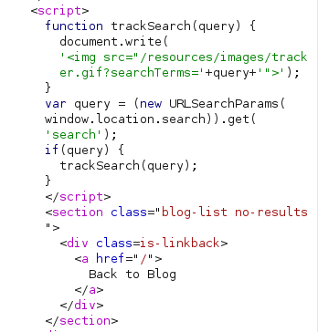
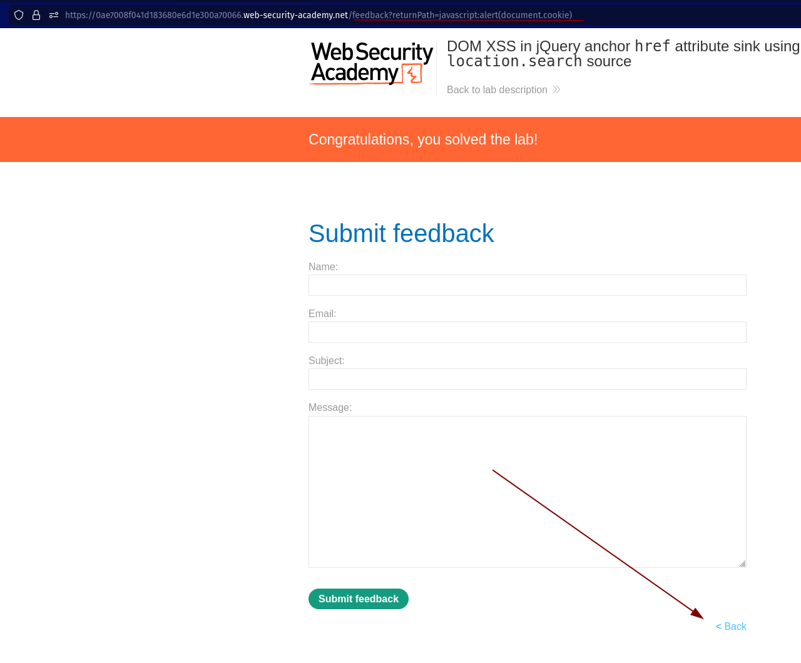
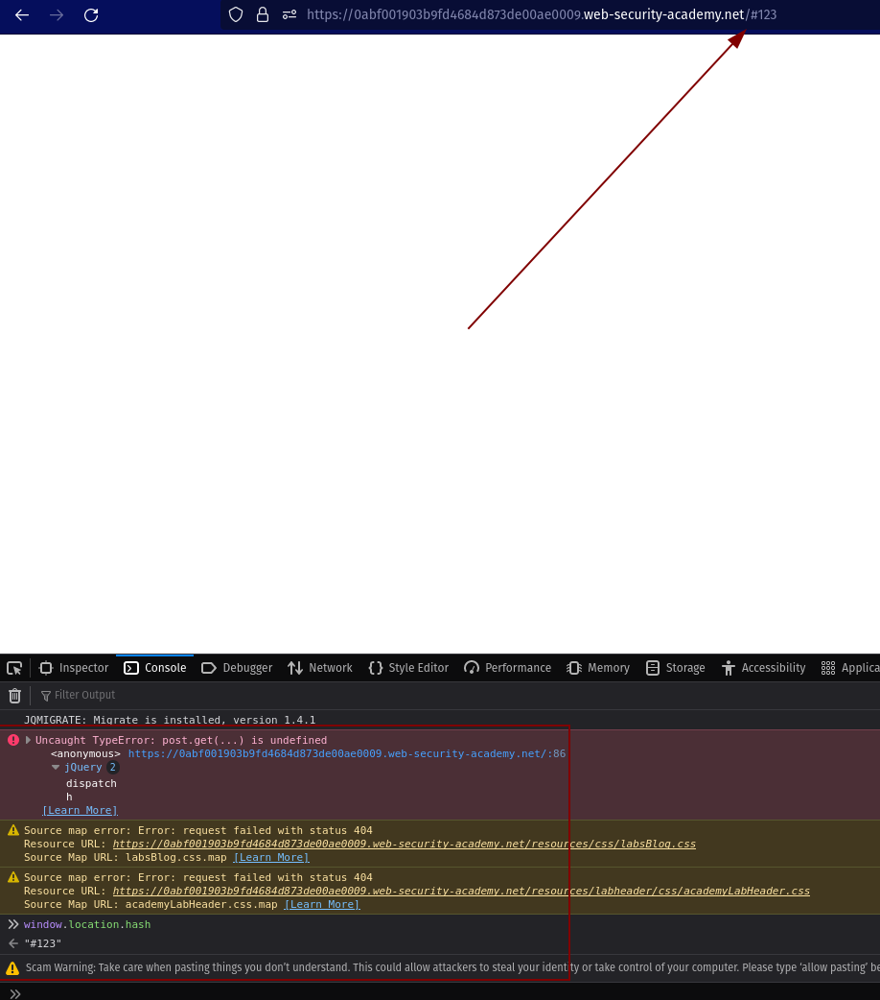
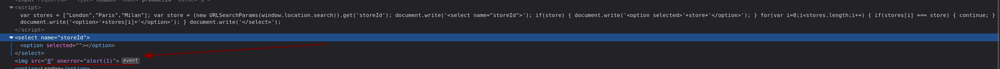

DOM XSS

senpre testart com

1.  

https://portswigger.net/web-security/cross-site-scripting/dom-based

esses são os caras que mais podem dar vuln de DOM XSS

`document.write() document.writeln() document.domain element.innerHTML element.outerHTML element.insertAdjacentHTML element.onevent`

uma query para resolver isso seria: **">&lt;script&gt;alert(location.search)&lt;/script&gt;**

**ta fechando a src com " e img com >**

**o innerHTML não roda &lt;script&gt; por isso um bom pra resolver:**

**``**

**https://samy.blog/element.innerhtml-and-xss-payloads/**

\*\*Essa foi muito louca, o parametro passada na url modificava o botao back la embaixo. \*\*

**vulnerabilidade no Jquery pegando todos os anchors com o $**

**javascript:alert(document.cookie)**

****

**Sempre perceba o Jquery pelo $**

**OUtra:**

**geralmente se usa o # para acessar sites.**

**Aqui ao digitar 123 n acontece nada porém ao verificar na console, da um erro no Jquery, e o windows.location.hash foi passado 123**

****

\*\*e o window.location.hash.slice(1) ta pegando a string depois do # \*\*

**Funcao vulneravel:**

$(window).on('hashchange', function(){

var post = $('section.blog-list h2:contains(' + decodeURIComponent(window.location.hash.slice(1)) + ')');

if (post) post.get(0).scrollIntoView();

});

Como ela ta sendo usada como bookmark para elementos h2 vc consegue digitar qualquer coisa depois do # que vai ser auto-scroll na pagina

## DOM XSS in `document.write` sink using source `location.search` inside a select element

product?productId=3&storeId=&lt;/option&gt;&lt;/select&gt;&lt;img src=0 onerror='alert(1)'&gt;

# Lab: [DOM XSS](https://portswigger.net/web-security/cross-site-scripting/dom-based) in [AngularJS](https://portswigger.net/web-security/cross-site-scripting/contexts/client-side-template-injection) expression with angle brackets and double quotes HTML-encoded

angularJS esta sendo deprecated desde 2022 agora eh so angular (typescript)

quando ter angular JS da pra dar olhar o {{}} o evaluation brackets, se por {{ 1 + 1}} retornar 2 eh pq tem uma flaw e n ta sendo sanatized

{{ $eval.constructor('alert()')() }}

ver arquivo `/home/smok1ng_sn4ke/Documents/bughunting/javascript_for_bug/angular.html`