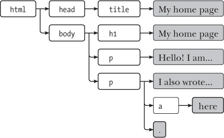
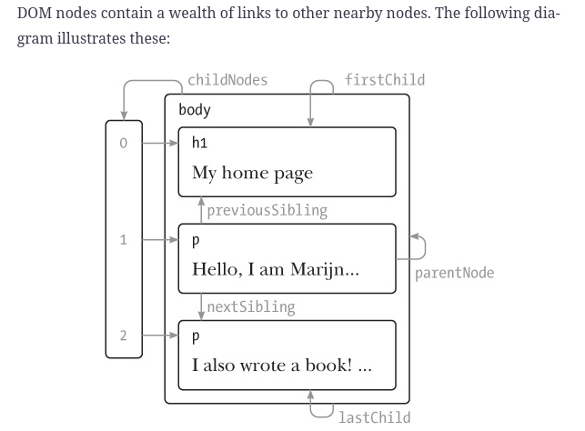
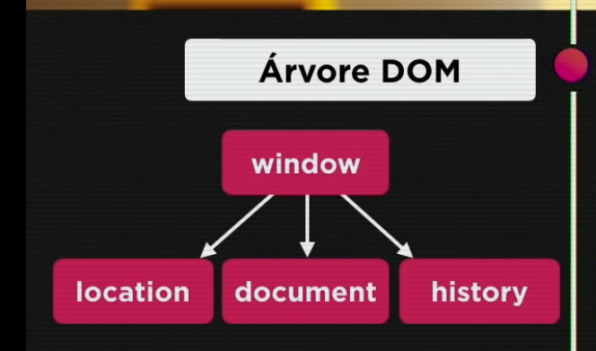
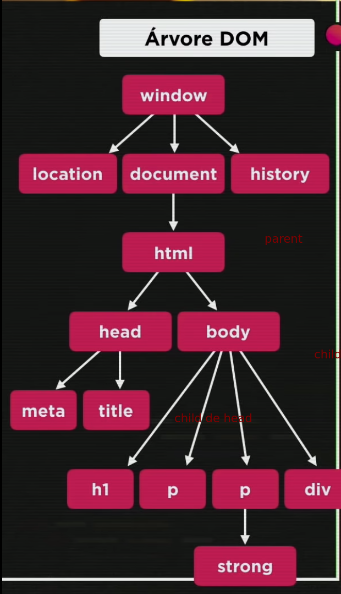
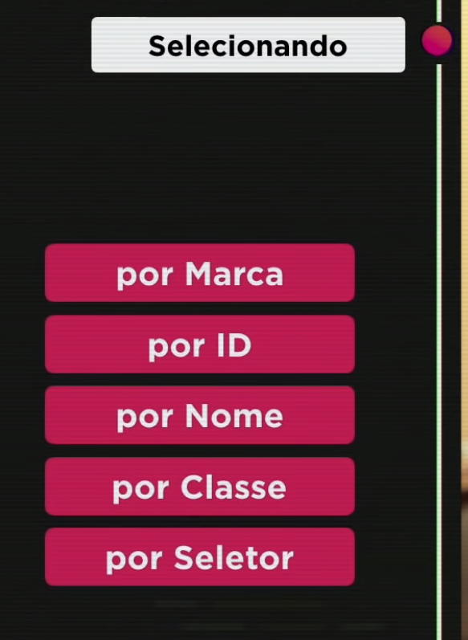
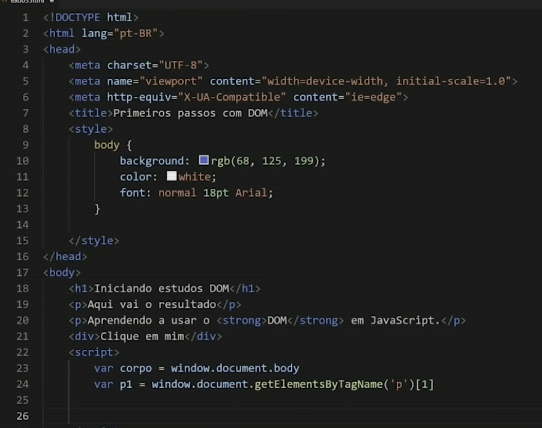

Javascript DOM

Each DOM node object has a nodeType property, which contains a code (number) that identifies the type of node. Elements have code 1, which is also defined as the constant property Node.ELEMENT\_NODE. Text nodes, representing a section of text in the document, get code 3 (Node.TEXT\_NODE). Comments have code 8 (Node.COMMENT_NODE).

pensa numa arvore, as folhas sao os textos, e as flexas indicam a relacao parent-child

****

****

**curso em video a arvore comeca com a root no navegador e a root eh o window**

**dentro de window tem location, document, history e muitos outros**

****

****

**da pra selecionar por **

****

**getElementsByTagName () por marca -> da pra selecionar mais de um objeto**

**getElementById() -> pega somente um**

**getElementsByName() -> pega varios**

**getElementsByClassName() -> classes seletor**

**querySelector('div#msg' )**

**querySelectorAll()**

**.o innerHtml or inner.Text**

****

**var post =  $('section.blog-list h2:contais(Procrastination)')**

**post.get(0) -> DOM element**

**var post =  $('section.blog-list h2:contais(Procrastinatio)')**

**post -> apesar de n ter match ele tem o objeto**

**if (post) {console.log('true');} -> ele existe carai**

**post.get(0).scrollIntoView**

**var post =  $('section.blog-list h2:contais(&lt;h1&gt;test&lt;/h1&gt;)') -> da match lollllll**

**var post = post.get(0) -> eh um dom element mas ele ta detached**

** var mynode = document.getElementById('academyLabHeader') **

**mynode.appendChild(post)**

let myimg = document.createElement('img')

myimg.src = 0 -> o http request eh feito para pegar a imagem. Eh aqui que vc vai se aproveitar

var post =  $('section.blog-list h2:contais(&lt;img src="0" onerror="alert()"&gt;)')

&lt;iframe src=" /#" onload="this.src+='&lt;/iframe&gt;