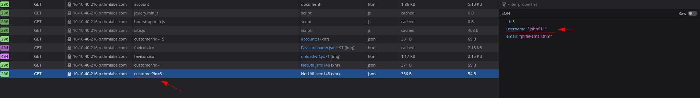

IDOR

insecure direct object reference

legal para descobrir paginas de outros usuários ou outros parametros passados diretamente na URL

tente sempre mudar os parametros das coisas para tentar achar essa vuln

os parametros geralmente vão estar hasheados ou encodados