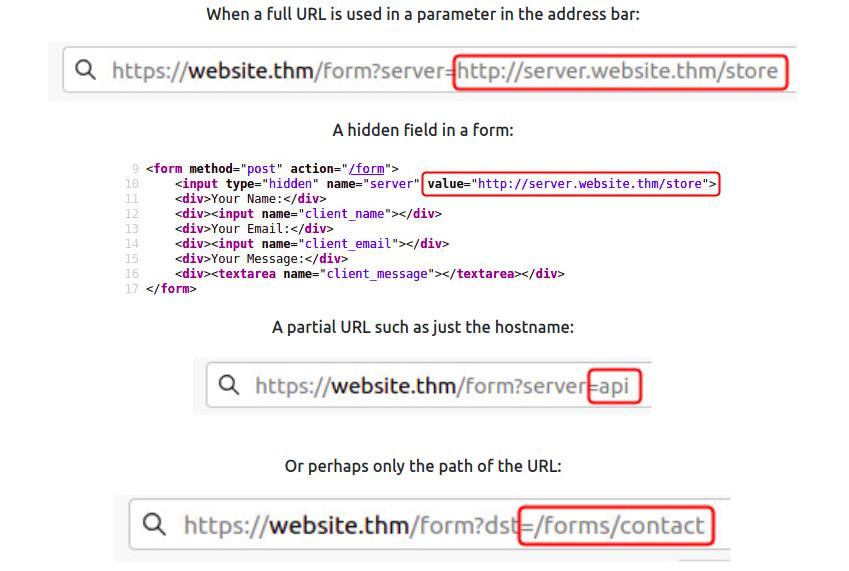

SSRF

onde procurar:

site pra monitorar blind SSRF = https://requestbin.com/

IP que pode conter informação util na cloud: 169.254.169.254, tente pegar um dns que aponte pra ele pois as empresas geralmente o bloqueiam.

& = redirect ou ? 

x&= cancela tudo da url seguinte

../ use directory traverse para acessar campos que vc nao conseguiria