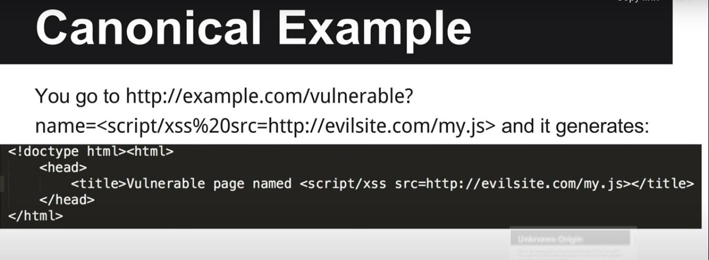
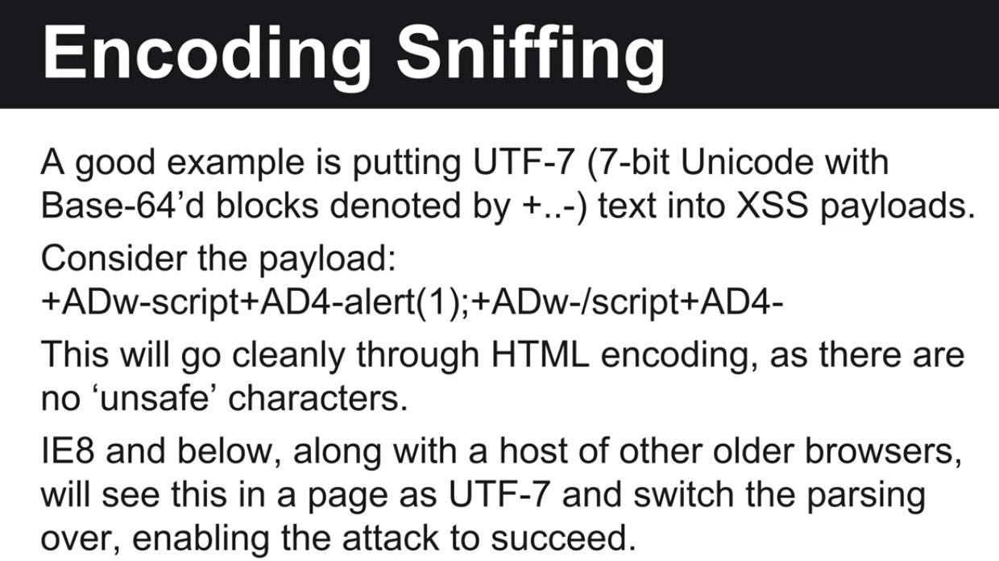
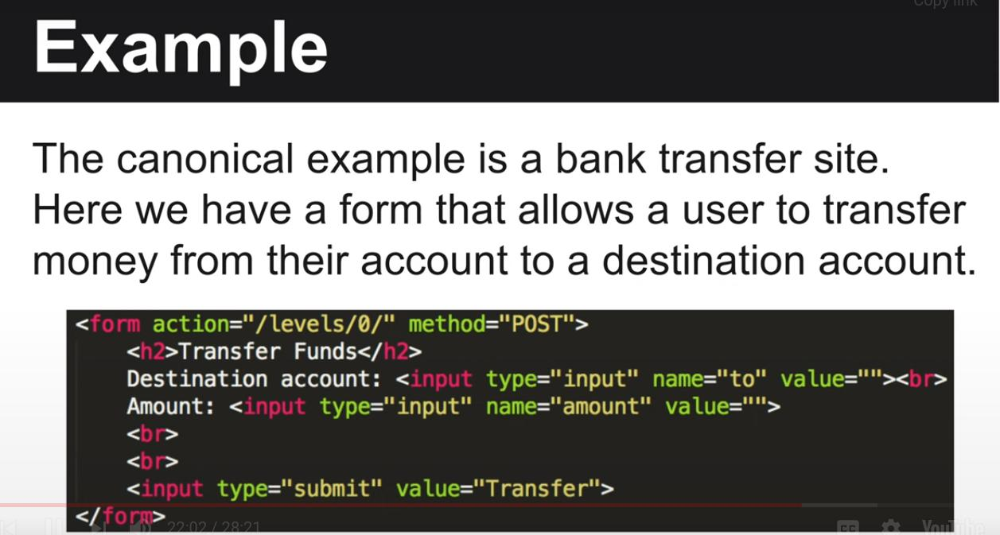
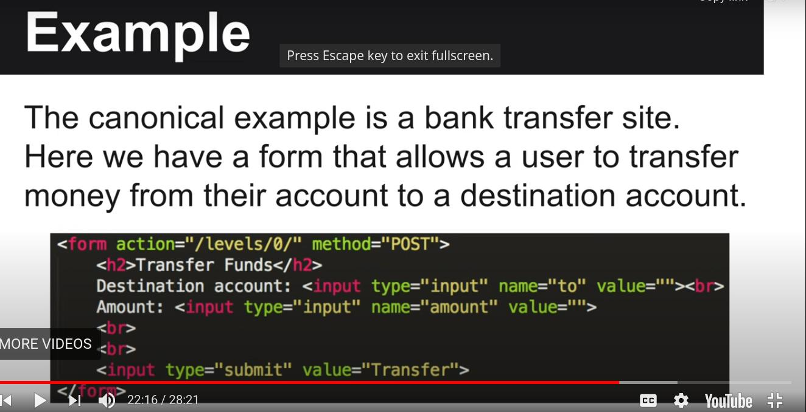
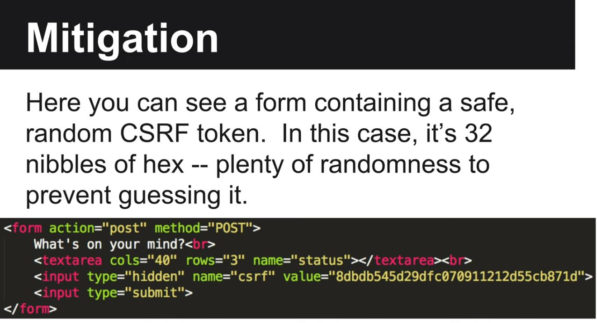
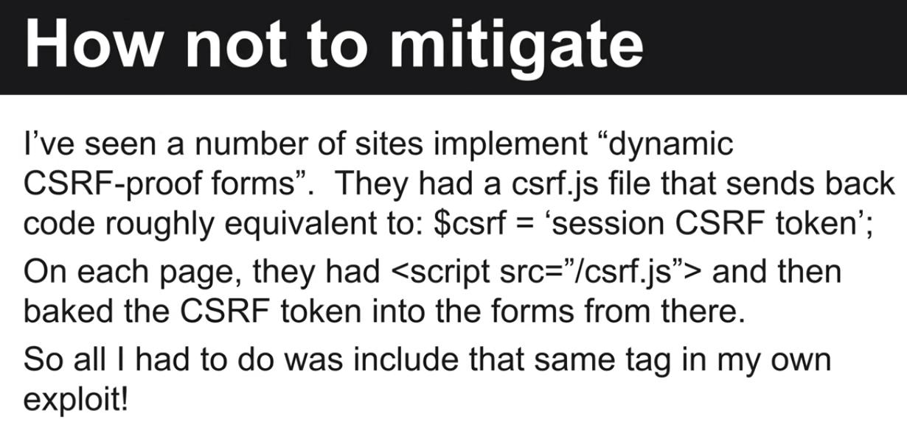

como a web funciona

https://www.hacker101.com/playlists/newcomers

http request

request header contem os seguintes parametros:

host: qual host vai manejar a request

accept: qual MIME type é aceito, geralemente usado para JSON ou XML output para web-services

cookie: passa dados de cookies para o server

referer: pagina que trouxe este request

authorization: basicamente usado para formas de auth basicas como &lt;base64´d user:passwd&gt;

Cokies -

são dados armazenados no cliente para alguma funcionalidade, eles sempre tem um periodo de existencia mesmo que alguns sejam longos.

segurança nos cookies:

pessoas tendem a esquecer de suprir os cookies para um determinado subdomíninio o que faz com que os hackers utilizem-no até nos roots "." dir fazendo coisas terriveis kkk.

Caso vc limite o cookie para ".teste.com", este so podera ser usado em todos os subdominios.

Agora se vc limitar por ".haha.teste.com", este so podera ser usado por subdominios tipo ".lul.haha.teste.com" ou outros, mas NÃO poderá ser usado em irmão como ".ye.teste.com"

setcookieheader:

duas flags importantes para os cookies:

secure: so pode ser usado em https

HTTPOnly:  não pode ser lido por javascript como "document.cookie" variable.

discrepansia no parseamento de html pode levar a quebras de segurança. Ex se um parser usar html4 e o Waf o 5 pode dar merda

mime sniffing:

se o browser acha que aquilo é html ele vai parsear aquilo como html, então olhe imagem e arquivos contendo tags html são executadas pelo browser

enconde sniffing

tente controlar o jeito que o browser faz decoding para talvez alterar o jeito que ele faz o parsing

sempre especificar MIME types

Same Origin Policy (SOP)

faz uma restrição sobre o que vc pode fazer de requisição como:

que dominios vc pode contactar via AJAX

[https://www.w3schools.com/XML/ajax\_xmlhttprequest\_send.asp](https://www.w3schools.com/XML/ajax_xmlhttprequest_send.asp)

acessar DOM (document object model) em frames/janelas separadas

o SOP é mais estrito do que o cookies pois ele limita coisas como:

tem que usar http/https, mesma porta 80 ou 443. Dominio tem que ter o match exato -- sem  * ou subdomain walking.

vc pode soltar um pouco o SOP document.domain em js

chrome extension usa post-messages os webdev quase nunca validam as mensagens

CORS (cross origin resource sharing)

permite criar request fora do SOP XMLHttpRequests

CSRF

ataque que faz a vitima se redirecionar para um site que o atacante controla, e dai o atacante manda dados para o site em ataque como se fosse a vitima.

CSRF TOKENS

Tipicamente quando vc usa um scanner de vuln em uma aplicação vai perceber que o GET muda o estado da aplicação o tempo todo. Então caso tenha o CSRF no POST e esteja ocorrendo mudança de estado em GET, isso está automaticamente QUEBRADO e vc pode exploitar

