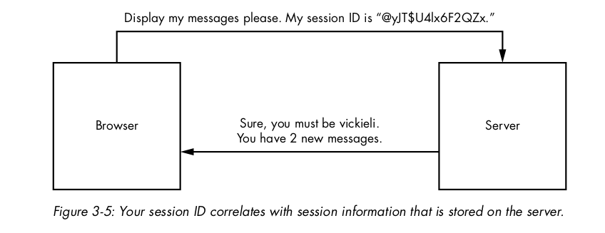
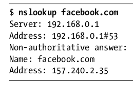
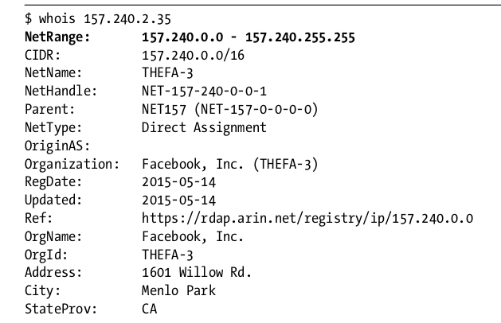
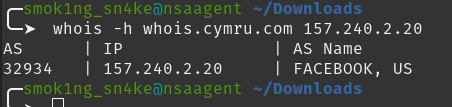
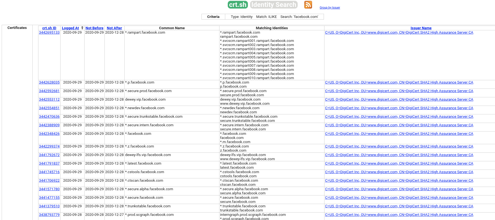
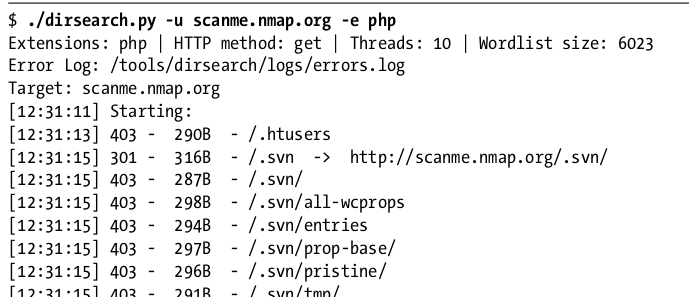
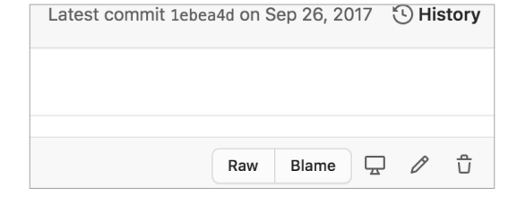
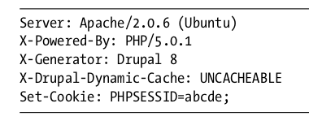

livro do bugbounty

social sites are a great way to begin

\-\- the more complex, mode user input validation not performed properly (sql, xss)

Facebook and Twitter are some of the most targeted programs.

\-\- mobile apps less competitive (da pra virtualizar o android, ter um rooted e um normal)

\-\- APIs (testa quase tudo, xml, json messages, é bom focar em data leaks e injection flaws)

\-\- source code and executables (mais dificil porem ninguem tenta)

\-\- IOT (a menos competitiva, requer comprar o produto)

SCOPO

\-\- asset scope -> where to hack

\-\- vulnerabitity scope -> which bugs are acceptable

TIPOS de PAYOUTS

vulnerability disclosure programs (VDPs)

Escrevendo um bom relatório

1- crie um bom título

Bom exemplo: “IDOR on a Critical Endpoint,” use one like “**IDOR on https://example.com/change_password Leads to Account Takeover for All Users.”**

**2- sumario**

**exemplo de um bom sumario:**

The https://example.com/change_password endpoint takes two POST

body parameters: user\_id and new\_password. A POST request

to this endpoint would change the password of user user_id to

new\_password. This endpoint is not validating the user\_id param-

eter, and as a result, any user can change anyone else’s password

by manipulating the user_id parameter.

**3- Inclua um assessment de severidade**

**Low severity**

The bug doesn’t have the potential to cause a lot of damage. For example,

an open redirect that can be used only for phishing is a low-severity bug.

**Medium severity**

The bug impacts users or the organization in a moderate way, or is a

high-severity issue that’s difficult for a malicious hacker to exploit. The

security team should focus on high- and critical-severity bugs first. For

example, a cross-site request forgery (CSRF) on a sensitive action such

as password change is often considered a medium-severity issue.

**High severity**

The bug impacts a large number of users, and its consequences can be

disastrous for these users. The security team should fix a high-security

bug as soon as possible. For example, an open redirect that can be used

to steal OAuth tokens is a high-severity bug.

**Critical severity**

The bug impacts a majority of the user base or endangers the organiza-

tion’s core infrastructure. The security team should fix a critical-severity

bug right away. For example, a SQL injection leading to remote code

execution (RCE) on the production server will be considered a critical

issue.

Common Vulnerability Scoring System (CVSS) at https://www.first.org/

cvss/

É possível usar as caluladores de severidades dos sites:

(https://bugcrowd.com/vulnerability-rating-taxonomy/), and HackerOne pro-

vides a severity calculator based on the CVSS scale (https://docs.hackerone

.com/hackers/severity.html).

You could list the severit

da pra indicar a severidade em uma linha:

Severity of the issue: High

**4 - de o passo a passo da reprodução:**

1\. Log in to the site and visit https://example.com/change_password.

2\. Click the Change Password button.

3\. Intercept the request, and change the user_id parameter to another

user’s ID.

Notice that these steps aren’t comprehensive or explicit. They don’t

specify that you need two test accounts to test for the vulnerability. They

also assume that you have enough knowledge about the application and the

format of its requests to carry out each step without more instructions.

**Now, here is an example from a better report:**

1\. Make two accounts on example.com: account A and account B.

2\. Log in to example.com as account A, and visit https://example.com/

change_password.

3\. Fill in the desired new password in the New password field, located at

the top left of the page.

4\. Click the Change Password button located at the top right of the page.

5\. Intercept the POST request to https://example.com/change_password and

change the user_id POST parameter to the user ID of account B.

6\. You can now log in to account B by using the new password you’ve

chosen.

5 - produzir um POC

na maioria ate o passo quatro já da pro gasto, mas para ataques mais complexos é necessário um proof of concept, por exemplo pra um CSFR, vc incluirá um arquivo HTML com o CSRF payload embutido. Ou um crafted XML por ex

6 - descreva o impacto causado e possíveis cenários

Using this vulnerability, all that an attacker needs in order to

change a user’s password is their user_id. Since each user’s public

profile page lists the account’s user_id, anyone can visit any user’s

profile, find out their user_id, and change their password. And

because user_ids are simply sequential numbers, a hacker can

even enumerate all the user_ids and change the passwords of all

users! This bug will let attackers take over anyone’s account with

minimal effort.

7- dar uma forma de mitigação ou correção

nao eh necessário mas é interessante

The application should validate the user’s user_id parameter

within the change password request to ensure that the user

is authorized to make account modifications. Unauthorized

requests should be rejected and logged by the application.

8 - por ultimo, valide o report

Por que vc não consegue achar bugs:

\- muda de programa em programa,

nao faz um bom recon,

so vai pras low hanging fruits

sempre de chain em bugs

For example, instead of reporting an open redirect, use it in a

server-side request forgery (SSRF) attack

**HTTP messages**

200 OK

300 redirect

400 erro por parte do cliente, 403 forbidden (pode dar pra bypassar o access control)

500 servidor

# **Commom encriptions**

## **content encoding:**

### base64

Q29udGVudCBFbmNvZGluZw==

(o base64 url usa caracteres não-alphanumericos e omita o padding ==)

### hex

436f6e74656e7420456e636f64696e67

https://en.wikipedia.org/wiki/Percent-encoding.

For example, the word localhost can be represented with its URL-encoded

equivalent, %6c%6f%63%61%6c%68%6f%73%74. You can calculate a hostname’s

https://www.urlencoder.org/

da pra usar o burp ou cyberchef

## **Session management and HTTP cookies**

**Aqui o server que armazena**

**quando vc loga o server cria uma session ID para te identificar, ao deslogar esse cookie é invalidado pelo server, e vc é deslogado.**

****

## **Token-based auth**

**Aqui o cliente que armazena info, da pra forjar tokens -> muita gente encripta achando que faz diferenca**

**um tipo mais reliable de token based Signatures:**

1\. The user logs in with their credentials.

2\. The server validates those credentials and provides the user with a signed token.

4\. The user sends the token with every request to prove their identity.

5\. Upon receiving and validating the token, the server reads the user’s iden-

tity information from the token and responds with confidential data.

## **JSON Web Tokens**

**tem tres componentes: o header, o payloader e a asssinatura**

**eyBhbGcgOiBIUzI1NiwgdHlwIDogSldUIH0K**

**(based64url-encoding for:)**

**{ "alg" : "HS256", "typ" : "JWT" }**

**{ "user_name" : "admin", }:**

**eyB1c2VyX25hbWUgOiBhZG1pbiB9Cg**

**signature**

For this specific token, the signature was generated by signing the

string **eyBhbGcgOiBIUzI1NiwgdHlwIDogSldUIH0K.eyB1c2VyX25hbWUgOiBhZG1pbiB9Cg.4Hb/6ibbVi****POzq9SJflsNGPWSk6B8F6EqVrkNjpXh7M**

with the **HS256 algorithm** using the secret key key. The complete token

concatenates each section (the header, payload, and signature), separating

them with a period (.):

**4Hb/6ibbViPOzq9SJflsNGPWSk6B8F6EqVrkNjpXh7M**

When implemented correctly, JSON web tokens provide a secure way to

identify the user. When the token arrives at the server, the server can verify

that the token has not been tampered with by checking that the signature

is correct. Then the server can deduce the user’s identity by using the infor-

mation contained in the payload section. And since the user does not have

access to the secret key used to sign the token, they cannot alter the payload

and sign the token themselves.

**But if implemented incorrectly, there are ways that an**

**attacker can bypass the security mechanism and forge arbitrary tokens.**

### Manipulating the alg Field

Sometimes applications fail to verify a token’s signature after it arrives at

the server. This allows an attacker to simply bypass the security mechanism

by providing an invalid or blank signature.

One way that attackers can forge their own tokens is by tampering with

the alg field of the token header, which lists the algorithm used to encode the

signature. If the application does not restrict the algorithm type used in the

JWT, an attacker can specify which algorithm to use, which could compro-

mise the security of the token.

JWT supports a none option for the algorithm type. If the alg field is set

to none, even tokens with empty signature sections would be considered valid.

Consider, for example, the following token:

eyAiYWxnIiA6ICJOb25lIiwgInR5cCIgOiAiSldUIiB9Cg.eyB1c2VyX25hbWUgOiBhZG1pbiB9Cg.

This token is simply the base64url-encoded versions of these two blobs,

with no signature present:

{ "alg" : "none", "typ" : "JWT" } { "user" : "admin" }

isso deveria ser desligado na produção, mas as x ele ta la.....

The two most common types of signing algorithms used

for JWTs are HMAC and RSA. HMAC requires the token to be signed with

a key and then later verified with the same key. When using RSA, the token

would first be created with a private key, then verified with the correspond-

ing public key, which anyone can read. It is critical that the secret key for

HMAC tokens and the private key for RSA tokens be kept a secret.

### Brute-Forcing the Key

### Reading Sensitive Information

## The Same-Origin Policy (SOP)

The same-origin policy (SOP) is a rule that restricts how a script from one ori-

gin can interact with the resources of a different origin. In one sentence,

the SOP is this: a script from page A can access data from page B only if the

pages are of the same origin. This rule protects modern web applications

and prevents many common web vulnerabilities.

Two URLs are said to have the same origin if they share the same pro-

tocol, hostname, and port number. Let’s look at some examples. Page A is

at this URL:

https://medium.com/@vickieli

It uses HTTPS, which, remember, uses port 443 by default. Now look

at the following pages to determine which has the same origin as page A,

according to the SOP:

https://medium.com/

http://medium.com/

https://twitter.com/@vickieli7

https://medium.com:8080/@vickieli

Acho que isso aqui é a famosa: vc esta saindo da pagina e indo pra outro dominio, deseja continuar?

# Formas de recon:

## manualmente reconhecendo o target:

por exemplo se vc estiver no facebook, tente entrar e sair de varias páginas, jogar jogos, quanto mais a plataforma oferecer mais **attacks surfaces** vc terá

## Google Dorking

(ReDoS vulnerability)

inurl:"/course/jumpto.php" site:example.com.

intittle:"index of"

link:"https://en.wikipedia.org/wiki/ReDoS".

filetype:log site:example.com

wildcard:

retorna qualquer operador que termina com using google

how to hack * using Google".

" " força um match especifico

or

"how to hack" site:(reddit.com | stackoverflow.com)

"how to hack websites" -php.

Usabilidades

site:example.com inurl:app/kibana

achando resources de empresas

site:s3.amazonaws.com COMPANY_NAME

extensoes especiais

site:example.com ext:php

site:example.com ext:log

(https://www.exploit-db.com/google-hacking-database/)

## Scope Discovery

Whois -> informações sobre o ambiente

reverse whois https://viewdns.info/reversewhois/

da um query no facebook para vc enteder o domain privacy

reverse IP whois depois de usar a ferramenta com o dominio

Autonomous system numbers (ASNs) -> identifica os donos daquela rede

whois -h whois.cymru.com 157.240.2.20 1

Se possui o mesmo AS a empresa possui o range

Censys, Cert Spotter

crt.sh -> para verificar mais sites:

o SSL certificate permite usar o Subject Alternative Name, que é onde o site busca

https://crt.sh/

?q=facebook.com&output=json.

wordlists para subdomain discover:

https://github.com/danielmiessler/SecLists/

cria wordlists

https://github.com/assetnote/commonspeak2

remove duplicatas:

sort -u wordlist1.txt wordlist2.txt

usar o gobuster para brute force de subdominios, o DNS mode é feito para bruteforce

gobuster dns -d target_domain -w wordlist

ferramenta que pega dominios em permutação e padroes

https://github.com/infosec-au/altdns/

nmap e shodan né kk

tb tem esses dois Censys and Project Sonar.

directory brute forcing:

200 existe, 404 nao existe, 403 existe mas esta protegido.

É bom examinar as 403 pra ver se da pra bypassar

./dirsearch.py -u scanme.nmap.org -e php

da pra usar o gobuster tb:

gobuster dir -u target_url -w wordlist

Keep an eye out for hidden services, such as developer or admin panels,

directory listing pages, analytics pages, and pages that look outdated and ill-

maintained. These are all common places for vulnerabilities to manifest.

usa essas duas aplicações para tirar prints de diretorios:

https://github.com/RedSiege/EyeWitness

https://github.com/dxa4481/Snapper/

craw through a site

tools -> spider

OWASP Zed Attack Proxy (ZAP) at https://www.zaproxy.org/

Third-Party Hosting

Amazon GOOGLE DORKS

BUCKET.s3.amazonaws.com or s3.amazonaws.com/BUCKET

site:s3.amazonaws.com COMPANY_NAME

site:amazonaws.com COMPANY_NAME

amazonaws s3 COMPANY_NAME

amazonaws bucket COMPANY_NAME

amazonaws COMPANY_NAME

s3 COMPANY_NAME

OUTRA FORMA DE ACHAR BUCKETS

https://buckets.grayhatwarfare.com/

OUTRA FORMA:

https://github.com/nahamsec/lazys3/

https://github.com/eth0izzle/bucket-stream/

PARA ACESSAR O BUCKET

so de acessar o bucket ja é uma vulnerabilidade, criar remover e copiar conteudo mais ainda

pip install awscli

aws s3 ls s3://BUCKET_NAME/

aws s3 cp s3://BUCKET\_NAME/FILE\_NAME/path/to/local/directory

aws s3 cp TEST\_FILE s3://BUCKET\_NAME/

aws s3 rm s3://BUCKET\_NAME/TEST\_FILE

github recon

achar o github da organizacao e fuçar ate achar info

prestar atencao nos Issues e Commit, tentar ir no Code section para possivel vulnerable code snippets

asism que achar um arquivo interessante, checar o Blame and History:

pesquise por key, secret and password para achar credenciais.

assim que achar entre no site:

https://github.com/streaak/keyhacks/

See

if any of the source code deals with important functions such as authen-

tication, password reset, state-changing actions, or private info reads. Pay

attention to code that deals with user input, such as HTTP request param-

eters, HTTP headers, HTTP request paths, database entries, file reads, and

file uploads, because they provide potential entry points for attackers to

exploit the application’s vulnerabilities.

procure por endpoints antigos e S3 buckets urls, recorde tudo

dependencias datadas e funcoes perigosas tb, imports, veja a lista de versoes

ve possiveis arquivos sensitivos sendo usados no git

https://github.com/michenriksen/gitrob/

se especializa em pegar segredos:

https://github.com/trufflesecurity/truffleHog/

pastehunter para fazer a osint do pastebin automatico:

https://github.com/kevthehermit/PasteHunter/

wayback:

https://archive.org/web/

https://github.com/tomnomnom/waybackurls/

tech stack fingerprinting:

[https://cve.mitre.org/cve/search\_cve\_list.html](https://cve.mitre.org/cve/search_cve_list.html)

nmap scanme.nmap.org -sV

pega informaçÕes do site, sendo que sao usadas tecnologias de php, Drupal e usando um cookie especifico do php

View source code, ctrl-f pesquise por powered by, built with, running.

checar por extensoes específicas: phpmyadmin, jinja2 (django)

Wappalyser

https://builtwith.com/

permite desenvolvedores compartilharem techs que eles usam

https://stackshare.io/

checa libraries de javascript e node.js, da pra checar outdated packages nos sites

https://github.com/retirejs/retire.js/

a partir daqui eu copiei o script de recon no meu pc

mostra diversas APIs de recon:

https://github.com/lanmaster53/recon-ng-marketplace/wiki/API-Keys/