# metodologia

tudo pego do: https://www.youtube.com/watch?v=p4JgIu1mceI

# The Bug Hunter's Methodology v4.0 - Recon Edition by [@jhaddix](https://www.youtube.com/channel/UCk0f0svao7AKeK3RfiWxXEA)  [#NahamCon2020](https://www.youtube.com/hashtag/nahamcon2020)!

ver aquisições feitas por empresas www.crunchbase.com 

ver ASN (enumeracao)

https://bgp.he.net/ site

Metabigor

ASNlookup

Amass -> pega o numero ASN e pega os sites que possuem o mesmo numero

whoxy.com -> reverse whois

domlink automatiza com a API

builtwith acredito que seja tipo um wappalizer

googlefu inurl

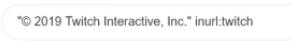

shodan

# subdomain enumaration

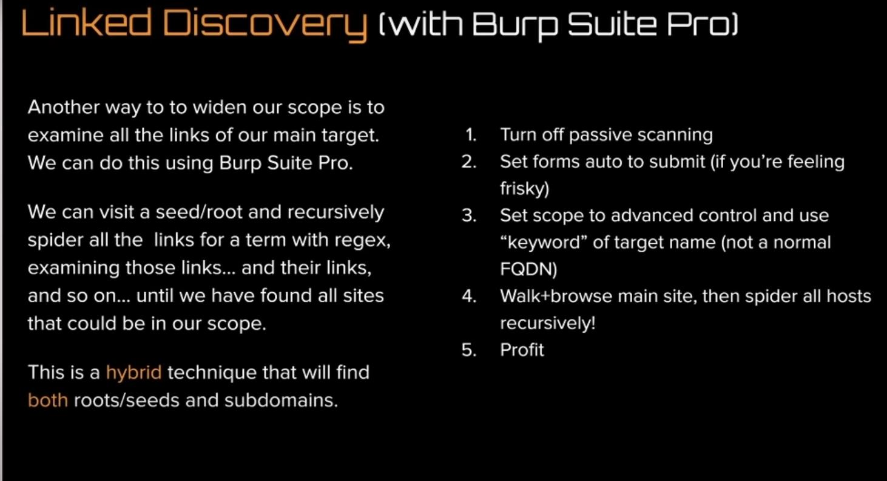

GoSpider

Hakrawler

Subdomainizer

subscraper

subdomain scrapping tools

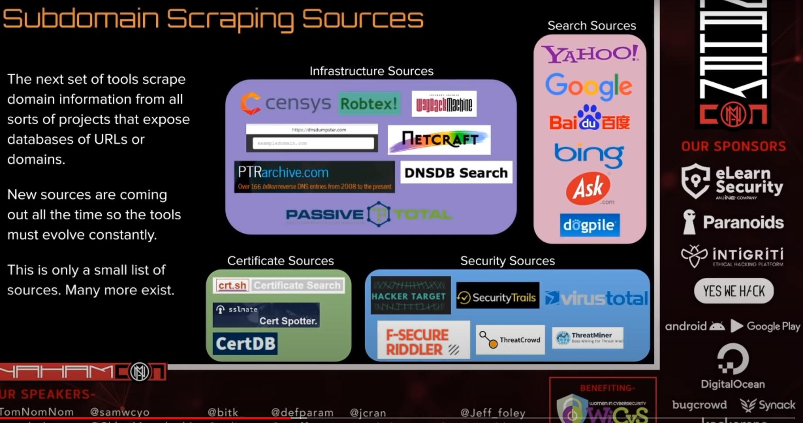

em sites de procura:

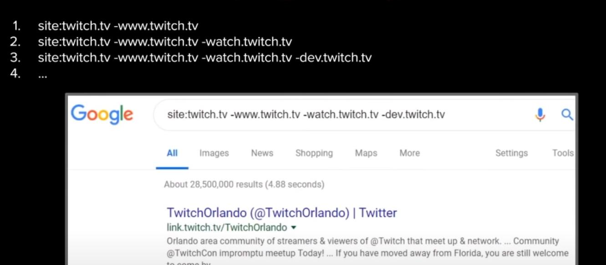

Amass e subfinder podem ser automatizados

Usar o github-subdomains

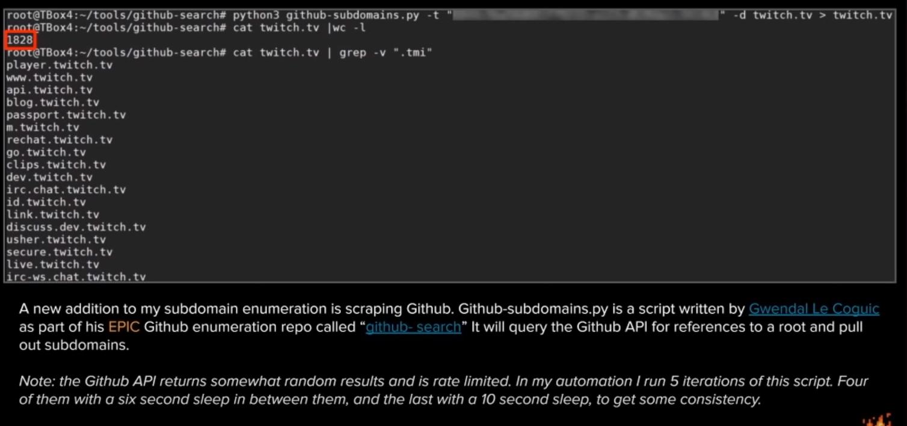

faça vc mesmo:

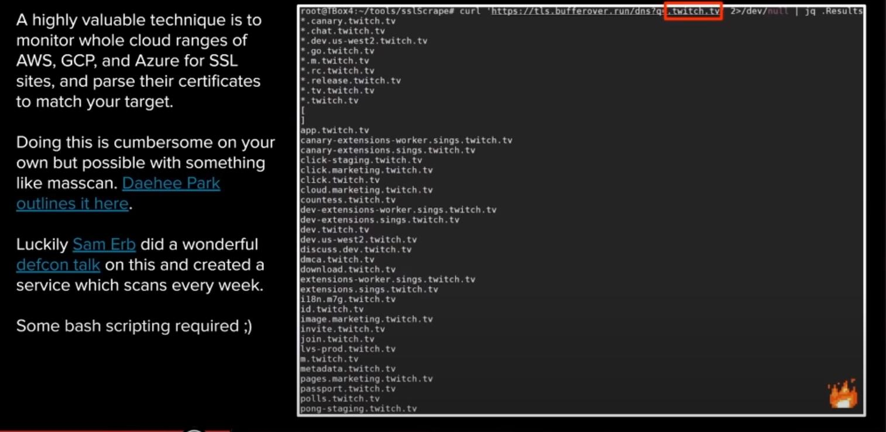

shosubgo

inc0gbyt3

subdomain Bruteforce

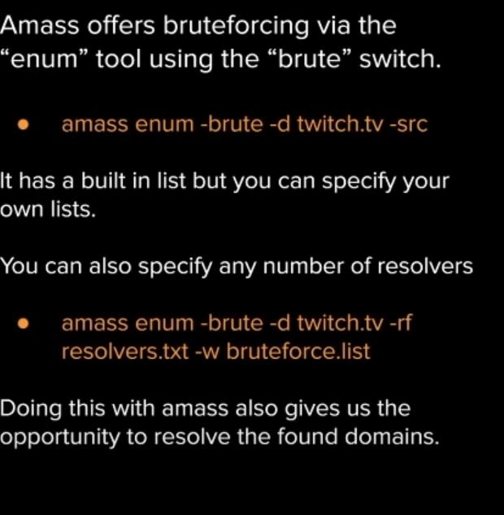

shuffleDNS precisa da sua propria wordlist se n me engano

alteration scanning tipo duh.twitch.com ou hud.twitch.com

Naffy para isso o Amass tb faz 

Port Scan

Masscan é mais rapido para ver portas TCP abertas, a ideia é pegar essas e mandar pro nmap para a coisa mais bonita

dnsmasscan

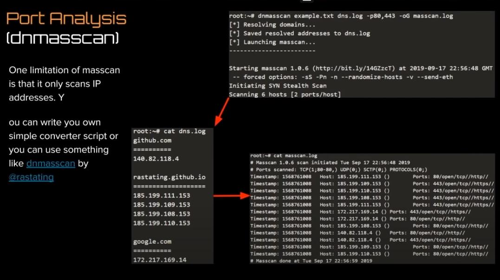

escanear serviços -> fazer um script

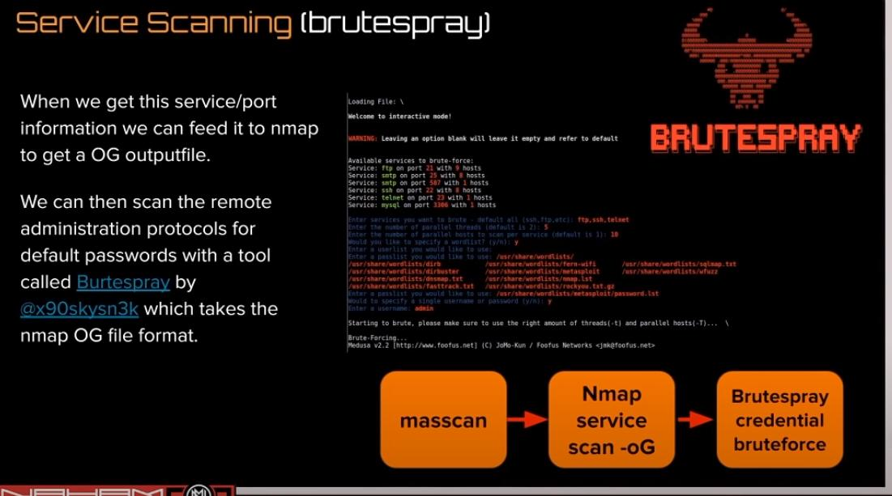

Github DORKING

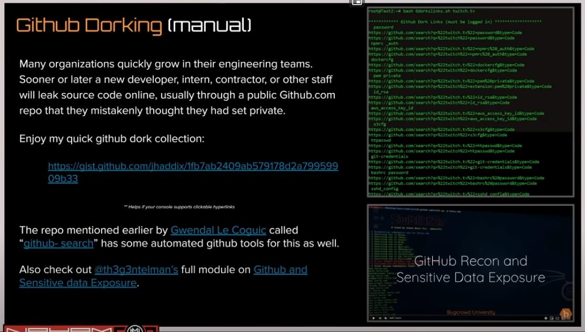

Screenshotting tools

Aquatone

HTTPscreenshot

Eyewitness

Subdomain TAKEOVER

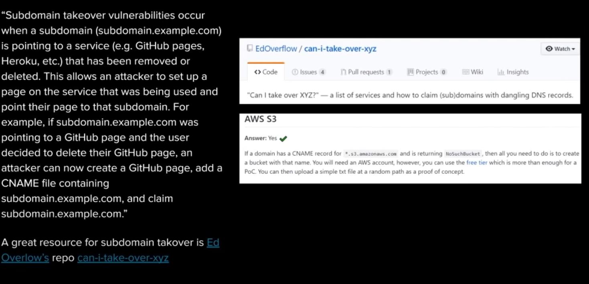

Project Discovery nuclei scanner

Automação

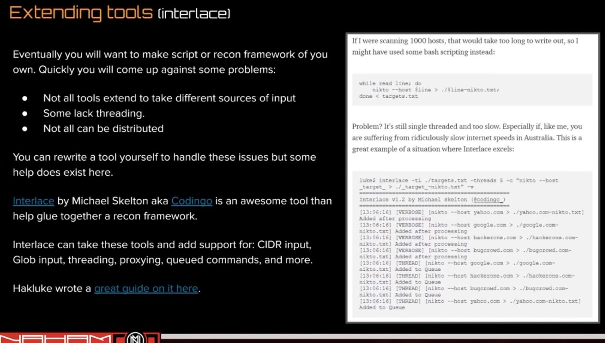

acompanha esse cara

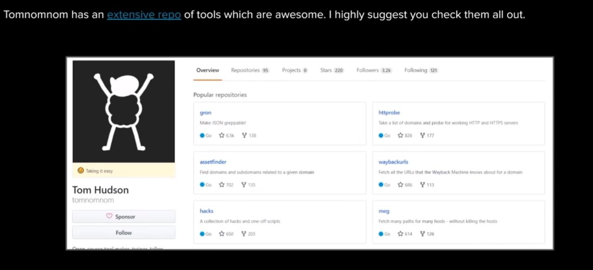

Frameworks

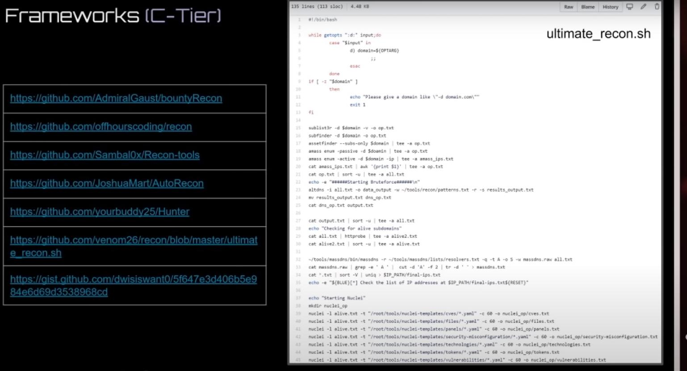

framework S+

https://www.mandiant.com

https://assetnote.io

spiderfoot