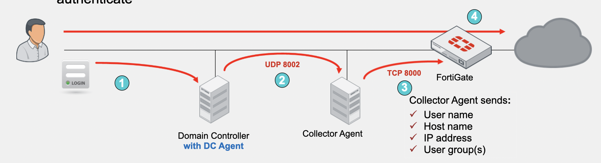
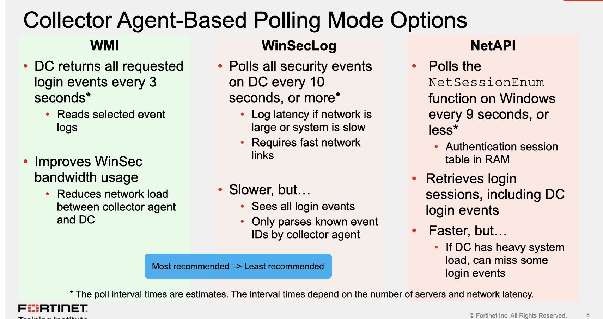
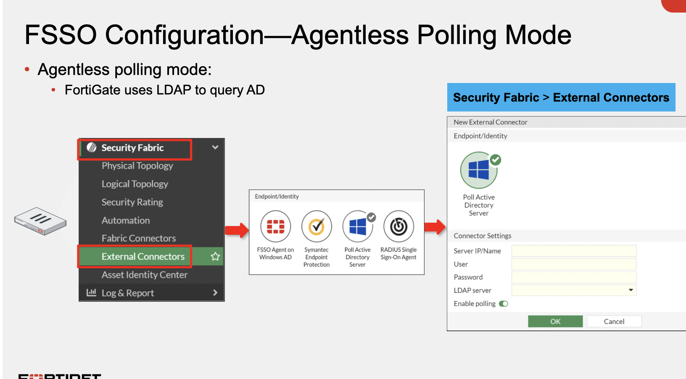
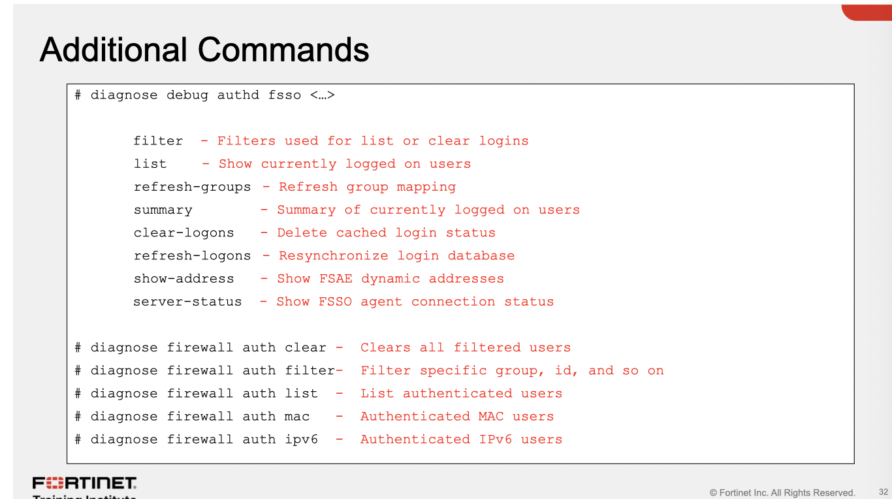

FSSO Dev

&nbsp;

# Microsoft Active Directory

tem dois modos:

DC agent mode

polling mode: agent colector or agentless

Terminal server (TS) agent

&nbsp;       melhora a capacidade do collector agent ou FortiAuthentication

&nbsp;       pega login do Citrix e terminal servers onde multiplos usuarios compartilham do mesmo IP

# Novel eDirectory

edirectory agent

usa Novell API ou LDAP

&nbsp;

# DC Agent Mode

requer o DC agent (dcagent.dll) instalado em todo Windows DC em Windows\\system32

É ressponsavel por:

monitorar eventos de login e encaminhá-los para os agentes colletores

handling DNS lookups (by default)

requer um ou mais coletores instalados nos Windows servers. O colector agent é responsável por:

verificação de grupo

checagem de workstation

updates de records de login no FGT

mandar informações para o FGT como local security group, OUs, e global security groups

# DC agent mode process

1- O usuario autentica com o Windows DC

2- DC agent ve o login e encaminha para o collector agent

3- O collector agent recebe o evento do DC agent e encaminha pro FGT

4- O FGT sabe o usuario baseado no seu endereço IP, então ele não precisa se autenticar ativamente.

porta 8002 (UDP) entre o DC agent e Collection Agent

port 8000 (TCP) entre o Agent e o FGT

# Collector Agent-Based Polling Mode

Nesse modo não é necessario o DC agent

A cada secundo o collector agent faz o polling em cada DC buscando eventos de login ele usa: SMB (TCP 445) para logs de eventos e TCP 135, 139 e UDP (137) como fallbacks

&nbsp; Esse modo é mais simples oferecendo menos manuntenção, usa tres modos:

&nbsp;       NETAPI

&nbsp;       WinSecLog

&nbsp;        WMI

Event loggin precisa estar habilitado nos DCs (GPO) (exceto no NetAPI)

desses 3 o melhor continua sendo o WMI:

processo:

1- user autentica no DC

2- colector faz o polling frequente para pegar eventos de login (445)

3- coletor encaminha logins  (username, host, ip, user group) ao FGT (8000)

4- usuario nao precisa logar ativamente.

# Agentless Polling mode

Nesse modo o FGT que faz o polling, nao eh recomendado pois aumenta CPU e RAM e possui menos features. FGT usa o SMB para ler WinSecLoc only, e nao faz pool em workstation

# Requerimentos adicionas

o DNS servers precisa resolver todos os nomes

&nbsp;       os logins de evento so contem nomes, nunca IPs

&nbsp;       o coletor agent usa o DNS server para resolver nomes em IPs

Para full feature, o collector agent precisa conseguir dar poll em workstations -> eh necessario ter a SMB (445) e 139 abertos em todos os hosts, Assim como o WMI habilitado em workstations remotos

# Agenttless

&nbsp;

