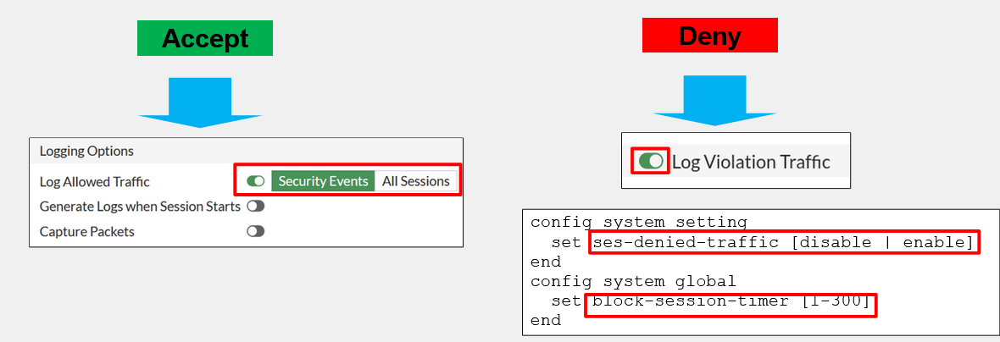
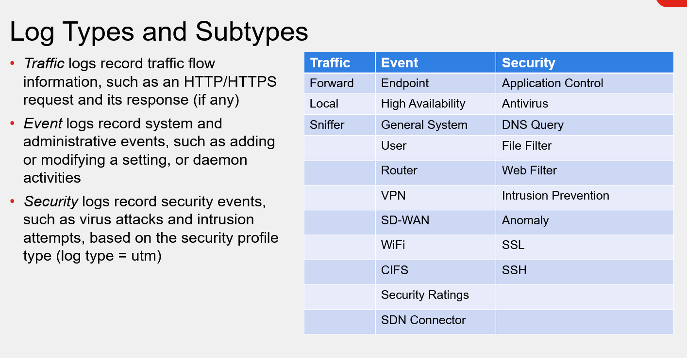
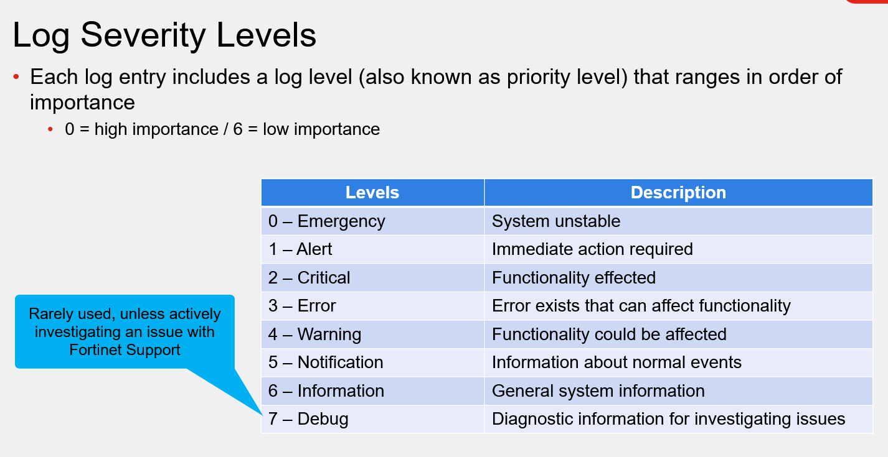
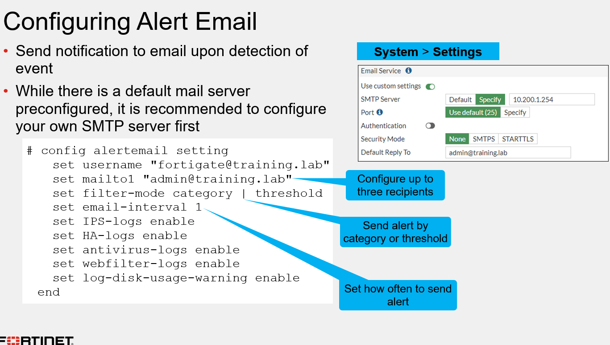

Log Types

&nbsp;

&nbsp;

no security event somente logs da UTM serão logados, as outras opção trazem uma granularidade maior para a inspeção de pacotes.

ja nas logs de deny se acionar a opção de log violation, da para configurar na CLI um timing para que não fique batendo log para cada pacote novo dropado.

