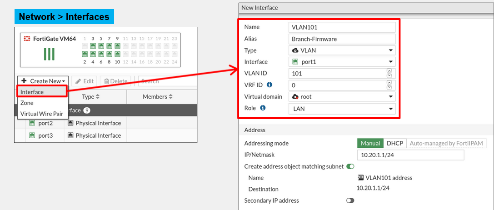

NSE4

não existe DHCP na role de WAN

Device detection é para ajudar na detecção de hosts dentro da LAN

&nbsp;

VLAN:

Frames que são enviados ou recebidos por interfaces fisicas nunca são taggeadas, eles pertencem a VLAN nativa.

 

&nbsp;

se a interface for DHCP ou PPOE a rota pode ser dinâmica