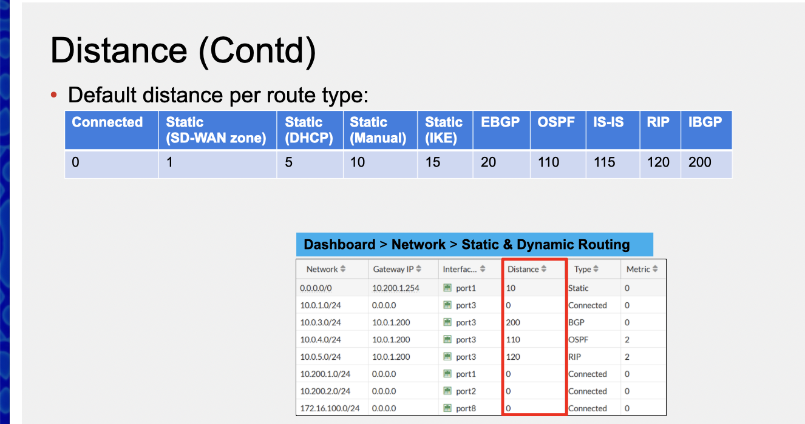
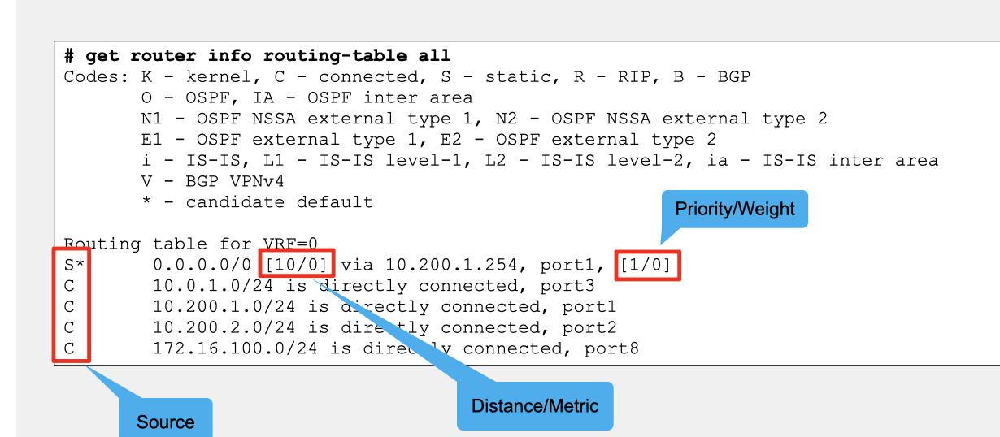
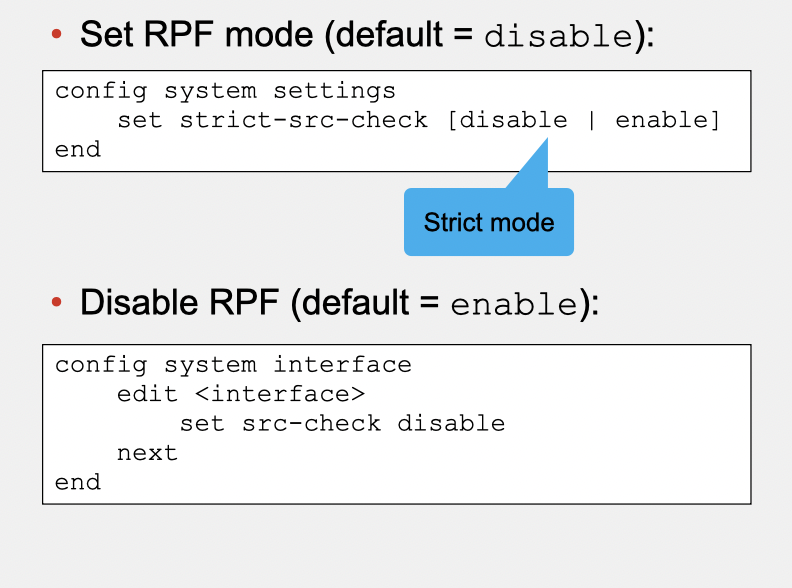
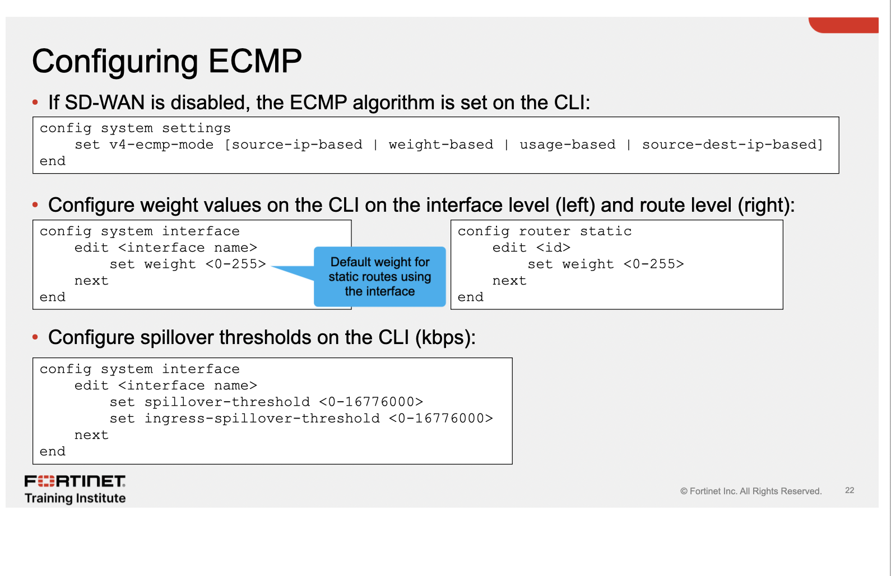

ROUTING

o default do FGT é trabalhar em NAT mode

possui dois tipos de rota:

RIB: rota padrão contendo as rotas ativas ou melhores conectadas, staticas, dinamicas etc. Visivel na GUI e CLI

FIB: Rotas do kernel, basicamente composta de RIBs, mais especificas do sistema, usado para fazer lookups, CLI only

**da pra fazer rota estatica com ISDB** 

a rota com menor distancia ganha para duplicatas, as rotas de menor distancia ficam na RIB

&nbsp;

para duplicatas em protocolos iguais é a **Metrica** 

**Prioridade** é a quebra de duplicatas para ECMP (equal-cost multi-path routing)

***get router info routing-table all***

******

# reverse path forwarding 

proteção anti-spoofing ip source é checado no retorno, RPF é checado no primeiro pacote da seção

dois modos:

Feasible (loose) -> nao precisa ter a melhor rota

Strict -> return path precisa ser a melhor rota

Se o RPF o debug mostra o seguinte: ***reverse path check fail, drop***

******

# ECMP

rotas iguais com o mesmo protocolo, e mesma distancia, metrica, prioridade e DST subnet. Instalado na RIB, é usado um load balancer entre as interfaces

o loadbalancer usados são: src ip (defult) src-dst, weighted (somente estaticas, sao distribuidas atraves dos pesos das interfaces), quanto maior o peso maior as seções passadas para a rota. Usage (spillover) quado o threshold é gasto, a proxima rota é usada.

existem dois ECMPs (default) e ECMP SDWAN

o sdwan usa suas proprias metricas, tem uma parte de volume, membros do sdwan, e tem um spillover próprio.

para rotas dinamicas em ECMP ele determina via Metrica