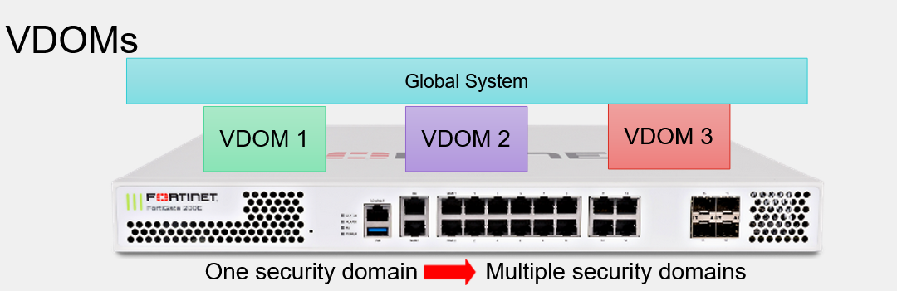

VDOM

todo ambiente é virtualizado, cada VDOM possui um central de rede totalemente apartada e por isso pode possuir IPs iguais nas interfaces sem que haja overlap.

Até 10 VDOMs podem ser usadas.

&nbsp;

