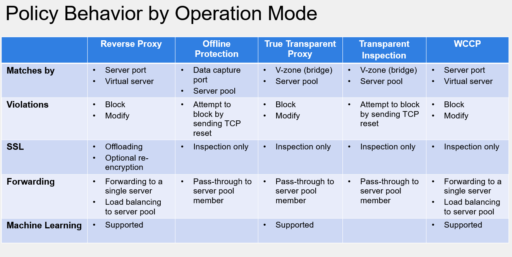
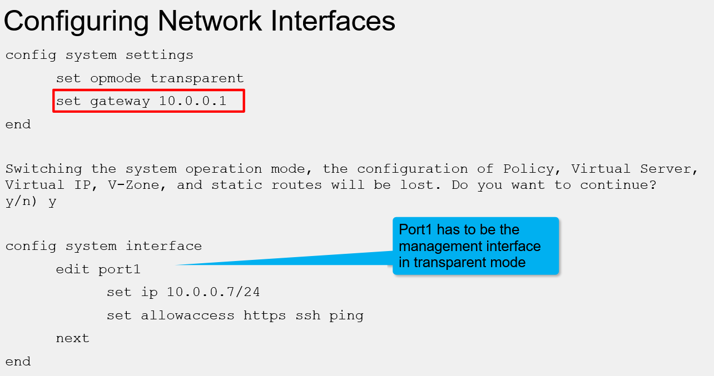

WAF (fortiWeb)

caso ele detecte um ataque ele volta com um RST ou HTTP error (da um indicio bacana de que existe um waf na rede)

**reverse proxy** -> proxy de costume, vai ter um IP dentro da rede que vai redirecionar para os servers HTTP

**true transparent proxy ->** o fortigate redireciona o trafego para os servers e o fortiweb intercepta o trafego

**transparent inspection mode** -> ele vai passar todo o trafego para os servers porem so vai detectar na volta? nesse modo ele não muda o tráfego, apenas bloqueia e manda RST.

**offline protection mode** -> precisa de uma porta SPAN no fortigate. É o que menos tem função, mas ainda sim bloqueia trafego de ataques com um RST. (**ELE TENTA PARAR O ATAQUE**)

****

**se for usar algum transparent mode, isso reseta a config de rede. Por isso não faça o setup da rede logo de cara pois irá perder conectividade, após a config, somente a porta 1 pode ser usada como admin**

****

```bash
config system settings

    set opmode <todos>
```

**ADOMs -> subdividem as configuracoes, ótimo para multitenent. similar aos vdoms da fortigate**

da para aprovar ou não regras de assinatura do fortiguard em **system > config > fortiguard.**