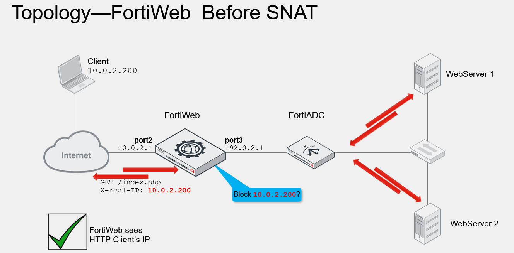
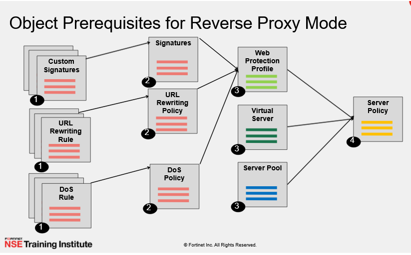

WAF setup

**\- traffic mirror:**

direct mode, switch mode, server mode

caso use algum loadbalancer:

X-FORWARD-FOR ou X-real-IP para utilizar com SNAT

&nbsp;

autentication so é viavel em authentication.

&nbsp;

politicas:

ordem de fazer as configuracoes do waf:

&nbsp;