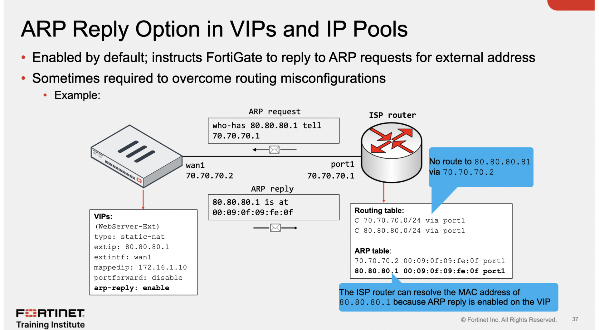

aprofundar

&nbsp;

Loose Strict RPF

autenticação do via DCAgent

&nbsp;

root fortigate em security fabric

Xauth o que eh?

set match-vip enable

feature comum em SDWan e IPv4 ECMP

&nbsp;

fortitoken

proxy-based tco session failover

carrier-grade NAT deployments

Tem dois tipos de conexão via NAT o SNAT vc coloca na regra, e ativa o outgoing int addr ( sia com o ed da interface, como por ex a wan) ou dinamic pool (para sair com o range de ip dinamico)

ao usar o outgoing, se uma porta ja estiver sendo usada o FGT usa uma porta dinamica no SNAT para impedir que tenha um crash de sessão

traffic inspection and CA

&nbsp;

Carrier grade NAT (CGN) é usada pelas ISPs:

O Fiexed port range e Port block allocation são dois tipos de NAT usados para que os consumidores não possam realizar NATs de suas casas (port forwarding).

&nbsp;

IP pools, o SNAT é usado para que na sessão o host possua o mesmo IP.

One to One -> se não tiver IPs no pool, o pacote será dropado

Overload (default) -> mesmo principio so que as portas tb vão ser contabilizadas ou seja 60416 \* 2 (ips) da uma cacetada de sockets a serem usados.

&nbsp;

arp reply é habilitado por default nos VIPS e Pools -> é interessante para contornar problemas de roteamento.

