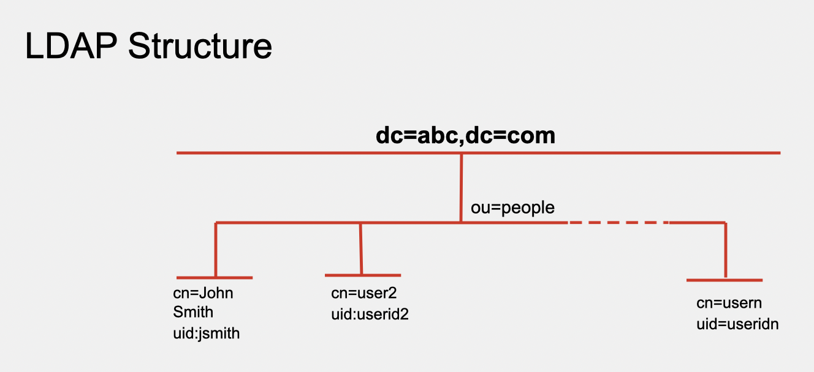
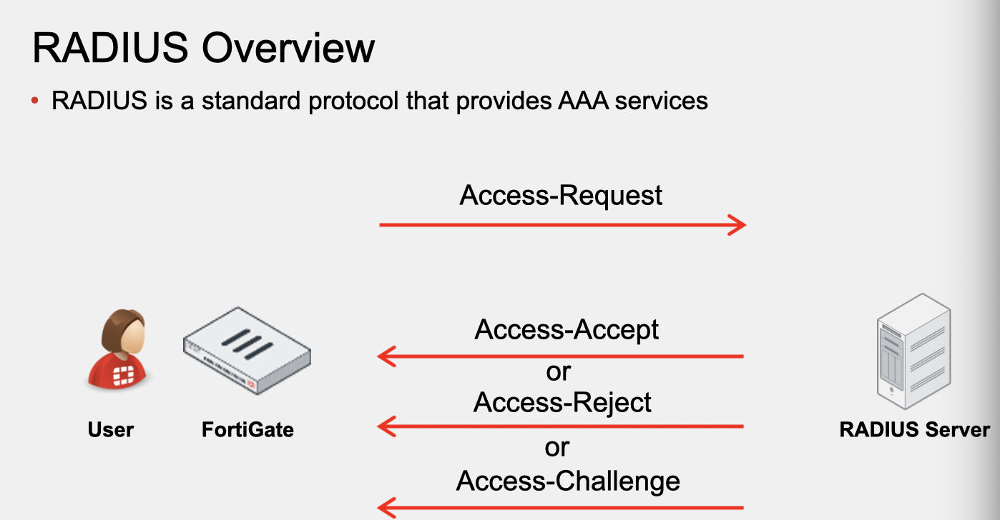
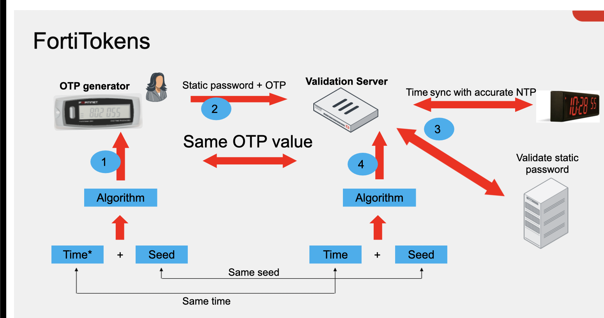

LDAP

&nbsp;

port 389 or 636

estrutura do LDAP

dc=ab,=dc=com



&nbsp;

uid=admin,cn=Users,dc=sairAIM7,dc=com,dc=br

Radius Overview (AAA)

a verificação dos grupos é providenciada pelo vendor-specific attributes (VSAs) configuradas no RADIUS server.



&nbsp;

# Diagnostico

diagnose test authserver ldap &lt;server_name&gt; &lt;username&gt; &lt;password&gt;

diagnose test authserver radius &lt;server_name&gt; &lt;scheme&gt; &lt;user&gt; &lt;password&gt;

# OTP methods

fortitoken 200 ou fortitoken mobile

email ou sms

FortiTOken mobile push

sempre usar NTP



# Authentication Methods

ativo: usuario recebe um prompt de login, precisa das credenciais para autenticar.

passivo: usuario nao recebe um login do FGT, credenciais sao determinadas automaticamente dependendo do tipo de auth, como ex: FSSO, RSSO e NTLM

nas regras, da pra usar as contas locais de firewall, servidores remotos, PKI (certificates) e FSSO users.

protocolos como http/s, ftp, telnet são necessários para pedir auth. Mas o DNS não pede auth.

para forçar a auth eh necessario uma das tres opçoes:

colocar auth em todas as politicas

forcar na CLI 

```cisco
config user setting

    set auth-on-demand <always|implicitly>
```

Habilitar o captive portal na interface de entrada.

se o fortigate nao consegue fazer a auth passiva, ele tenta a ativa.

&nbsp;

timeout:

```cisco
config user setting
    set auth-timeout-type <idle-timeout|hard-timeout|new-session>
end

```