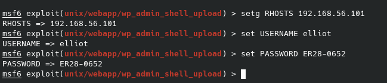
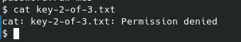
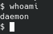

EXPLOIT

já que conseguimos logar no wordpress, iremos usar o módulo de drop shell.php do metasploit

ele não funciona....

seguimos com o método padrão manual e popamos uma shell, porém não temos permissões para nada.

