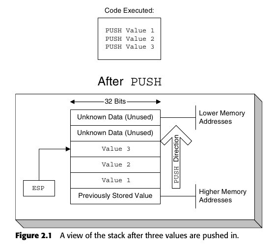
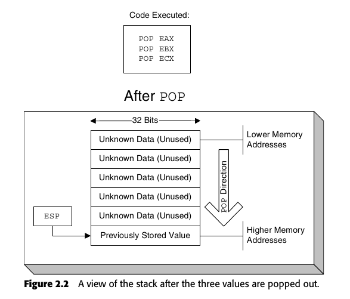
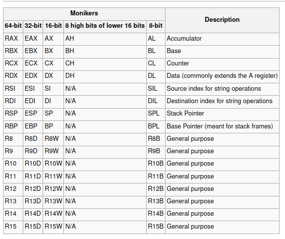
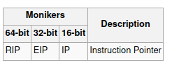
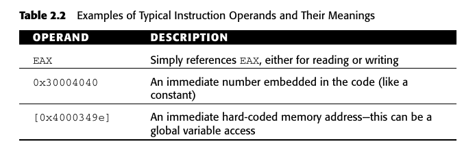
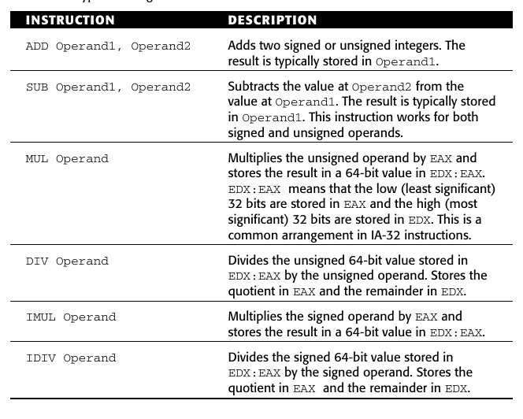
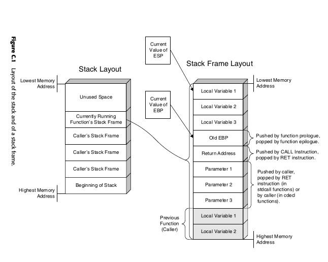

conceito de programação para reversers

módulos:
	são arquivos binários que contem segmentos isolados do programa, basicamente existem dois tipos de modulos, *livrarias dinâmicas* e *livrarias estáticas* 
- estaticas: são partes externas feitas por terceiros que fazem parte do programa, adicionam funcionalidade a ele.
- dinâmica: ou DLLs também adicionam funcionalidade ao programa, porém elas não ficam dentro do código mas sim em arquivos fora dele para serem chamados.

user defined data structure:
- lists: uma estrutura onde cada item pode ser tanto um inteiro quanto uma string onde todas pertencem ao mesmo grupo.
	- arrays - o conceito mais básico de listas, os itens são postos em sequência em memória. Existem arrays multimencionais com n colunas e n linhas.
	- linked lists - são listas que possuem o endereço em memoria de cada item seguinte ou passado (link), é pessimo para mudar a estrutura desse tipo de lista, como o acesso individual de um item pois a eles acabam sendo estruturados randomicamente em memória.
	- trees - esse tipo também possui cada item salvo em memória, o que muda é a forma de organização, pense em uma arvore onde cada valor tem uma hierarquia, valores maiores são os galhos, onde dão acesso aos valores menores (folhas). Simplifica bastante a procura de valores.

control flow: é a lógica por tras do programa.
- conditional blocks - são os `if` dos programas.
- switch blocks - são blocos com varias condições a seguir, `case` do C.
- loops - famoso `while`

**registers:** para o cpu não precisar ficar usando a ram que é uma memoria mais lenta ele usa os registradores que na arquitetura atual x86_64 bits existem 64 bits.

**stack:** usado para armazenar variáveis de duração curta, onde os registers são usados para uso imediato, e ram para a longa. Fisicamente o stack é uma parte alocada da ram usada pra este propósito. Cada stack representa um programa ativo, e SOs conseguem ter varios stacks. Usam o padrão LIFO (last in first out), onde item são pushados ou popados, padrão top down. Ou seja os maiores endereços são usados primeiro e os endereços mais baixos são usados depois, o stack cresce descrescente.

ex de stack (push):

ex de stack (pop):

a stack é usada para os seguintes propósitos:
- salvar temporiamente valores de registros, para não corrompé-los
- variaveis locais
- parametros de funções e endereços de retorno.

**heap:** é uma região em memória gerenciável que permite a alocação de varios de blocos de memória em tempo de execução. São gerenciados por bibliotecas ou pelo SO. Mais usados para alocar objetos grandes o suficiente para não caberem no stack. Malloc?

Executable data section: são dados preinicializados, bastante usados para guardar variáveis. Ex: 
`char szWelcome = “This string will be stored in the executable’s
preinitialized data section”;`

para acessar essa string o compilador irá emitir endereços em memorias dentro do codigo que apontam para a string. **variáveis globais são postas aqui**.

registradores:
- ax, abx, edx - de uso geral para armazenar valores.
- ecx - generico, porém pode ser usado para contar funções repetitivas.
- esi/edi - source/destination pointers (source index, destination index).
- ebp - base pointer, em combinação com o stack pointer (esp) ele faz um stack frame, que é a zona de stack da função atual. Usados para acessar rapidamente as variáveis do codigo.
- esp - armazena a posição atual do stack, então qualquer coisa que é pushada no stack vai pra baixo deste endereço e esse registrador é atualizado.

operações basicas de instruções:

CMP: instrução compare, compara duas variáveis no caso ela simplesmente faz uma subtração, se der 0 o ZF (zero flag) é ativada dizendo que são iguais.

EFLAGS:

- CF (carry flag) -> avisa se houve um overflow em um numero natural (unsigned operand).
- OF (overflow flag) -> avisa se houve um overflow em um inteiro (signed operand).
- ZF (zero flag) ->  usado quando uma operação aritmética da zero, a cmp seta essa flag pra saber se uma variavel é igual a outro.
- SF (sign flag) -> pega o bit mais significativo do resultado, independentemente se for signed ou unsigned. Para signeds ele pega o sinal da operação.
- PF (parity flag) -> reporta se o resultado aritmetico foi par ou impar de acordo com a quantidade de bytes setados em 1.Ex:
0 = 0000 0000 = even
1 = 0000 0001 = odd
2 = 0000 0010 = odd
3 = 0000 0011 = even
4 = 0000 0100 = odd
5 = 0000 0101 = even

as veses pra fazer operação de soma e subtração os processadroes acabam usando LEA (load effective address) 

para multiplicação e divisão ao invez de MUL e DIV eles podem usar SHL (shift bits to the left) SHR(shift to the righ), para mudarem as posições dos bits, isso corresponde a multiplicação e divisão por 2

funcionamento da stack:

calling conventions:
- cdecl: provavelmente a mais comum, a função retornar com um simples RET
- fastcall: sempre usa o ECX e EDX para armazenar as duas primeiras variáveis da função.
- stdcall: usa o RET para limpar a stack pode ainda receber um numero especifico de bytes no RET para saber qual variáveis limpar.
- thiscall: qualquer função que chama um ponteiro valido para o stack mas sem usar o EDX é um thiscall.

variáveis importadas, no caso são as famosas dlls ou dynamic libraries. Elas aparecem assim: 

mov
eax, DWORD PTR [IATAddress]
mov 
ebx, DWORD PTR [eax]

**SIGNED comparisons (CMP):** 
quando a zf é setada saiba que a operação deu zero e ambos são iguais.

quando as tres flags são setadas (ZF, SF, OF), da pra saber que o primeiro operando é maior que o segundo pois acontece um resultado positivo e nenhum overflow.

SF=1,OF=0,ZF=0 -> segundo operando é maior que o primeiro com resultado negativo.

OF=1, SF=0, ZF=0 -> o segundo operando é maior que o primeiro, o valor se torna pequeno o bastante para estourar o operando de destino.

OF=1, SF=1, ZF=0 -> o primeiro operando é maior que o segundo, vc tem um valor grande o suficiente para não caber no operando de destino. 

**Unsigned CMP**
x=y -> CF=0,ZF=1 
x<y -> CF=1,ZF=0
x>y -> CF=0,ZF=0

