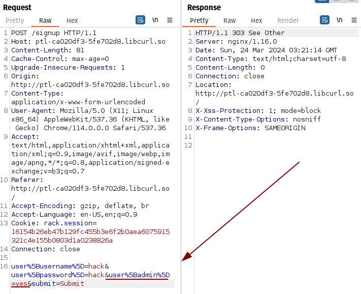
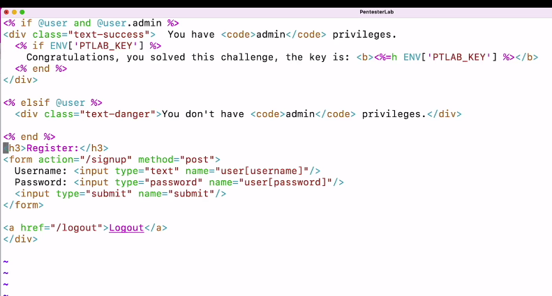
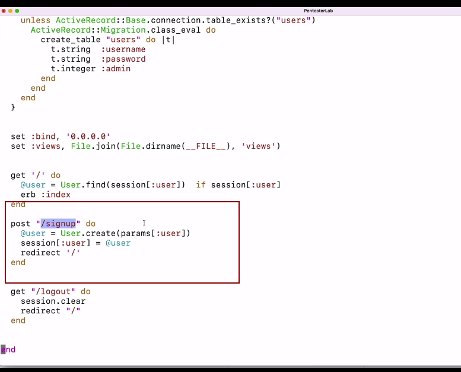
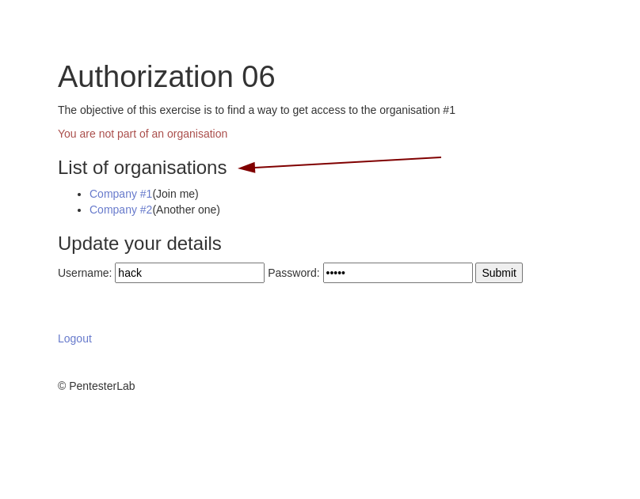
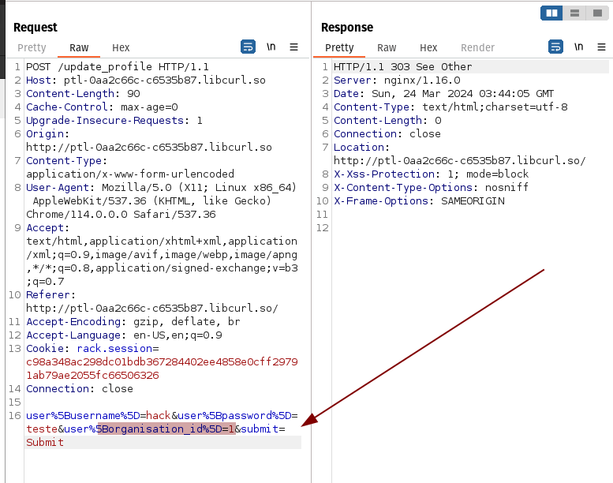

Authorization

ORM (object relational mapping)
a galera não queria mais fazer as queries manualmente e por isso criaram esse metodo para mexer em DB sem nenhum conhecimento.

user%5Busername%5D=hack&user%5Bpassword%5D=hack&submit=Submit

observando o padrão da URL vemos que podemos registrar um user com o parametro admin=yes



não há nada no backend previnindo o atacante de adicionar o admin:1 e é por isso que o request anterior funciona.






as classes em RB e em diversas linguagens de programação seguem uma convenção de nomes para melhor entendimento do codigo e padronização:

observe que o site oferece uma lista de organizações, aqui vc pode deduzir que a chave de cada compania é **organisation_id** ou **id_organization** etc.



com isso podemos craftar uma req para fazer o usuario pertencer a uma org.



dev usando ActiveRecord (data mapper mais comum) usado para mass assignment
```
class User < ActiveRecord::Base
  belongs_to :organisation
end

class Organisation < ActiveRecord::Base
  has_many :users
end
```

