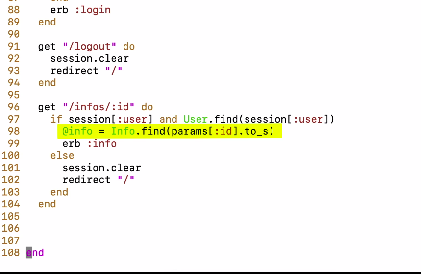
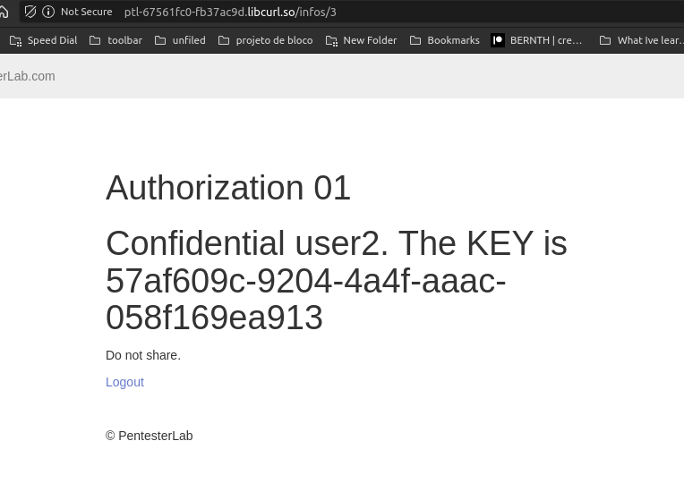
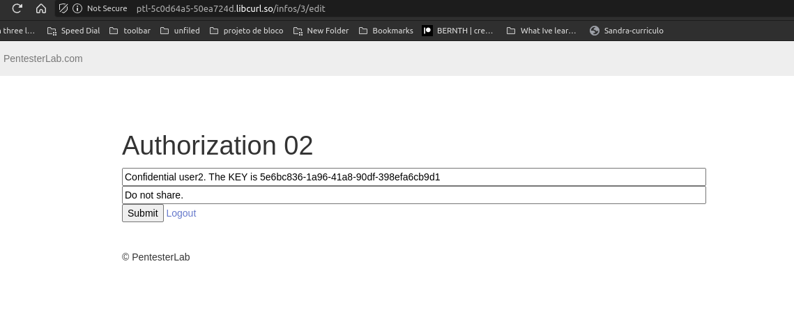
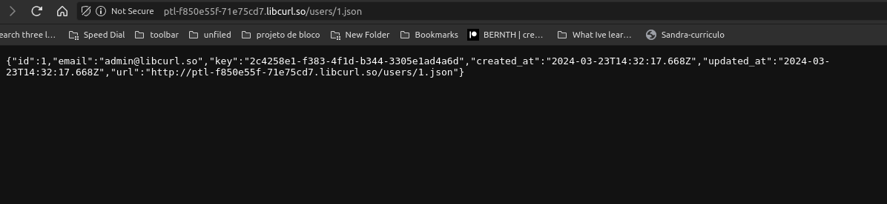
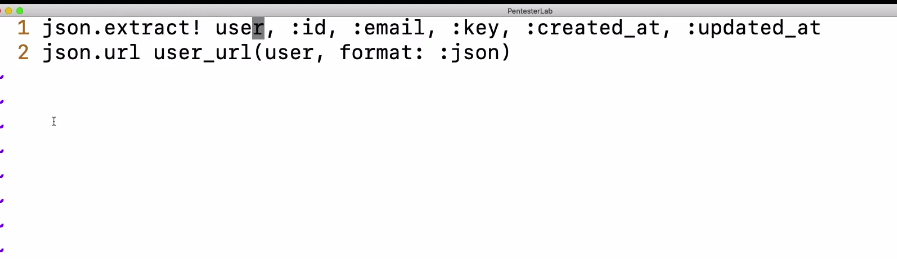

IDOR

linha 98, só está checando se existe a informação com o ID do usuário mas não faz uma checagem se o user pode acessar essa informação.

em IDOR mesmo logado em um user, eu consigo info de outros users.

lembra de testar em outras funcionalidades do site, pode ser onde esteja testando tenha controle de acesso, porém em um edit info do site por exemplo não tenha

Maneira de pegar somente um tipo de objeto da pagina, e burlar alguns WAF que não permitem acessar direto na URL:

curl -H 'Accept: application/json' http://ptl-f850e55f-71e75cd7.libcurl.so/users/1 

varios frameworks fazem tratativa automatica de um certo tipo de arquivo e so printam pro user o HTML

Ruby on rails por exemplo cria diversos arquivos:

o Show.html é a página a ser mostrada para o user
já o json.extract vai extrair todas as informações do usuário:

aqui o leak está em :**key** que poderia ser removido