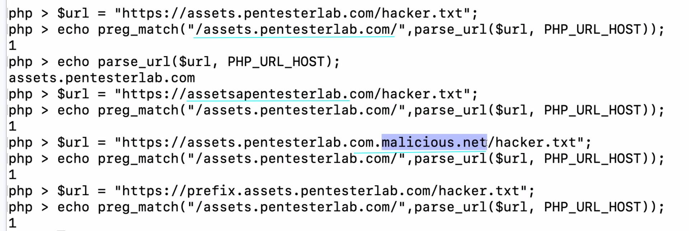

SSRF 

server side request forgery

aqui eu to pedindo para o servidor acessar o localhost na porta 1234
http://ptl-addc31d2-db2ce2b1.libcurl.so/?url=http://127.0.0.1:1234

isso pode ser usado para diversos fins, ja que vc tem controle sobre o que o servidor está fazendo.

lebre-se de mudar localhost, 0.0.0.0 ou até mesmo ::1 se permitir ipv6, dependendo do filtro que o programador usar.

o problema ali é que o regex não faz o escaping no ponto (.) e assim em regex significa tudo, e assim o atacante tem controle sobre o sufixo e prefixo, podendo usar um dominio malicioso que contenha pentesterlab no nome como por exemplo https://ptl-8adcd48f-bb90406c.libcurl.so/?url=http://assets.pentesterlab.com.hackingwithpentesterlab.link:1234
esse domain hackingwithpentesterlab.link sempre vai retornar o localhost

