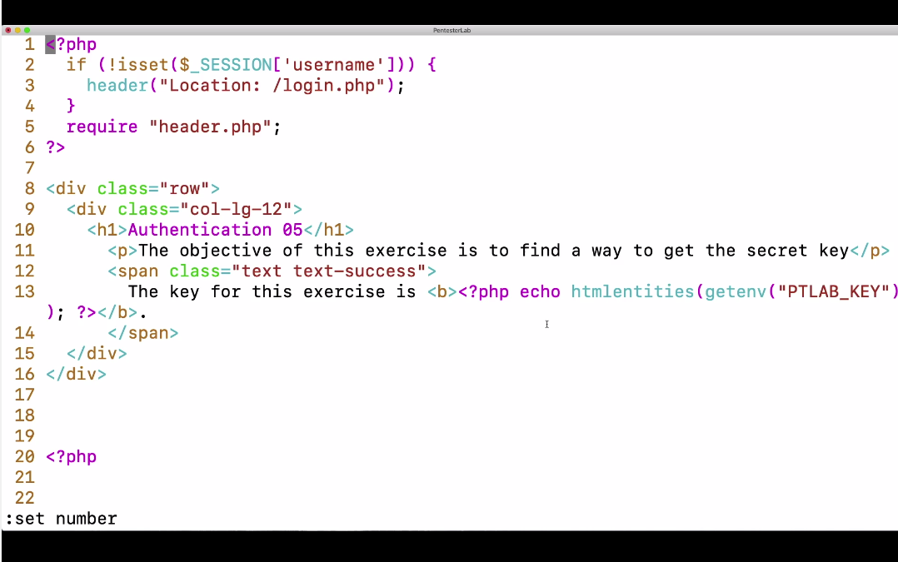

flow do codigo

nesse exemplo o bug está presente no 3-4 linha, pois não há uma parada no código de pois do redirect 302 para o login.php. Ou seja o código abaixo (8 em diante) vai ser executado mesmo se o user não estiver logado. Uma ferramenta como o Curl ou Burp consegue pegar. Mas pelo browser como há um redirect ele n mostra as linhas.

Um die() na linha 4 pararia o flow do codigo e n teria bug.