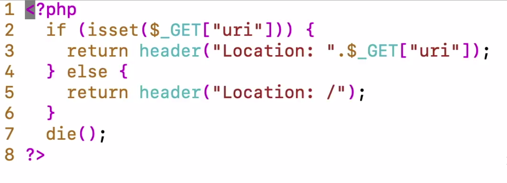

open redirect

aqui o parametro está sendo passado pelo cliente, e não há nenhum filtro que barre algum URI malicioso

exemplo de open redirect:
https://ptl-443616cf-f2b01af1.libcurl.so/redirect.php?uri=https://webhook.site/1c0018dd-ed5d-4c27-8908-86e5934ed8a3

esse site **webhook** permite que façamos uma POC para demonstrar um user clicando em um site que pertence ao atacante.

alguns sites podem fazer restrições futeis como indicar que o site começa com /, porem podemos fazer o bypass com a seguinte requisição

https://ptl-16c82284-c577b40b.libcurl.so/redirect.php?uri=**//google.com**

o **//** faz o redirect direto pro site mesmo assim