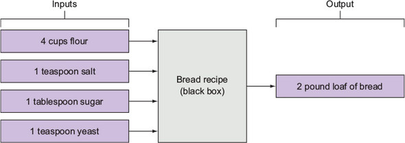

aula 2

get programing cap 1

visualizar o problema

quebrar ele em diversos probleminhas

escrever alguns inputs e possiveis outputs do problema

perguntinhas legais:

- ha alguma interecao com o usuario?
- ha algum input que programa precisa?
- algum output que eh para ser mostrado?
- seu programa é somente para fazer calculos por traz das cenas (backend)?

escrever essas perguntas em um diagrama

