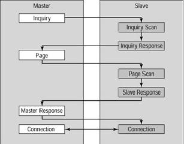

Resumão:

https://www.gta.ufrj.br/grad/10_1/bluetooth/tecnologia.html

bluetooth (802.15.1) == bladand == dente azul, é em referencia ao povo viking. 

alcance: 

frequência em 2.4 Ghz compete com o wifi, por isso pode ter interferencia. Consegue transmitir audio também; como ela funciona em half-duplex e full-duplex, permite a transmissão simultânea entre dispositivos. Por ter um dispositivo que vai fazer um controle do que vai ser transmitido, acaba se tornando uma Possui 2 modos:

- stand-by
- conected
    - park -> modo que permite a conexão de mais 7 dispositvos, para formar uma piconet.
    - hold -> menor consumo, algum se um slave não estiver em conexão o master o coloca nesse estado, o clock do dispositvo é a unica coisa usada para se manter sincronizado com os outros dispositivos
    - sniff -> diminui a taxa de escuta, programável
    - ativo -> conexão ativa, recebendo ou transmitindo

conexão: 

