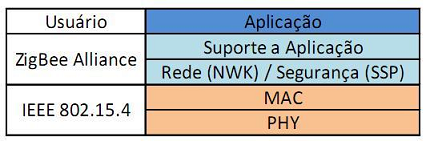
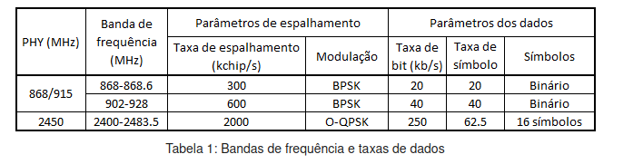

Resumão:

o protocolo Zigbee (ou IEEE 802.15.4) é ótima para redes de baixo alcance e pequenas que precisam se comunicar com uma energia eficiente. O que é extremamente bom para o IOT, pois esses dispositivos além de estarem em uma rede "segmentada" com seu próprio protocolo de comunicação, são empacotados com AES-128 (Advanced encryption security) o que os torna sua confidencialidade 

comprovada.

https://www.techtudo.com.br/noticias/2019/12/o-que-e-zigbee-saiba-tudo-sobre-o-protocolo-para-iot-e-casa-conectada.ghtml

https://www.gta.ufrj.br/grad/10_1/zigbee/conclusao.html