Chapter 10 - Understanding Cryptography and PKI

Conceitos gerais para pegar:

- Integrity
    - Hash
    - hash cria um fixed lenght string of bits ou hexa que n pode ser revertidos para criar o dado original
    - SHA-3 comum
- Confidentiality
    - Encryption
    - Symmetric encryotion
    - Stream ciphers
    - Asymmetric encryption
        - requer a PKI (public key infraestructure) para tirar certs
        - qualquer coisa encriptada com pup key so pode ser decriptada com a priv key exata
        - e vice versa
    - Steganography
- Digital signature
    - authentication
    - non-repudiation
    - digital signature email
    - only the sender pup key can decrypt the hash, providenciando verificacao.

# Providing Integrity with Hashing

o SHA-3 (secure hash algorith 3) tem o numero em hexa, o SHA-3-256 geralemente tem display de 64 hex chars

## Hash versus checksum

eh parecido sqn, o checksum so tem um bit ou 2 e verifica a integridade dos dados rapidamente, o raid-5 usa isso. Usando um simples bit de paridade para identifcar dados corrompidos. Cartoes de credito tb, num cartao de 16 digits os primeiros 6-digitos sao usados para identificar a instuicao que emitiu o cartao, os outros 9 sao os numeros da conta, e o 16th digito eh um checksum.

Checksums nao sao usados para garantir encrypt seguro mas sim virificar rapidamente se ha perda de integridade. Já o SHA-3 faz os dois bem d+

## MD5

Message Digest 5 he um hashing que produz 128-bit hash. eh vulneravel

## Secure Hash Algorithms

1.  SHA-0 -> nao eh usado
2.  SHA-1 -> 160-bit
3.  SHA-2 -> sha1 melhorado cria 256-bits, 224, 384, 512
4.  SHA-3 -> keccak  pode criar os mesmos tamanhos do 2

## HMAC

hash-based message authenticaiton code ele eh parecido com o md5 e sha, HMAC-MD5 e HMAC-SHA256. Porém ele também usa uma shared key para atribuir uma randomizacao ao resultado, sendo que so o remetente e o recebidor sabem a senha.

Providenciando autenticidade e integridade.IPsec e TLS usam dessa cript

## Hashing Files

sha256sum.exe da pra ser usado para calcular o hash md5sum tb

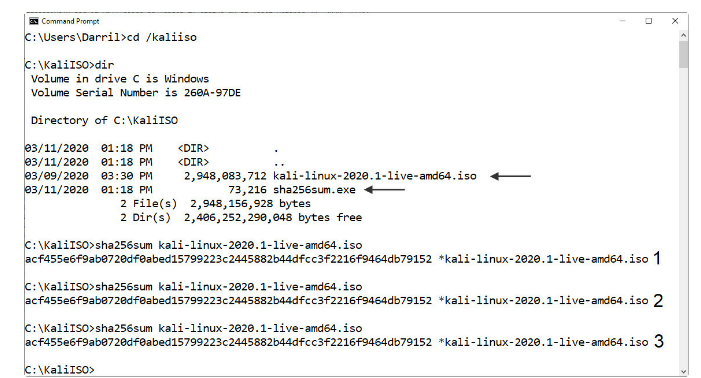

## Hashing Messages

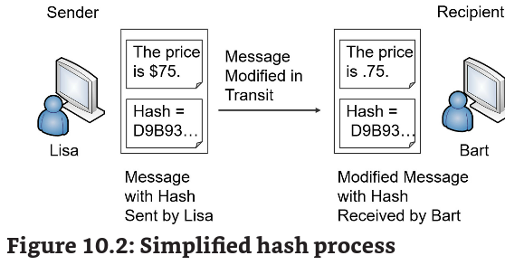

## Using HMAC

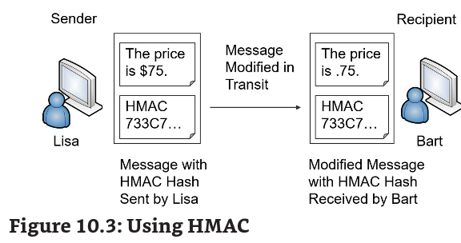

remember hashing algorithms don't encrypt data

## Hashing Passwords

geralmente as senhas armazenadas em sistemas nao sao armazenadas em clear text e sim o hash da senha. Não usa MD5 pois ela eh sucessetivel a ataques de dicionario.

Use SHA-3 com salt

https://www.md5online.org/

## Understanding Hash Collisions

quando um hash gerado eh o mesmo para mais de uma senha. o MD5 eh sucessetivel. Assim o atacante pode usar mais de uma senha para adentrar no sistema.

# Understanding Password Attacks

online password attack - logar num site, ncrack, hashcat, xhydra

offline password attack - baixar banco de dados de hash para tentar quebrar, durante um data breach, o windows event 4625 (security log) mostra as tentativas de colocar a senha, e o 4740 mostra o lock do user de tanto ele tentar.

## Dictionary Attacks

usa um dicionario de palavras para tentar adivinhar a senha

## Brute Force Attacks

tanta todos os caracteres possiveis para adivinhar a senha.

## Spraying Attacks

um programa automatico comeca com uma lista de contas target, então pega uma senha e tenta essa em todas as contas, pega e outra e ai vai. Isso eh usado para nã5438o ser bloqueado com o numero de tentativas.

## Pass the Hash Attacks

o atacante descobre o hash do usuario e usa para logar no sistema. Qualquer protocolo de auth que usa um metodo de passar hash em clear text eh sucessetivel ao ataque. Como Microsoft LAN Manager (LM) e NT LAN Manager (NTLM), e também pode ser usado no Kerberos.

Assim que tem privelegios de user e principalmente admin, eles usam para roubar mais senhas no Security Accounts Manager (SAM) DB, Local Security Authority Subsystem (LSASS) process e o Credential Manager (CredMan) store, e o LSA Secrets armazenado no registro.

Um bom indicador do uso do NTLM/NtLmSSP eh o ID 4624 security log. Isso pode ser correlacionado ao 4672, para determinar privilégio, com essa conexão.

## Birthday Attacks

No paradoxo do aniversario, para qualquer grupo randomico de 23 pessoas, há 50% de chance que 2 pessoas tem o mesmo aniversario. Nesse ataque o atacante cria uma senha que produza o hash exato da senha do user. Ele nao precisa adivinhar todas as senhas possiveis, pois ela é uma entre as 366 possibilidades, tendo uma chance de 50% de acertar após 23 tentativas.

MD5 eh sucessetivel, pois usa 128 bits, quanto mais longo menos sucessetivel a esse atack. SHA-3 512 nao eh.

## Rainbow Table Attacks

a aplicacao checa um db com senhas e seus hashes contra um hash encontrado, assim descobrindo a senha.

## Salting Passwords

o salt sao caracteres adicionais passados na senha antes de fazer o hash. Isso faz com que mesmo que o todos os ataques de hashing nao funcione

## Key Stretching

eh uma tecnica avançada, que aumenta ainda mais a seg de senhas. Alem do salt ele coloca uma alargador criptografico na senha, fristrando ainda mais o atacante.

bcrypt, password key derivation function 2 (PBKDF2), and Argon2.

por ex o bcrypt salts a pass e a criptografa com blowfish, e pode fazer isso diversas x, gerando um 60 char string

o pbkdf2 usa um salt de pelo menos 64 bits e usa um funcao randomica tipo hmac para proteger senhas. O WPA2 usa, IOS e cisco usa, o processo pode ser feito até 1 milhao de xpara produzir, podendo gerar hashes de 256 a 512.

# Providing Confidentiality with Encryption

tem que proteger **data at rest (armazenada)**, **data in transit** (passada pela rede) or **data in processing (sendo usada pelo systema)**

Os dois methodos criptograficos mais usados sao o symetric & assymetric key.

Algorithm: calculo, permanece o mesmo

Key: numero que providencia a variabilidade da encriptacao, e mais privada e/ou mudada frequentimente

## Symmetric Encryption

usa a mesma chave para encriptar e desencriptar dados.tambem chamada de secret-key ou sesion-key

radius usa

## Block Versus Stream Ciphers

os dois sao simetricos,o block vai dividir a mensagem a ser criptografada em blocos, geralemnte 64-128 bits, ja o stream vai bit por bit encritando o dado.

Block - quando o tamanho do dado eh conhecido, por ex um DB

Stream - quando n sabemos o tamanho - voip - videochamada .

# Common, Symmetric Algorithms

## AES

advanced encription standard, fast, efficient, strong

## 3DES (triple des)

64 bit blocks

## Blowfish and twofish

blowfish pode ser mais rapido que AES 256, e eh pode ser usado por ser forte, twofish eh a mesma coisa mais encripta em 128 ao invez de 64, eh recomendado pela NIST

# Asymetric Encryption

se algo for encriptado com a pub, somente a priv consegue decriptar E vice versa.

priv keys sao sempre privadas, nunca compartilhadas

pub podem ser compartilhadas com um certificado

apesar de ser forte, consome muitos recursos. A maioria dos protocolos cript so usam para key exchange

## Key Exchange

eh um metodo para passar chaves criptograficas, o assymetric eh muito usado para isso.

## The Rayburn Box

imagina que vc tem um cofre que so fecha com sua chave privada, e vc manda uma chave publica (que so pode abrir porem nao fecha) para um amigo, se a caixa vier fechada, isso comprova que a mensagem dentro do cofre eh seu. E assim o seu amigo consegue abrir e ler a mensagem em paz. Agora se a caixa vier aberta, o cofre foi interceptado e o grande irmao esta a sua procura.

## Certificates

documento digital que inclui uma chave publica, e a informacao do dono do cert. CAs geram e gerenciam certificados.

possuem os seguintes:

- serial number: identificacao do cert
- issuer: quem gerou o CA
- validity dates: expiration dates
- subject: o dono do cert
- pub key: a asymetric encryption pub key
- usage: uso do cert

• CN: CommonName (also known as the Fully Qualified Domain Name such as letsencrypt.org) • o: Organization (such as the Internet Security Research Group) • L: Locality (such as Mountain View) • S: StateOrProvinceName (such as CA) • C: CountryName (such as US)

## Ephemeral Keys

coisas que duram pouco tempo. Uma chave dessa inclu o priv e pub keys. Certificados sao baseados em chaves staticas.

Elliptic Curve Cryptography

ECC nao pega tando recurso como os outros. Usa equacoes mat para formular uma curva eliptica. ECDSA (eliptic curve digital signature augorithm) dizem que uma 256 ECDSA providencia a mesma seg que um 3072-bit key DSA

## Quantum Computing

que louco um qubit precisa de outro para formar o segundo estado quantico. Ou seja um Bit (o ou 1)?

E por isso os qubits sao dependentes um de outro, ao contrio do pc normal que os bits sao independentes (0 ou 1). é impossivel copiar data enquanto no estado quantico. Qualquer tentativa pode mudar os dados, tambem chamado de no cloning theorem.

## Quantum Cryptography

QKD (quantum key distribution) asymwadmetric key, lembra do no cloning theorem aplicado aqui. Qualquer tentativa de MITM vai corromper o QKD conectino

## Post-Quantum Cryptography

refere-se aos algoritmos que provavelmente serao resistentes aos computadores quanticos. Até 2024 vao lancar algoritmos assim.

## Lightweight Cryptography

refere-se a criptografia usada em dispositivos com RFID, sensor nodes, smart cards, heath care, IOT etc

ISO/IEC 29192-2:2019

## Homomorphic Encryption

deixa os dados encriptados enquanto estao sendo processados. Por isso pessoas podem manipular e acessar os dados sem poder ver, pq eles continuam encriptados.

# Key Lenght

RSA (rivest-shamir-adleman) eh a chave mais usada na net e suporta chaves de 1024, 2048 e 4096

chaves de tamanho 2048 sao safe ate 2030 as outras sao deprecated

# Modes of Operation

message authentication code (MAC). Imagine o acesso a um site com TLS

Homer usa seu computador para acessar um site. Nesse processo o site faz uma sessao e os dois compartilham chaves simetricas. A **primeira chave** eh usada para encriptar as paginas antes de manda-las. A **segunda chave** eh usada com um hash no ciphertext para criar o MAC. Note que neste ponto somente o web site e o Homer sabem dessas chaves -- o website entao manda o ciphertext e o MAC para Homer, o computador entao usa a segunda chave com o hash para recalcular o MAC. Se o recalculo for igual ao MAC enviado, entao eh autentico a mensagem. A primeira chave entao eh usada para decriptar o ciphertext.

Um counter mode cipher (CTR) converte o bloco cipher num stream cipher. Combina um initiazation vector (IV) com um counter e então usa o resultado para encriptar todo o plaintext block. O IV eh um valor fixo randomico ou pseudo-randomico que ajuda a criar, chaves criptograficas randomicas, e providencia um valor de comeco para o algorithm.

Cada bloco usa o mesmo IV mas o CTR combina com um counter, resultando em chaves diferentes para cada bloco. CTR eh respeitado e altamente usado -- providencia também autenticidade na encript.

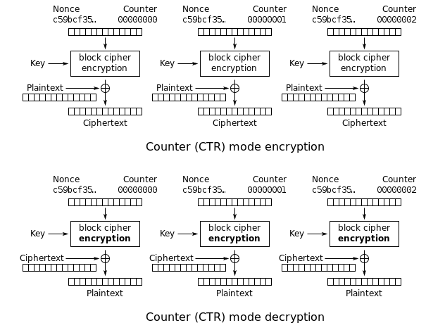

Remember: 3 modos comuns de encript sao authenticated, counter e unauthenticated.

https://www.educative.io/answers/what-is-ctr

# Steganography

steganalysis - analisar coisas obfuscadas, o metodo mias usado eh por hashing, se um bit do arquivo foi mudado o hash vai mudar.

## Audio steganography

pega vantagem das limitacoes do ouvido humano, ele so pode ouvir no range 20Hz a 20KHz. A maioria não consegue detectar entre 18KHz e 20KHz, mas esses sonns podem ser detectados por microfones. (audio beacons).

Pesquisar por SilverPush, o SDK do app deles permite escutar audio beacons, e o app fica escutando a todo momento para saber quais comerciais (comerciais usam isso) a pessoa ta ouvindo.

## Image Steganography

esconder dados numa imagem

https://greatadministrator.com/sy0-601-labs/

## Video Steganography

o problema daqui eh que ele pode gerar um ruido, entao o que muita gente faz eh modificar apenas as imagens no video

# Using Cryptographic Protocols

Quem encripta e quem decripta?

- Email digital signatures
    - o sender priv key encripta ou signs
    - a pub key do sender decripta
- Email encription
    - a pub key do recebidor encripta
    - a priv key do recebidor decripta
- Web Site encript
    - a pub key do site encripta
    - a priv key do site decripta
    - a chave simetrica encripta a data na secao do site

Email e web usam uma combinacao de simetrica e assimetrica, assimetrica eh usada para key exchange, privadamente compartilhando uma chave simetrica. Encriptação simetrica encripta dados.

## Protecting Email

### Signing email with digital signatures

providencia autenticacao, nao-repudiacao (nao fui eu que mandei o email) e integridade

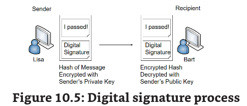

geralmente a pub key vem no formato: MIME.p7s

por que nao encriptar a mensagem inteira? recursos, levaria tempo e recurso pra encriptar um email com todos os seus attachments, pensando em seg tb seria mais complicado verificar se uma malware está sendo transmitido.

## Encrypting Email

as x temos que encriptar tudo

### Encrypting Email with Only Asymmetric Encryption

dai a chave pub eh usada para encriptar a mensagem e a privada eh usada para decriptar.

lisa pega uma copia do certificado de bart que contem a pub key, e ela encripta a mensagem, que depois bart vai ter que decriptar usando a privada.

### Encrypting Email with Asymmetric and Symmetric Encryption

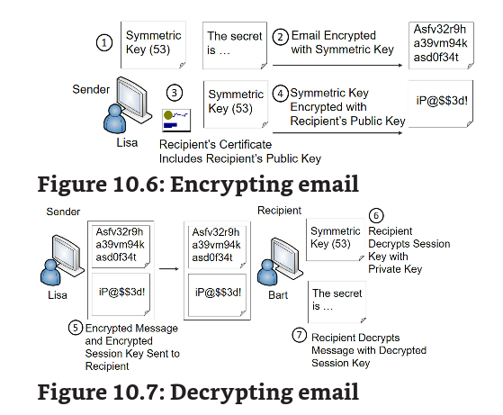

a maioria usa os dois metodos para decriptar email, segue o processo:

1.  lisa pega uma chave simetric para encriptar seu email.
2.  encripta o email
3.  lisa pega uma copia da pub key de bart
4.  ela usa a pub key de bart para encriptar a chave simetrica um AES da vida por ex
5.  lisa envia o email encriptado e a chave simetrica encriptada para bart
6.  bart decripta a chave simetrica com sua chave privada
7.  ele decripta o email com a chave simetrica decriptada.

## S/MIME

secure/multipurpose internet mail extensions (s/mime) eh um dos mias populares standards para ditalmente assinar e encriptar email e assinaturas digitais usam o S/MIME

Ele usa tanto simetric quanto assimetric. Pode encriptar at rest e in transit

A versao atual usa Cryptorgraphic Message Syntax (CMS) que permite o uso de diversas hash e algoritimos de criptografia.

Portas: 995 POP3, 597 SMTP, 993 (IMAP)

# HTTPS Transport Encryption

## Encrypting HTTPS Traffic with TLS

usa tanto a simetrica quanto assimetrica

- ele usa a asymmetric para assegurar a symmetrica.
- e usa a simetric enc para encriptar a data de sessão.

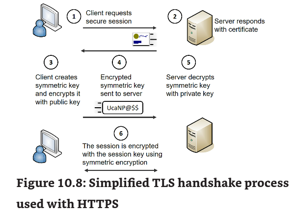

1.  ao acessar um site, o webserver manda seu certificado pub com a chave pub para o client
2.  o client recebe o cert com a chav pub, e cria uma chave simetrica encriptada com a chave pub do server.
3.  essa chave simetrica eh usada para encriptar a secao, lembre-se que a assimetrica eh pessima para isso.
4.  o cliente envia a chave da secao encriptada para o server.
5.  o server desencripta com sua chave privada. E agora tanto o cliente como o servidor sabem da chave. E assim rola uma secao encriptada por ambas as partes.

## Downgrade Attacks on Weak Implementations

Geralmente eh associado a ataques de weak cipher, por ex um server comporta tanto TLS (principal) como SSL (compatibilidade) um atacante forca um host a usar o SSL para fazer uma MITM pois eh um cipher fraco e vulneravel. the Padding Oracle On Downgraded Legacy Encryption (POODLE)

## Blockchain

eh geralmente definido como distribuidora, descentralizadora, livro-caixa publico (ou seja uma armazenadora de dados publica) - **public ledger**

A palavra bloco refere-se aos pedacoes de informacoes digitais (ledger) e a chain refere-se ao DB publico. Juntos eles criam uma banco de dados publico.

Cada bloco tem 3 partes:

- informacao de transacoes, como dia, hora, quantidade
- informacao de partes envolvidas
- um hash que difere um bloco do outro

Para um bloco ser incluido ela precisa ter 4 coisas:

- uma transação ocorreu
- um transacao foi verificada
- uma transacao foi gravada com sucesso em um bloco
- o bloco assimilou um hash unico

ele grava o hash do bloco que veio antes dele. eh o que faz a chain

a recompensa para minerar bitcoin comecou em 50 bitcoins por bloco, a recompensa eh cortada pela metade depois de 210mil blocos mineradas o que ocorre a cada 4 anos. Eventualmente a recompensa vai parar e nenhum bitcoin vai ser criado, porem mineradores ainda vão ganhar dinheiro atraves de taxa de transaçoes.

## Crypto Diversity

se um algoritimo for vulneravel vc tem a protecao pq foi usado diversos algoritimos para encriptar a mensagem.

NISTIR 8214A (Roadmap Toward Criteria for Threshold Schemes for Cryptographic Primitives) suggests the use of multiple hardware security modules (HSMs) to protect keys.

## Identificando Limitações

se vc sabe a limitacao do algoritimo vc pode se precaver dela.

### Resource Versus Security Constraints

Organizacoes frequentemente precisam balancear os recursos disponiveis com restrições de segurança. Corte de custo sem impactar a seguranca HAHAHAHAH

### Speed and Time

vc quer um algoritmo mais rapida em data in transit e um mais lento em data at rest

## Size and Computational Overhead

refere-se ao tamanho de memoria e espaco necessario para usar o algoritimo. Dispositivos menores como IOT tem recursos limitados e por isso precisam de um lightweight cryptography que sao os mesmos algoritimos so que menores, requerendo um overhead menor.

### Entropy

quanto maior a entropia mais aleatorio o ciphertext vira. Todos os algoritimos de cripto sao postados na net para cryptoanalistas olharem e ver alguma falha no codigo. SHA-1 tem falha desde 2010 nao eh mais aprovado.

### Predictability

o que vai acontecer se for repetido os mesmos eventos ao aplicar criptografia.

### Weak Keys

nem os melhores algoritimos de cripto nao sao uteis se nao for usada uma key boa, por ex a NIST recomenda pelo menos 2048-bit keys com o RSA desde 2010.

### Longevity

quanto tempo sera possivel usar o algoritimo por ex o DES era usado até 2005 depois o AES entrou em cena

### Reuse

nao reusar a mesma chave, esse era o problema com o WEP

## Plaintext Attack

usar um aircrack-ng para crackear wep ou pegar uma mensagem em cleartext junto do ciphertext e tentar descobrir o metodo de encript.

## Common Use Cases

- Supporting integrity: hashing procols sao usados para isso.
- Supporting confidentiality: encription protocols
- Supporting non-repudiation: digital signatures -email
- Supporting high resiliency: refere-se a resiliencia de que mesmo que uma parte da chave seja descoberta pelo atacante, ele nao consegue a mensagem pq tem a outra.
- Supporting Obfuscation: Steganography
- Supporting low power devices: ECC e outros lightweight cryptography algoriths
- Supporting low latency: OCSP supports o use case de latencia baixa. Quando um certificado eh revogado ele eh adicionado ao CRL, porem o CRL eh cacheado, e por isso o client so vai saber quando o certificado foi revogado quando ele sofrer refresh. o OCSP providencia real-time response eliminando essa latencia.

# Exploring PKI Components

Public Key Infrastructure (PKI) eh um grupo de tecnologias que sao usadas para fazer request, manage, store, distribute, e revoke certificates.

HTTPS sessions protect internet credit card transactions, and these depend on a PKI.

o maior beneficio disso eh que ele permite duas pessoas ou entidades de se comunicarem seguranmente sem se conhecerem previamente.

## Certificate Authority

CA issues, manages, validates and revokes certs. Comodo, DigiCert, Symantec. Por que um computador deveria confiar em uma CA? pelo trust path

## Certificate Trust Models

CAs são confiaveis, pq o seu root certificate estão armazenados no trust root CA do pc:

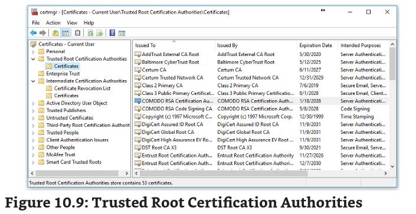

a maioria dos web browsers ja distribuem esses certs.

o modelo de confianca mais comum é o hierárquico, or centralized trust model, funciona assim:

- root CA gera um intermediate CAs
- intermediate CAs gera um child CAs
- Child CAs geram certificados para dispositivos ou end users

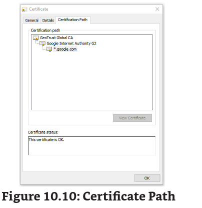

**Certificate chaining** combina todos os certificados de um root CA  até o cert gerado para o end user

## Registration Authority and CSRs

Alguns sites fazem vc preencher os dados diretamentes, outros requerem que vc ja tenha as chaves pub e priv criadas, OpenSSL consegue fazer isso.

1.  criacao da pub e priv (RSA)
2.  certificate signing request (CSR), incluindo o proposito e a info sobre o site, a maioria está formatada no Public-Key Cryptography Standards (PKCS) #10. O CSR inclui a chave pub, mas n a privada.
3.  CA valida sua identidade e cria um certificado com a pub key.
4.  Agora eh so registrar o certificado no web site junto da priv key.
5.  Em grandes organizacoes a registration authority (RA) pode dar assistencia a CA coletando informacoes de registro.

## Online Versus Offline CAs

grandes orgs querem proteger o root CA deixando ele offline, assim o intermediate cert pode ficar online. Assim mesmo que um cert seja comprometido, a chain cert toda nao vai se comprometer.

## Updating and Revoking Certificates

Cara no Lets Encypt da pra ter cert de graça e fazer o update quando os 90 dias passarem. Quando um cert expira ou eh compromised, a CA pode fazer update das chaves ou revogar o Cert não permitindo que ninguem use o CERT. Razões para revoke:

- Key compromise
- CA compromise
- Change of affiliation
- Superseded
- Cease of Operation
- Certificate hold

## Certificate Revocation List

certificate revocation lists (CRLs) sao usadas para revogar um cert.

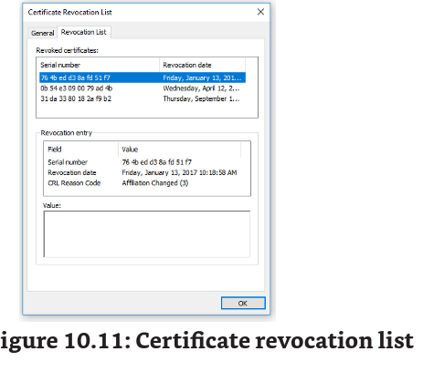

Mostra a lista dos motivos junto de um serial number de identificacao.

## Validating a Certificate

motivos deles serem invalidados:

1.  Expired
2.  Certificate not trusted: se o sistema n tem a CA cert armazenada no certmngr
3.  certificate revoked:

um metodo comum de validar eh fazendo o request do CRL:

1.  client inicia uma secao requisitando o cert, https session por ex
2.  server responde com uma copia do cert junto da pub
3.  client faz uma queria com a CA pela copia do CRL
4.  a CA responde com a copia da CRL

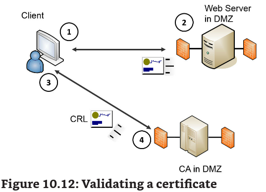

so checar a serial number do cert com a serial do CRL e comparar. Geralmente o CRL fica em cache.

Outro metodo de validar eh com o Online Certificate Status Protocol (OCSP). Por ele providenciar real-time response eh otimo para validar a low latency. Se no CRL vem como resposta Unknown pode ser um indicio de forgery de cert.

## Public Key Pinning

eh um hash criado por admins que oferece uma protecao extra na validacao do cert (anti fraud). No request do site, vem um header adicional contendo os hashes de pub keys do site, e também um max-age field de quanto tempo o clinet deve armazenar esses dados.

Quando o cliente se conecta ao site novamente eh so recalcular os hashes e comparar com os armazenados. Isso reduz OCSP traffic.

## Key Escrow

eh o processo de copiar a chave privada num ambiente seguro. Eh util para recuperacao. Se a chave original eh perdida, a org pega a chave copia para acessar os dados.

## Key Management

define o processo de gerencia de chaves, como deixar chaves priv privadas, destribuir pub keys em certificados, revogar certs quando as chaves forem roubadas etc.

## Comparing Certificate Types

- Machine/computer: gerados para um pc ou despositivo, identifica um
- user: vpm ssl, sao usados por usuarios
- email
- code signing: devs usam esses certs para validar autenticacao de executaveis e scripts, mostra que o codigo nao foi modificado
- self-signed: nao foi gerado por uma CA confiavel
- root: a root cert gerada por um root CA
- wildcard: comeca com um *, pode ser usada para multiplos dominios como *.google.com
- subject alternative name: SAN eh usado para multiplos dominios com diversos nomes, mas que sao da mesma empresa. Por ex, a google usa a SANs para *.google.com, *.android.com, *cluod.google.com. Usados para outros top-level domains
- Domain validation: indica que o requisitor do certificado tem algum tipo de controle sobre o dominio. A CA toma passos extras para contactar o requisitor por email ou tel.
- extended validation: EV usa passos adicionais para providenciar a validacao. A maioria n usa isso.

## Comparing Certificate Formats

a mioria usa X.509 v3, a maior excessão eh que os certificados usados para distribuir revocation lists usa X.509 v2

tipicamente armazenados em BASE64 ou binary, e alguns ainda sao encriptados.

A base do certificado eh a Canonical Encoding Rules (CER) ou Distinguished Encoding Rules (DER) X.690 standard. CER ASCII e DER BIN

-----BEGIN CERTIFICATE----- MIIDdTCCAl2gAwIBAgILBAAAAAABFUtaw5QwDQYJKoZIhvcNAQEFBQAwVzEL ... additional ASCII Characters here... HMUfpIBvFSDJ3gyICh3WZlXi/EjJKSZp4A== -----END CERTIFICATE-----

Certificados podem ter as seguintes extensoes: .crt, .cer, .pem, .key, .p7b, .p7c, pfx, and .p12. However, it’s worth stressing that a certificate with the.cer extension doesn’t necessarily mean that it is using the CER format.

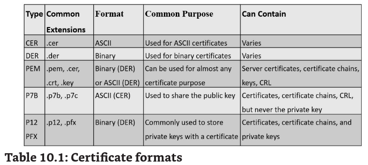

O privacy enhanced mail (PEM) certs implica que o PEM-based so pode ser usado para emial, **mas não eh verdade.**

eh comum usar o .key para a chave priv

P7B usa PKCS version 7 (PKCS#7) e sao CER-based(ASCII) usados para pub keys

P12 usam (PKCS#12) e sao DER(BIN). Usados para se ter o certificado com a chave privada.Eh comum concriptar o p12

Personal Information Exchange (PFX) predecessor do P12 com o mesmo usado. Windows usa bastante.