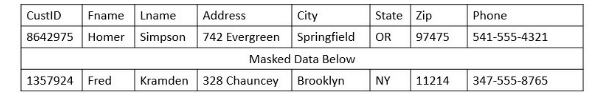

Chapter 11 - Implementing Policies to Mitigate Risks

# Exploring Security Policies

## Personal Policies

na polica de seg geralmente sao segmentadas por categorias de pessoas. Inclui comportamentos, expectativas e possiveis consequencias.

### Acceptable Use Policy (AUP)

descrevem os propositos dos sistemas e redes e como acessá-los. Muitas orgs monitoram suas atividades, como quais websites visitar, que tipo de dados podem ser enviados por email -- falando que suas acoes estao sendo monitoradas etc.

Muita org faz com que as pessoas leiam o contrato durante a assinatura da carteira, ou forncem treinos de seg, banner ou emails periodicos.

### Mandatory Vacations

faz com que funcionarios tirem ferias do seu trablaho, essas politicas ajudam a deter fraude e descoberta de atividades maliciosas enquanto funcionarios estao de ferias.

TIPO pq esse ADMIN que está de ferias, está mudando a senha do DB

### Separation of Duties

quem faz o que -- previne que uma unica pessoa ou entidade controle todas as funcoes.

### Least Privilege

somente o essencial eh liberado -- reduzir riscos

Que loco tem uma vuln no SQL server da microsoft que permite vc deixar  a senha "sa" do admin em branco

### Job Rotation

requer que pessoas troquem de posicoes ferenquemente, por ex em TI o Admin deve trocar com outro regurlarmente para nao ter fraude, ou algo ilicito na conta.

### Clean Desk Space

nada de senha ou documentos na mesa

### background check

pega o historico do safado

### Onboarding

dar recursos da empresa ao novo funcionario

### offboarding

remove seus recursos ao sair, eh comum rolar entrevista de saida

### Non-Disclosure Agreement (DNA)

nada de uma parte pode ser divulgada.

### Social Media Analysis

geral checa a media social do trabalho,

## Third-Party Risk Management

third parties, ou organizacoes que estao fora da sua org. Temos que gerenciar seus riscos

### Supply Chain and Vendors

atacar a suply chain para acabar com a producao da org

usar vendor disversity eh bom pra conter isso, quando fazemos contratos com terceiros eh importante ver o EOL ou EOSL (end of service life) policy

### Third-party agreements

- service level agreement (SLA): performance, downtime etc
- memorandum of understanding (MOU) ou MOA (memorandum of agreement): expressa um intendimento entre duas ou mais partes indicando sua intencao de trabalharem juntos para atigir um objetivo em comum. Eh menos formal que o SLA, mas mostra as responsabilidades de cada parte, n tem penalidade monetaria.
- Business partners agreement (BPA): eh um escrito que mostra os detalhes entre os parceiros de trabalho. Identifica shares, profits or losses que cada um vai ter, sua responsabilidade um com o outro. E o que fazer se um querer sair da party

### Terms of Agreement

Mostra o periodo que o acordo tera efeito. GEralemnte eh uma clausula adicional ao NDA, SLA etc

### Measurement System Analysis

MSA avalia os processos e ferramentas para pegar medicoes. O MSA usa varios metodos para identificar variacoes com as medidas que podem gerar em resultados invalidos. Idealemnte um sistema de medida deve gerar o mesmo valor quando mensurando o mesmo sample.

# Incident Response Policies

“NIST SP 800-61.”

## Incident Response Plan

providencia mais detalhas do que a politica de desposta a incidentes (acima). Incluem:

- Definitions of incident types: mostra as diferenças de eventos. O que pode ser ou não um incidente de seg
- Incident response team: composto de trabalhadores de areas diferentes, orgs referem o time a (IRT) ou computer incident response team (CIRT). Devido a complexa naturesa de incidentes, o time precisa ter treinamento extensivo, incluindo conceitos -- como identificar e validar um incidente -- como coletar evidencia -- e como proteger a evidencia coletada
- roles and responsibilities: identifica roles para um incident response team junto de suas responsabilidades. Por ex, da pra incluir um gerente senior com autoridade suficiente para fazer acontecer, um net admin ou engenheiro com conhecimento tecnico para entener o problema, e um esperto em seg info para coletar e analisar evidencia.

### Communication Plan

providencia uma direcao de como comunicar problemas relacionaddos ao incidente. Se pessoas erradas falarem com a media, pode criar um caos e fazer as acoes derreterem

- first responders: help desk devem saber a quem informar e quando. Enquanto uma infecção so de malware possa nao parecer seria, pode ser a primeira hint de um ataque significativo ou data exfiltration.
- internal communication: o time de resposta a incidentes devem saber quando informar seniors do incidente. Por ex eh desnecessario informar ao CEO de um DDoS que ta sendo bloqueado. Mas caso seja uma exfiltracao ai sim
- reporting requirements: law enforcement, se os dados de clientes forem expostos eles devem saber, o incident response plan deve dizer quem precisa ser notificado e quando
- external communication: quem pode fazer com entidades externas, como a media
- law enforcement: podem providenciar -- nao no brasil -- ajuda com incidentes.
- customer communication: em alguns casos a lei dita quando as organizacoes devem informar consumidores de um data breach. Em outros casos vira uma chamada de julgamento. Pq isso afeta a reputacao da empresa.

### Data Breach Responses

intelectual property (IP), tade secrets, software algo.

Eh comum escalar qualquer data breach para C-Level Personnel. (Chief information officer CIO ou CEO executive)

### Stakeholder Management

qualquer pessoa interessado na organizacao, incluem -- donos, donos de acoes, empregados, fornecedor, etc. Eles devem ser incluidos

# Incident Response Process

- Preparation: ocorre antes de um incidente e providencia um guia para pessoas em como responder um incidente. Inclui a implementacao de controles para impedir malware
- identification: todos os eventos nao sao incidentes de seg, entao eh necessario verificar se nao eh um falso positivo ou falso negativo
- containment: quarentena, tirar da rede, etc
- eradication: remover todos os remanescentes de malware.
- recovery: operacao nomal, aqui eles corrigem vulns tb
- lessons learned: lissoes para planejar treino, adicionar controles etc

# Understanding SOAR

Secure Orchestration Automation, and Response (SOAR) -- sao ferramentas que respondem low-level security events automaticamente.

Tipo podem olhar email ver se tem algum header estranho, abrir attachments em uma sandbox etc.

a resposta depende da org, pode ser deletar o email, blockear email do user etc.

## Playbooks

playbook de phishing por ex, pode incluir uma checklist do que pode checar num email de phishing.

Appendix A of NIST SP 800-184

tem as especificações do que se ter em um playbook

## Runbooks

implementam guidelines documentadas em playbooks. Idealmente eh o runbook que automaticamente responde a incidentes potenciais, ou assign ao admin

# Understanding Digital Forensics

orgs coletam informacoes de incidentes usando forense.

## Key Aspects of Digital Forensics

### Admissibility of Documentation and Evidence

tem que seguir procedimentos proprios para garantir que a evidencia eh adimitivel. Seguir esses procedimentos garante o controle de evidencia depois da coleta, mantendo a originalidade da evidencia.

Evidencia suporta non-repudiation, incluem prova de que individuos estão envolvidos em um incidente.

### Tags

depois que um item eh identificado ele precisa de um tag, que pode ser um simples sticker, com data, tempo e nome da pessoa que colocou o tag, um control number eh comum tb

### Chain of Custody

eh basicamente controle de evidencia. Pra ninguem pegar e alterar nada. Mostra quem ficou responsavel pela evidencia.

### Legal Hold

refere-se a uma ordem de corte para manter diferentes tipos de dados como evidencia. Emails, DBs, backups, etc.

### Video

CCTV melhor coisa

### Interviews

entrevista de testemunhas.

### Event Logs

uma investigação forense inclui uma analise de logs disponíveis

### Sequence of Events

timestamps, time offsets, qualquer coisa que evidencie uma sequencia

### Reports

depois de analisar tudo a galera cria um report de tudo relevante a investigacao:

- um sumario executivo contendo as recomendacoes e o que foi encontrado
- list de tools forense usadas na investigacao
- uma lista de evidencia coletada e analisada
- os encontros derivados analisando cada pedaco de evidencia
- recomendacoes baseadas no que foi encontrado

## On-premises vs Cloud Concerns

quando se usa cloud pode trazer riscos adicionais. Qualquer tempo que a organizacao contrata um cloud provider ele vira uma third-party fornecendo serviço. Isso se mantem quando o provider armazena dados ou providencia outro tipo de serviço. E esses dados podem estar em qualquer lugar.

### Right to audit clauses

essa clausula permite ao consumidor contratar um auditor e revisar os records do provider.

### Regulatory Jurisdiction

se alguem contratar cloud aqui no brasil, eles tem que entrar em compliance com a LGPD, agora se contratar no EU, la tem a GDPR e assim vai. Para cada pais ou estado tem suas leis.

### Data Breach Notification Laws

não sei se aqui no BR tem, mas la no EUA todo estado empresas tem que reportar data breach em ate x dias (depende do estado). Na GDPR eh 72 horas

# Acquisition and Preservation

quando comprar dados para forense, eh importante seguir os seguintes procedimentos:

## Order of Volatility

Refere-se a ordem que deve coletar evidencia. Por praxe, eh comum pegar os dados mais volateis primeiro.(ram)

- cache
- ram
- swap ou pagefile
- disk
- attached
- network

## Data Acquisition

depois de seguir a ordem de volatilidade:

eh importante usar snapshots

Forensic Artifacts:

- web history
- recycle bin
- windows error reporting
- RDP cache

## Forensic Tools

ha diversas tools para pegar infos de dispositivos/pessoas

### Capturing Data

data no cache, RAM, disk drives. Hardware devices, user files, etc. Com imagens vc tem um dado que nao pode ser alterado.

- dd (disk image tool linux)
- memdump (dump de ram)
- winhex (hexeditor)
- FKT imager (forensic toolkt pago, captura disco)
- autopsy (sleuth kit TSK)

### Verifying integrity

hashes e checksums

provenance refere-se a tracing de algo de volta a origem. E os hashes ajudam a provar que os dados foram mudados.

### Bandwidth Monitors

melhor coisa para se ter capture traffic...netflow etc

### Electronic Discovery

descoberta de informação eletrônica: voice mail, social media, website data. Metadados

### Data Recovery

restore data, recycle bin, swap etc

## Strategic Intelligence and Counterintelligence

inteligencia é a habilidade de aprender adquirindo novos conhecimentos e habilidades. Digital forensic intelligence refere-se a conhecimento e informacao que tem valor para pessoas que cuidam de investigacao -- usando metodos e ferramentas de forense.

Strategic intelligence refere-se a coletar processar e analisar informacao para criar planos de longo termo e objetivos.

Honeypots sao exemplos de counterintelligence.

# Protecting Data

toda companhia tem seus segredos, ao mantelos vc fica no topo, ao nao conseguir vai falhar miseravelmente. Criar uma polica de dados ajuda previnir roubo de dados.

## Classifying Data Types

Como melhor pratica, organizacaoes pegam tmepo para identificar e classificar dados que eles usam. Classificacoes de dados ajudam usuários a entenderem o valor dos dados. E suas classificacoes ajudam a proteger dados sensiveis. Classificacoes podem alicar dados em qualquer forma, como prints e arquivos.

Por ex o US Gov:

- top secret: danos graves para nacao se forem pegos por outros govs ou terroristas
- secret: dano serio
- confidential: causa dano

embora o US tenha disponibilizado esse standard, não um padrão a ser seguido por orgs privadas. Eh importante dar treinamento as pessoas para entenderem que tipo de dados estão usando.

identificadores de companhia:

- public data: disponivel para todos
- private data: info de um individuo que deve se manter privada PII PHI
- confidential data: informacao que a org tende a manter em segredo entre um certo grupo de pessoas
- proprietary data: patentes, trade secrets, software algo, etc algo que alguem ou org tenha posse
- financial information: qualquer dados sobre money
- employee data: eh toda a informacao coletada sobre trabalhadores.
- customer data: dados de consumidores, email, user names, senhas etc

## PII and Health Information

PII eh uma informacao pessoa como:

- nome completa
- data de aniversari
- informacao sobre saude ou medica
- email, endereço
- caracteristicas pessoas, dados biometricos
- qualquer tipo de numero de identificacao, como SSN (social security number) or licensa de motorista. (aqui seria CPF e ID)

geralemente para ser PII vc precisa de duas ou mais infos até vc conseguir trackear uma pessoa, tipo matheus oliveira n se remete a nada, agora se eu colocar um cpf ou email, já eh um PII

(NIST) created Special Publication (SP) 800-122 “Guide to Protecting the Confidentiality of Personally Identifiable Information (PII)."

https://www.idtheftcenter.org/

## Impact Assessment

esse assessment ajuda a organizacao a enteder o valor de dados considerando o impacto causado se for perdido ou entregue ao publico.

Nem todos os dados precisam da mesma protecao.

## Data Governance

processo de uma organizacao gerenciar, processar e proteger dados. Enquanto data quality é o core goal de data governance, muitas orgs sao motivadas a implementar data governance para entrar em compliance com leis e regulamentacoes. Sendo elas:

- HIPAA: saude
- GLBA: financas
- SOX: contadores, relatorios financeiros
- GDPR (LGPD BR): protecoes de dados de individuos

certas leis como a GDPR manda o uso de privacy notices, avisos de que seus dados estão sendo coletados e como estao sendo, e porque.

Critical dada sao dados criticos pro sucesso da missao da org.

# Privacy Enhancing Technologies

um dos mais faceis modos de proteger dados eh atraves de data minimization: eh o principio de limitar as informacoes que eles coletam e usam.

## Data Masking

modificar dados para esconder os conteudos originais. Nesse processo eh retido data usavel porem convertida em data inutilizada.

## Anonymization

remove todo o PII de um data set, para nao ser possivel trackear o individuo

## Pseudo-Anonymization

replaces PII e outros dados com pseudonimos, ou identificadores artificiais. Homer pode ser substituido por um pseudonimo de Z1

## Tokenization

substitui dados sensiveis por tokens. Um sistema de tokenizacao pode converter um token de volta para sua forma original. Cartoes de credito usam isso, ao invez de dar usas infos ele usa um token.

# Data Retention Policies

quanto tempo a data pode ser retida. Alguns leis mandam isso.

HIPAA 10 anos kkkkkkkk

# Data Sanitization

antes de jogar um dispositivo fora, tenha certeza que existam politicas de purge de dados. Alguns procedimentos comuns para se jogar dados fora:

- File shredding
- wiping
- erasing
- burning
- pulping
- pulverizing
- degaussing
- third-party solutions (shred-it  kkkk)

Melhore a confidencialidade

# Training users

treinamento de pessoal eh essencial para qualquer organizacao.

QUando usuarios entendem os riscos relacionados a suas acoes, eles são menos propensos a cometer essas acoes. Pessoas aprendem diferente, as proximas secoes definem alguns treinamentos:

## Computer-based training

quando o user interage com um aplicativo em um pc. Podendo ser instalado em um unico pc ou de um web-based training.  ICS-CERT, providencia bastente treinamento no site deles.

https://www.cisa.gov/ics-training-available-through-cisa

https://ics-training.inl.gov/learn

## Phishing Campaigns

quando descobrir novos tipos de ataques pessoas da cyber precisam alertar funcionarios.

## Phishing Simulations

se ele um unico funcionario dentro da org clickar em um link malicioso, via email ou responde com informacao privada, pode ser o suficiente para o atacante ownar toda a sua rede.

Entao a melhor coisa a fazer eh simular um email de phishing e ver quantos funcionarios clickam.

## Gamifications

tudo no jogo funciona melhor

## Capture the Flag

yall ready for this

## Role-Based Awareness Training

minimizar o risco da org, dando um treinamento especifico para aquela role: Tipo cibersec precisa de trienamentos focados para blue, red, purple, o arcoiris inteiro team, e cada um foca em um aspecto diferente de cyber.

GDPR:

- data owner: precisa entender suas responsabilidades relacionadas aos dados que eles possuem. Incluindo dados classificados corretamente e garantindo que ela está com label que de match na obra. É responável também por colocar controle de seg nos dados, Enquantos eles delegam dtd tasks para os caras que geram os dados, eles nao podem delegar sua responsabilidade.
- Data controller: a entidade que determina o por que e como dados sao processados.
- Data processor: qualquer entidade que usa e manipula os dados pelo controller.
- Data custodian/steward: dia a dia. backup, storage, businnes plan etc.
- Data protection officer: DPO, responsavel para garantir o compliance da org com a lei. Essa pessoa tambem tem que atuar como defensora independente de dados de consumidores.